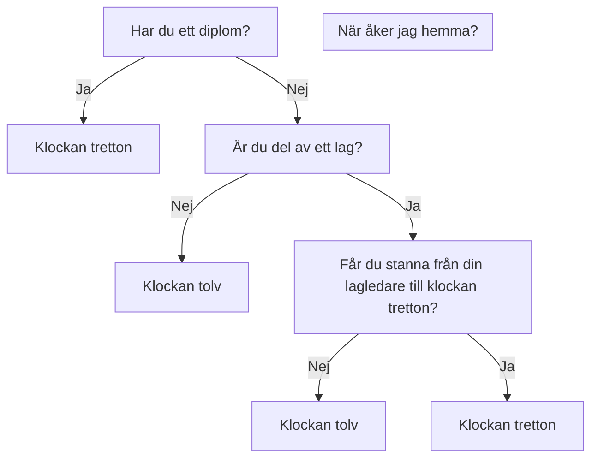

> If you are from Ukraine, you are welcome! See [FAQ](faq.md)
>
> Якщо ви з України, ласкаво просимо. [Перегляньте поширені запитання](faq.md)

På lördag gör vi coola grejer i Uppsala Makerspace för elever i ålder 8 till 88:

Kurs                                                                                                           |Vad                                                                      |Bok
---------------------------------------------------------------------------------------------------------------|-------------------------------------------------------------------------|-----------------------------------------------------------------------------------------------------------
 **Arduino**                                             |En kretskort som programmeras för att bygga maskiner                     | [Arduino för ungdomar](https://github.com/richelbilderbeek/arduino_foer_ungdomar) 
 **Blender**                                    |En 3D ritnings program för att, t.ex. 3D schrivning                      | :construction:
  **Programmering** |Skapar datorspel, med, bland annat, programmerspråket Processing         | [Processing för ungdomar](https://github.com/richelbilderbeek/processing_foer_ungdomar) och [git for youngsters](https://codeberg.org/richelbilderbeek/git_for_youngsters)

Varja gång du kommer i, får du väljar en av den kurser för den där dag.

Inga förkunskaper krävs.

Det viktigaste i kurserna är att lära sig nya saker tillsammans.

Se "Schema" nedan för mer information.

 * Tycker du mer om att skapa datorspel med bara vuxna
   kanske [programmeringslag 'tresinformal'](https://github.com/tresinformal/game)
   passar dig bättre

### Dagschema

 * Första kursdagen: du är alltid välkommen!
 * Ålder: 8-88 år [*](faq.md)

När  |Vad
-----|-------------------------------------------------------
10:00|Dörr öppnas
10:15|Början
11:00|Rast
11:15|Fortsättning
12:00|Slut/rast
12:15|Extratimme, bara för elever med ett diplom och vuxen
13:00|Slut



 * Plats: Uppsala Makerspace i Uppsala, [https://www.uppsalamakerspace.se/](https://www.uppsalamakerspace.se/),
   Ekeby Bruk 6M, 752 63 Uppsala
 * Kostnad per elev:
   * September till december: 400 kr för Uppsala Makerspace medlemmar, 600 kr för andra
   * Januari till maj: 400 kr för Uppsala Makerspace medlemmar, 600 kr för andra
 * Ålder: 8-88 år [*](faq.md)
 * Krav: en bärbar dator med WiFi [*](faq.md)

Din första lektion kan vara vilken dag som helst.
Även utan förvarning.
Om du vet när du kommer är det trevligt om du berättar det för Richel: `richel@richelbilderbeek.nl`

Har du en annan fråga? Se [vanliga frågor](faq.md).

## Veckoschema

 * [Sista flygbladet är här (PDF)](https://github.com/uppsala-makerspace/loerdagskurser/blob/master/publicity/20221214_vintersemester/20221214_vintersemester.pdf)

Vecka| Dag      |Vad
-----|----------|-------------------------------------
50   |2022-12-17|16. Sista dag
51   |2022-12-24|Jullov
52   |2022-12-31|Jullov
52   |2022-12-30|Jullov
 1   |2023-01-07| 1. Kurser förtsätter igen
 2   |2023-01-14| 2.
 3   |2023-01-21| 3. 
 4   |2023-01-28| 4. 
 5   |2023-02-04| 5. 
 6   |2023-02-11| 6.
 7   |2023-02-18| Början Sportlov, ej kurs 
 8   |2023-02-25| 7.
 9   |2023-03-04| 8.
10   |2023-03-11| 9.
 .   |2023-03-14| [Pi Dag](https://github.com/richelbilderbeek/pi_day) 6:15 @ Olof Palmes Plats
11   |2023-03-18| 10.
12   |2023-03-25| 11.
13   |2023-04-01| Början Påsklov, ej kurs
14   |2023-04-08| Påskafton, ej kurs
15   |2023-04-15| 12. Börjar skapa slutpresentation
16   |2023-04-22| 13. 
17   |2023-04-29| Valborg, ej kurs
18   |2023-05-06| 14.
19   |2023-05-13| 15.
20   |2023-05-20| 16. Öva slutpresentation
.    |2023-05-21| Hackathon
21   |2023-05-27| 17. Slutpresentation
22   |2023-06-03| 18. Eftermorsdag
23   |2023-06-10| 19. Sista kursdag
24   |2023-06-17| Sommarlov, ej kurs
25   |2023-06-24| Sommarlov, ej kurs
26   |2023-07-01| Sommarlov, ej kurs
27   |2023-07-08| Sommarlov, ej kurs
28   |2023-07-15| Sommarlov, ej kurs
29   |2023-07-22| Sommarlov, ej kurs
 .   |2023-07-22| [Pi Approximation Day](https://github.com/richelbilderbeek/pi_approximation_day) 7:22 @ Uppsala Slott
30   |2023-07-29| Sommarlov, ej kurs
31   |2023-08-05| Sommarlov, ej kurs
32   |2023-08-12| Sommarlov, ej kurs
33   |2023-08-19| Sommarlov, ej kurs
34   |2023-08-26| 1. Kurs förtsätter igen

 * [1] Morsdag är den 28:e maj

## Årschema

Detta är det övergripande schemat. Ser veckoschema för detaljerna.

När      |Vad
---------|----------------------------
Januari  |Kursen 1:e semester
Juli     |Presentation och utvärdering 
Augusti  |Sommarlov
September|Kursen 2:e semester
December |Presentation och utvärdering

## Betalning

Kursen kostar 400 kr för Uppsala Makerspace medlemmar
och 600 kr för andra per halv år (tips: medlemskap är 200 kr per år!).

Du kan betala in via antingen bankgiro (584-8056) eller Swish (123 056 57 47).
Snälla, använd formatet här (`LK` betyder 'Lördags Kurs'):

```
LK: [nam], [email]
```

till exempel:

```
LK: Sven Svensson, sven@svensson.se
```

## [Bilder](bilder.md)

Ser [Bilder](bilder.md).

## Länkar

 * [GitHub repo för Lördagskurser](https://github.com/uppsala-makerspace/loerdagskurser)
 * [Programmeringslag 'tresinformal'](https://github.com/tresinformal/game) för 13-88 åriga
 * [Uppsala Makerspace hemsida](https://www.uppsalamakerspace.se/)
 * [LaserMaze: en Arduino project](https://github.com/yurtman/LaserMaze) 


> QR code för den här hemsida

## Statuses

[](https://github.com/uppsala-makerspace/loerdagskurser/actions/workflows/check_links.yaml)
[](https://github.com/uppsala-makerspace/loerdagskurser/actions/workflows/jekyll-gh-pages.yml)
