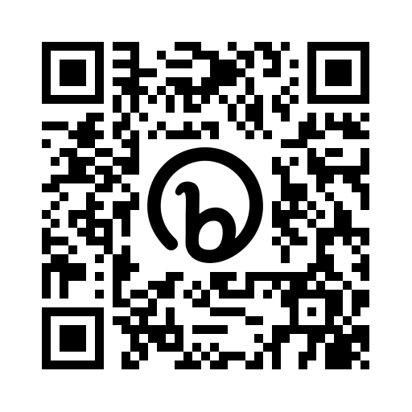

> If you are from Ukraine, you are welcome! See [FAQ](faq.md)
>
> Якщо ви з України, ласкаво просимо. [Перегляньте поширені запитання](faq.md)

På lördag gör vi coola grejer i Uppsala Makerspace för elever i ålder 8 till 88:

Kurs                                                                                                           |Vad                                                                      |Bok
---------------------------------------------------------------------------------------------------------------|-------------------------------------------------------------------------|-----------------------------------------------------------------------------------------------------------
 **Arduino**                                             |En kretskort som programmeras för att bygga maskiner                     | [Arduino för ungdomar](https://github.com/richelbilderbeek/arduino_foer_ungdomar) 
 **Blender**                                    |En 3D ritnings program för att, t.ex. 3D schrivning                      | [Grundkurs i Blender](https://github.com/richelbilderbeek/grundkurs_i_blender)
  **Programmering** |Skapar datorspel, med, bland annat, programmerspråket Processing         | [Processing för ungdomar](https://github.com/richelbilderbeek/processing_foer_ungdomar) och [git for youngsters](https://codeberg.org/richelbilderbeek/git_for_youngsters)

Varja gång du kommer i, får du väljar en av den kurser för den där dag.

Inga förkunskaper krävs.

Det viktigaste i kurserna är att lära sig nya saker tillsammans.

Se "Schema" nedan för mer information.

 * [Ser vår flyer här](publicity/20230414_flyer_usb/20230414_flyer_usb_1.pdf)

### Att vara informerad

Logo                                                |Link
----------------------------------------------------|---------------------------------------------------------
 | **[Email list](https://www.freelists.org/list/loerdagskurser)**
      | **[Discord](https://discord.gg/xrPBqBBEqn)**

### Dagschema

 * Första kursdagen: du är alltid välkommen!
 * Ålder: 8-88 år [*](faq.md)

När  |Arduino och Blender|Processing
-----|-------------------|-----------------------------------
 9:00|([Förberedning](lesson_plans/preparation/README.md) av frivilligarna)|.
10:00|Dörr öppnas        |.
10:15|Början             |.
11:00|Rast               |.
11:15|Fortsättning       |.
12:00|Slut/rast          |Dörr öppnas
12:15|Extratimme         |Början
13:00|Slut               |Rast
13:15|.                  |Fortsättning
14:00|.                  |Slut/rast
14:15|.                  |Extratimme
15:00|.                  |Slut

 * [Plats](#Plats): Uppsala Makerspace i Uppsala, [https://www.uppsalamakerspace.se/](https://www.uppsalamakerspace.se/),
   Ekeby Bruk 6M, 752 63 Uppsala
 * Kostnad per elev (ser [betalning](https://github.com/uppsala-makerspace/loerdagskurser#Betalning) för mer info):
   * Familjmedlemskap: 300 kr varje år
   * September till december: 300 kr 
   * Januari till maj: 300 kr
 * Ålder: 8-88 år [*](faq.md)
 * Krav: en bärbar dator med WiFi [*](faq.md)

Din första lektion kan vara vilken dag som helst.
Även utan förvarning.
Om du vet när du kommer är det trevligt om du berättar det för Richel: `rjcbilderbeek@gmail.com`

Har du en annan fråga? Se [vanliga frågor](faq.md).

## Plats

Lördagskurser är hos Uppsala Makerspace:

```
Uppsala Makerspace
Ekeby Bruk 6M, 752 63 Uppsala
```

Ekeby Bruk är 2 kilometer sydväst av Uppsala centrum:


Makerspacet är nära parkeringsplatsen:


Där kann du ringa på dörren eller knacka på fönstret:


## Veckoschema

Vecka| Dag      |Vad
-----|----------|-------------------------------------
51   |2023-12-23| Jullov
52   |2023-12-30| Jullov
1    |2024-01-06| Jullov
2    |2024-01-13| 1. Första lektion igen
3    |2024-01-20| 2.
4    |2024-01-27| 3.
5    |2024-02-03| 4.
6    |2024-02-10| 5.
7    |2024-02-17| 6.
8    |2024-02-24|Ej kurs, Sportlov
9    |2024-03-02|Ej kurs, Sportlov
10   |2024-03-09| 7.
.    |2024-03-14|[Pi Dag](https://github.com/richelbilderbeek/pi_day) 6:15 @ Olof Palmes Plats
11   |2024-03-16| 8.
12   |2024-03-23| 9.
13   |2024-03-30|Ej kurs, Paskafton
14   |2024-04-06|Ej kurs, Pasklov
15   |2024-04-13| 10. Början jobba åt slutpresentation
16   |2024-04-20| 11. 
17   |2024-04-27|Ej kurs, Valborg
18   |2024-05-04| 12. 
19   |2024-05-11| 13. Övning av slutpresentation
.    |2024-05-12|[Hackathon](activities/20240512_hackathon/README.md)
20   |2024-05-18| 14. [Slutpresentation](activities/20240518_slutpresentation/README.md)
21   |2024-05-25| 15. ?Bjoritowo
22   |2024-06-01| 16. Eftermorsdag
23   |2024-06-08|Ej kurs, sommarlov
24   |2024-06-15|Ej kurs, sommarlov
25   |2024-06-22|Ej kurs, sommarlov
26   |2024-06-29|Ej kurs, sommarlov
27   |2024-07-06|Ej kurs, sommarlov
28   |2024-07-13|Ej kurs, sommarlov
29   |2024-07-20|Ej kurs, sommarlov
 .   |2023-07-22|[Pi Approximation Day](https://github.com/richelbilderbeek/pi_approximation_day) för er själva
30   |2024-07-27|Ej kurs, sommarlov
31   |2024-08-03|Ej kurs, sommarlov
32   |2024-08-10|Ej kurs, sommarlov
33   |2024-08-17|Ej kurs, sommarlov
34   |2024-08-24| 1. Första lektion igen
35   |2024-08-31| ?
36   |2024-09-07| ?
37   |2024-09-14|Kulturnatten och vi är med!
38   |2024-09-21| ?
39   |2024-09-28| ?
40   |2024-10-05| ?
41   |2024-10-12| ?
42   |2024-10-19| ?
43   |2024-10-26|?Ej kurs: höstlov
44   |2024-11-02|Ej kurs: höstlov och Alla Helgonsdag
45   |2024-11-09| ?
46   |2024-11-16|Efterfarsdag (Farsdag är 10:e november)
47   |2024-11-23| ?
48   |2024-11-30| ?
49   |2024-12-06| ?
50   |2024-12-14| ?
51   |2024-12-21|?Ej kurs, jullov


 * Om det fins ingen plats skriven, är det på Uppsala Makerspace
 * Om det fins ingen tid skriven, är det på vanligt kurstid
 * [1] Morsdag är den 28:e maj
 * [Tidigare aktiviteter finns här](veckoschemar.md)

## Årschema

Detta är det övergripande schemat. Ser veckoschema för detaljerna.

När      |Vad
---------|----------------------------
Januari  |Kursen 1:e termin
Juli     |Presentation och utvärdering 
Augusti  |Sommarlov
September|Kursen 2:e termin
December |Presentation och utvärdering

## Betalning

Grundavgiften för en ny (minderårig) elev är 600 kronor, 
vilket inkluderar medlemsavgift för ett år (300 kronor) 
och det första halvårets undervisningshäften (300 kronor).
Medlemskapet i Uppsala Makerspace som gäller för eleven, 
en förälder (som adminstrerar medlemskapet), 
samt alla andra i familjen som vill bli medlemmar under ett år. 
Om andra minderåriga i familjen också vill gå kursen 
behöver de bara betala 300 kronor per termin, 
det vill säga avgiften för undervisningsmaterialet.
Vuxna elever behöver bara ha ett medlemskap.

Du kan betala in via antingen bankgiro (584-8056) eller Swish (123 056 57 47).
Finast är att använder formatet här (`LK` betyder 'Lördags Kurs'):

```
LK: [nam], [email]
```

till exempel:

```
LK: Sven Svensson, sven@svensson.se
```

## [Bilder](bilder.md)

Ser [Bilder](bilder.md).

## Länkar

 * [GitHub repo för Lördagskurser](https://github.com/uppsala-makerspace/loerdagskurser)
 * [https://bit.ly/loerdagskurser](https://bit.ly/loerdagskurser): förkorta länk
 * [Programmeringslag 'tresinformal'](https://github.com/tresinformal/game) för 13-88 åriga
 * [Uppsala Makerspace hemsida](https://www.uppsalamakerspace.se/)
 * [Science Fika](https://www.sciencefika.se): foskare berättar enkla om sina upptäckningar
 * [LaserMaze: en Arduino project](https://github.com/yurtman/LaserMaze) 



> QR code för den här hemsida

## Contributors

 * [Aui Aui Rönnemaa](https://github.com/auironnemaa)
 * [mardub1635](https://github.com/mardub1635)
 
## Statuses

[](https://github.com/uppsala-makerspace/loerdagskurser/actions/workflows/check_links.yaml)
[](https://github.com/uppsala-makerspace/loerdagskurser/actions/workflows/jekyll-gh-pages.yml)

hi!
