# Slutpresentation och utvärderig

> En tidigare slutpresentation

 * Vad: Slutpresentation och utvärderig
 * När: Lördag 10:e December
 * Målet: att elever får visar deras mästarevärk
 * Vem: varje en
 * Var: [Uppsala Stadsbibliotek](https://bibliotekuppsala.se/web/arena/stadsbiblioteket), Svartbäcksgatan 17, 753 75 Uppsala
 * Kostnad: ingenting
 * Tiderna: 11.00-13.00

När  |Besökare                           | Elever
-----|-----------------------------------|-----------------------
11:00|Dör öpnas [G]                      | Dör öpnas [M]
11:01|Väntar med kaffe, te och kakor [G] | Förbereda presentation [M]
11:30|Kollar på presentationer  [M]      | Ger presentationer  [M]
12:00|Rast [M]                           | Rast  [M]
12:15|Utvärdering med föräldrar [M]      | Anonym utvärdering [B]
13:00|Slut                               | Slut

 * [G] Grupprum brevid Mallassal
 * [M] Mallassal
 * [B] Biblioteket

Tider är bara riklinjer, ofta slutar vi tidigare.

> Det är här

## Presentationsschema

Vem                 |Vad
--------------------|---------------
Kevin               |Super Mario Bros 1-1
Roni                |Handdisco
Gunnar              |IR Bil
Team Sus-USB stickor|Konstig spel
Team Slumpen        |Slumpspel

## Text till UNT

Lördag 10:e December kl 11.00 till 13.00 presenterar ungefär 17 elever från Uppsala Makerspace visar sina mästervärk som har med datorspel eller elektronik (Arduino) att göra. Alla är välkomna i Stadsbiblioteket! Mer information finns på http://bit.ly/loerdagskurser.

## Schema för frivilligäre

 * Richel: teknik
 * Björn B: briefing utvärderingsmännika
    * Linus
    * Björn B
    * Sara
    * Far Gunnar
 * Björn E: gästgivare
 * Johanna: foton

När  |Frivilligare
-----|-----------------------------------
10:00|Brygga kaffe, te [UMS]
10:30|Ta elevmojänger, kaffe, te, socker, kaffemjölk till USB
10:45|Vänta till USB öppnar
11:00|Gästgivare [G], Björn B: briefing utvärderingsmänniska [M], teknik/Richel [M]
11:30|Kollar på presentationer  [M]
12:00|Gästgivare [M]
12:15|Utvärdering med föräldrar [M]
13:00|Slut

 * [UMS] Uppsala Makerspace
 * [USB] Uppsala Stadsbibliotek
 * [G] Grupprum brevid Mallassal
 * [M] Mallassal
 * [B] Biblioteket

## Foton

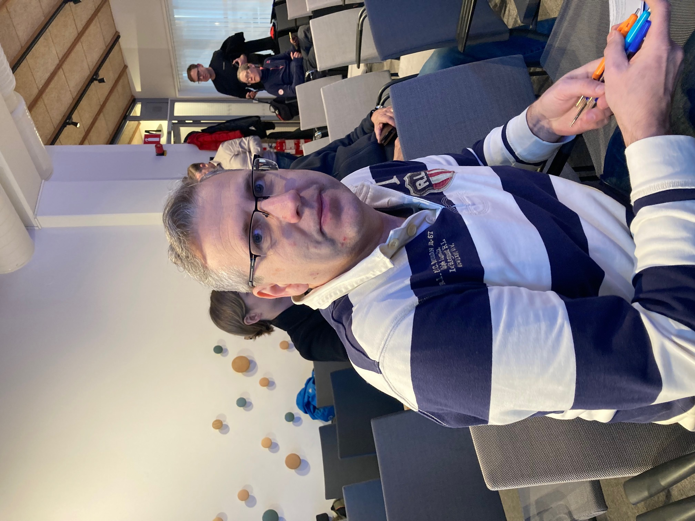

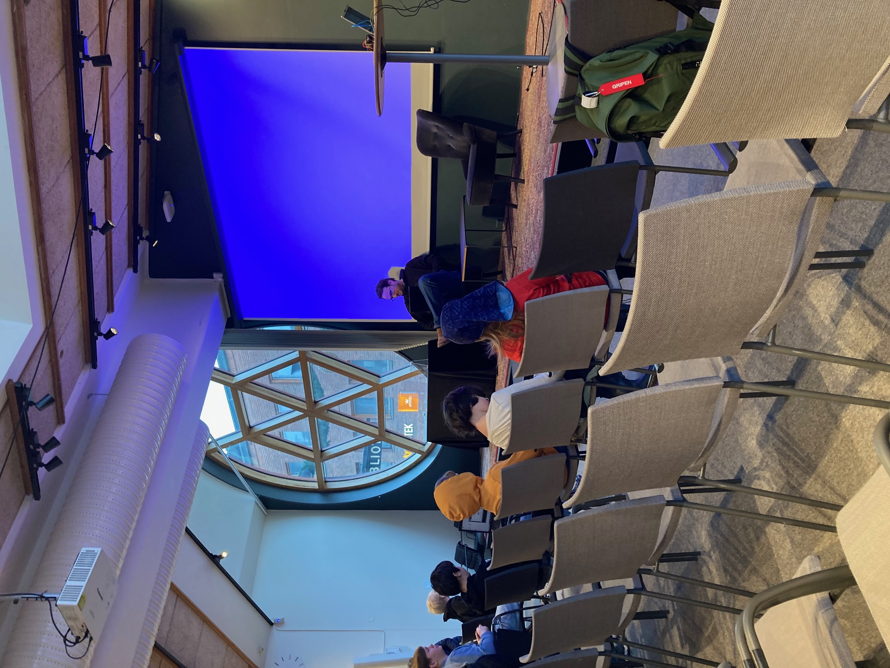
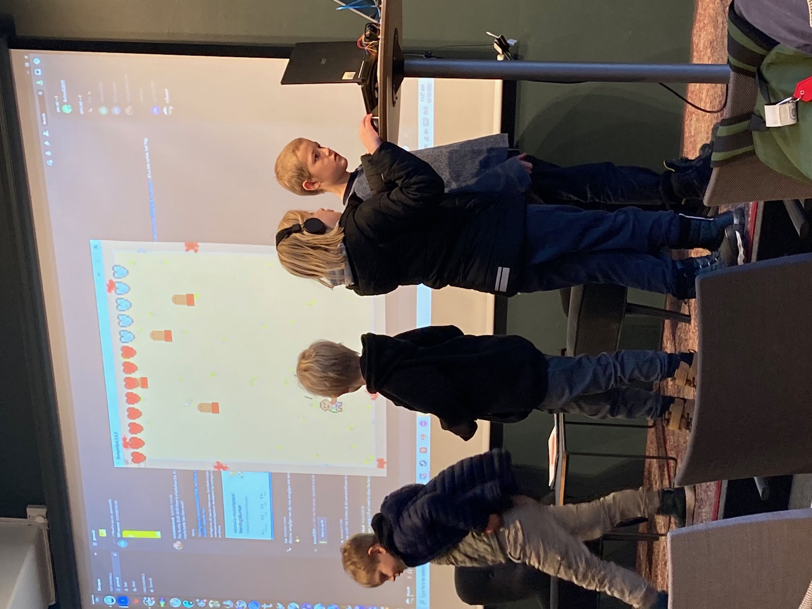

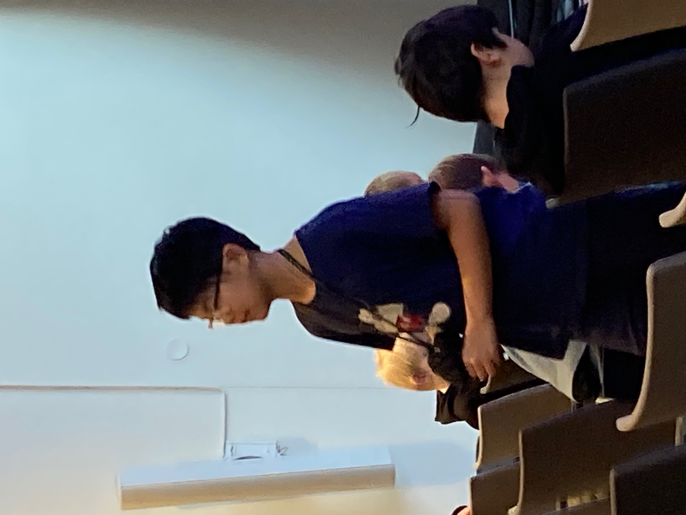
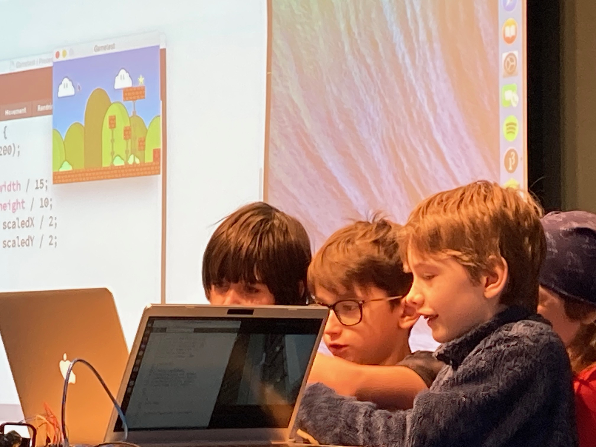
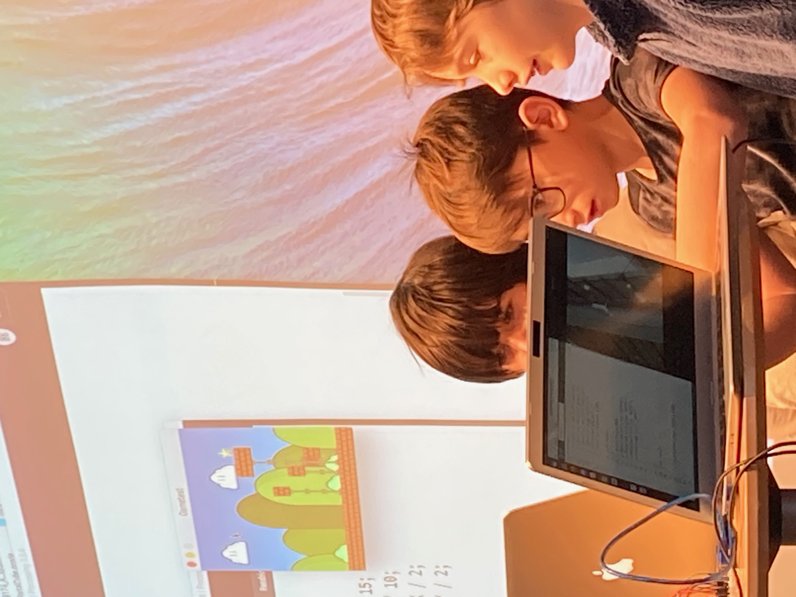

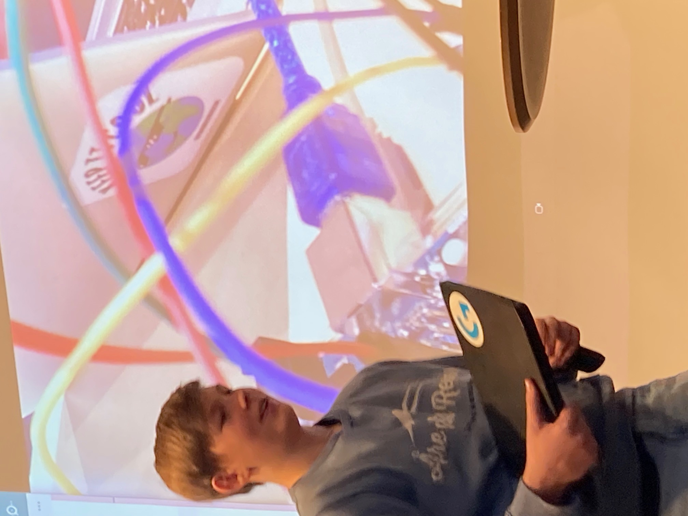
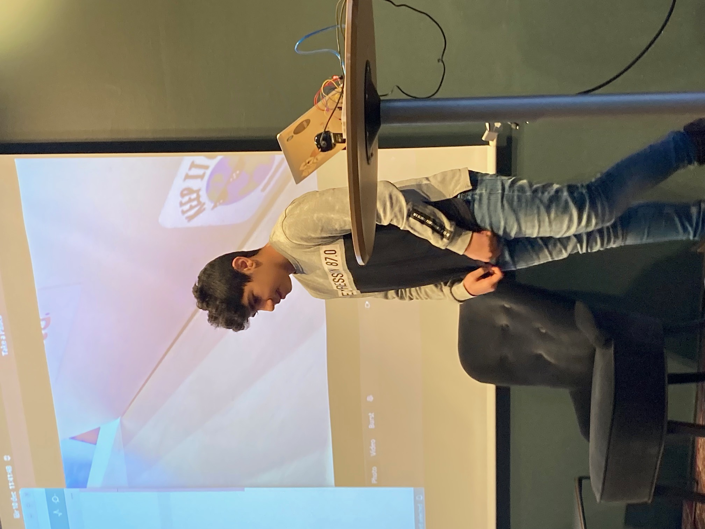

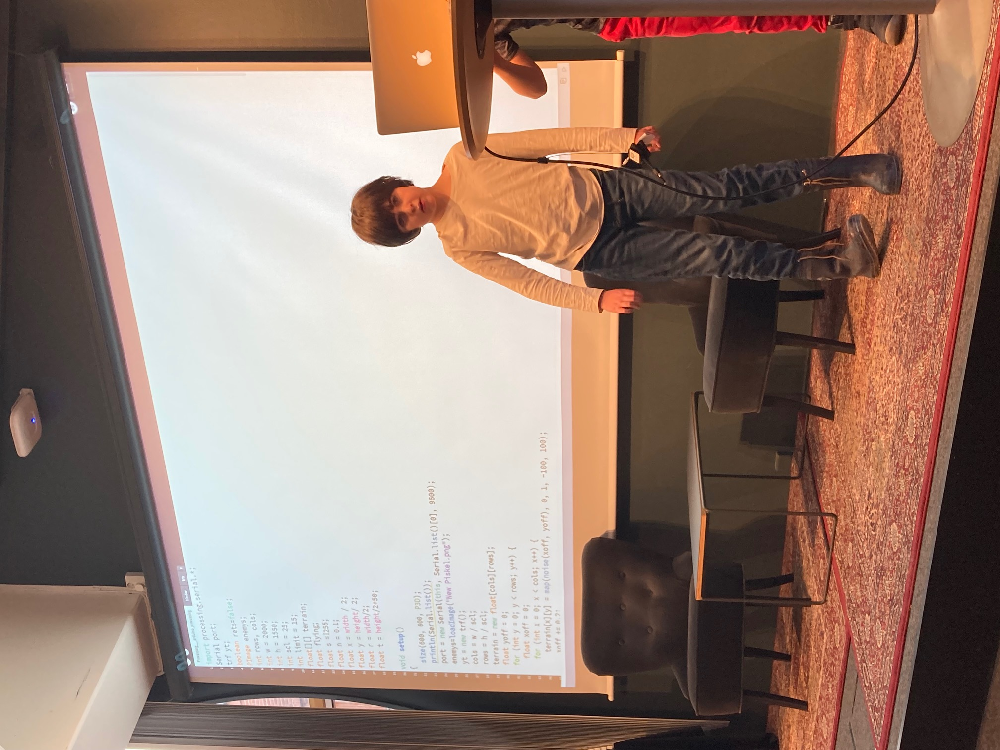

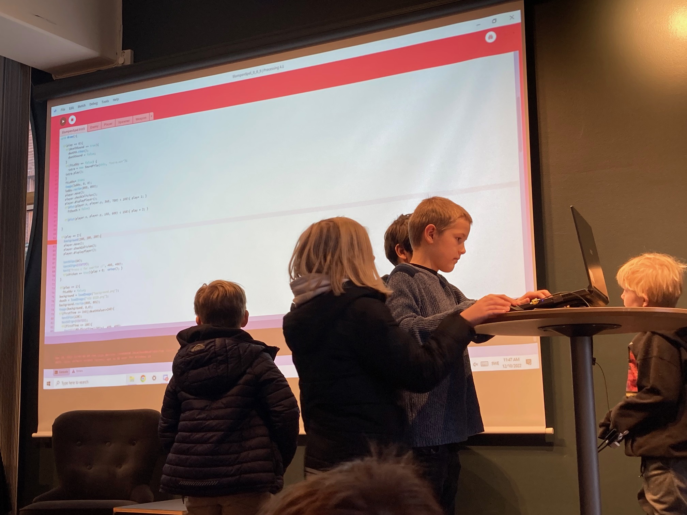

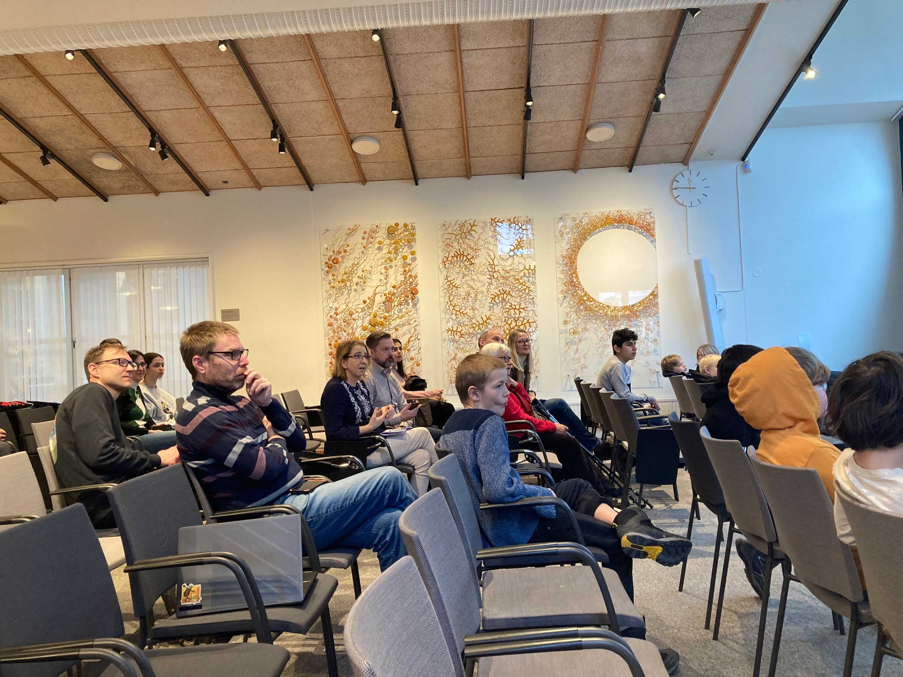

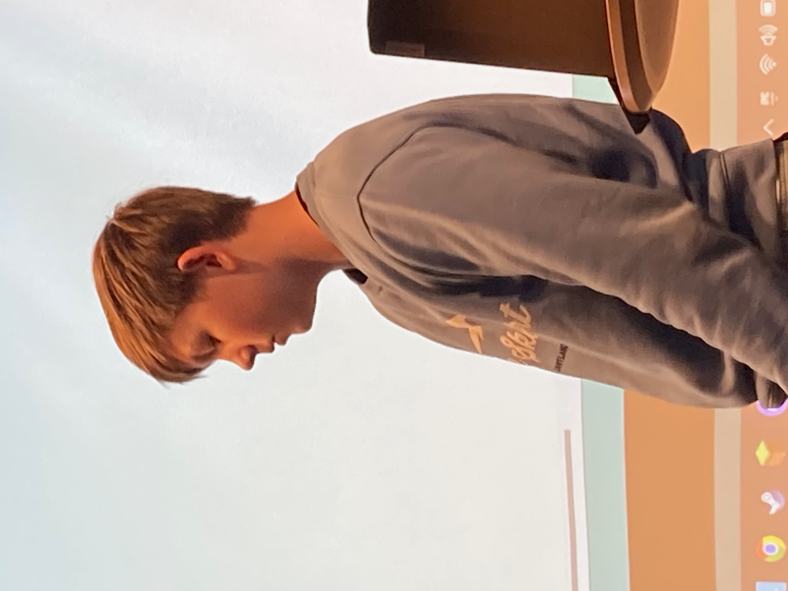

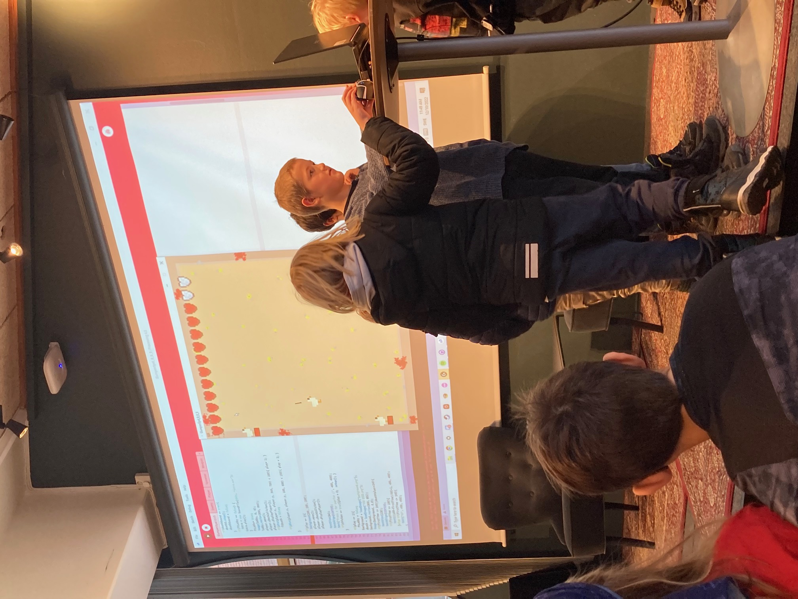

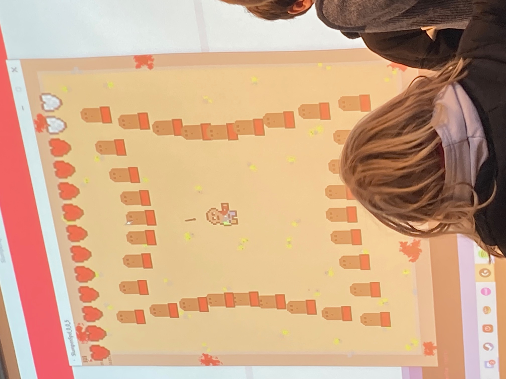

