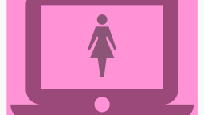

# Efterkvinnansdag

This page is in both :gb: [English](#English) (top) och på :sweden: [Svenska](#Svenska) (nedåt)

## English

:gb:

 * Goal: to teach programming to the women from Uppsala Women Coding ('UWC')
   and make them feel welcome
 * Who: the students from the Saturday course and women from Uppsala Women Coding ('UWC')
 * Where: Uppsala Makerspace
 * Cost: nothing
 * Times: same schedule as usual
 * When: Saturday 11 March 2022 (the first Saturday after [International Women's Day](https://en.wikipedia.org/wiki/International_Women%27s_Day), at the usual times, see below

When | What
-----|------------
10:00|The door opens
10:15|Start
11:00|Break
11:15|Continuation
12:00|End

This activity is a regular lesson,
but with women from UWC who are extra students.
The students teach and the UWC women finally get to learn
what cool stuff we do in our course!

### FAQ

#### Am I welcome?

Yes!

There is a limit of 10 participants, 
due to safety regulations (think: in case of a fire) 
of Uppsala Makerspace.

#### What are we going to do?

You'll have your first lesson at the Lördagskurserna ('The Saturday Courses')
at Uppsala Makerspace, to see if you like it there.

You can pick between Arduino (electronics and programming), 
Blender (3D modelling) and Processing (programming, e.g. for making games).
At the end of the event, we'll discuss if we can form a team for the UWC women.

#### What do I need to bring?

A laptop would be great, but we have some you can borrow.

#### I cannot read/speak Swedish, is that OK?

Yes, that is OK. Most course material is in Swedish, yet (1) it is also digitally available, so Google Translate can easily be used (2) most code is English anyway.

It will work :-)

## Swedish

:sweden:

 * Målet: att undervisa programmering till kvinnor från Uppsala Women Coding ('UWC')
 * Vem: eleverna från Lördagskursen och kvinnor från Uppsala Women Coding ('UWC')
 * Var: Uppsala Makerspace
 * Kostnad: ingenting
 * Tiderna: samma schema som vanligt
 * När: Lördag 11:e Mars 2022 (den fösta lördag after [International Women's Day](https://en.wikipedia.org/wiki/International_Women%27s_Day), på den vanliga tider, se nedåt

När  |Vad
-----|------------
10:00|Dörren öppnas
10:15|Start
11:00|Rast
11:15|Fortsättning
12:00|Slut

Den här acktivitet är en vanligt lektion, 
men med kvinnor från UWC som är extra elever.
Eleverna undervisar och UWC kvinnorna äntligen får lära sig 
vilken coola grejer vi gör i vår kurs!

## Vanliga frågor

### Jag pratar ej svenska. Är det OK?

Absolut, det är ingen fara alls! Kanske du vill läsa [the English of this webpage](#English) istället.

## Länkar

 * [Uppsala Women Coding](https://www.meetup.com/Uppsala-Women-Coding-Beginners-welcome)
