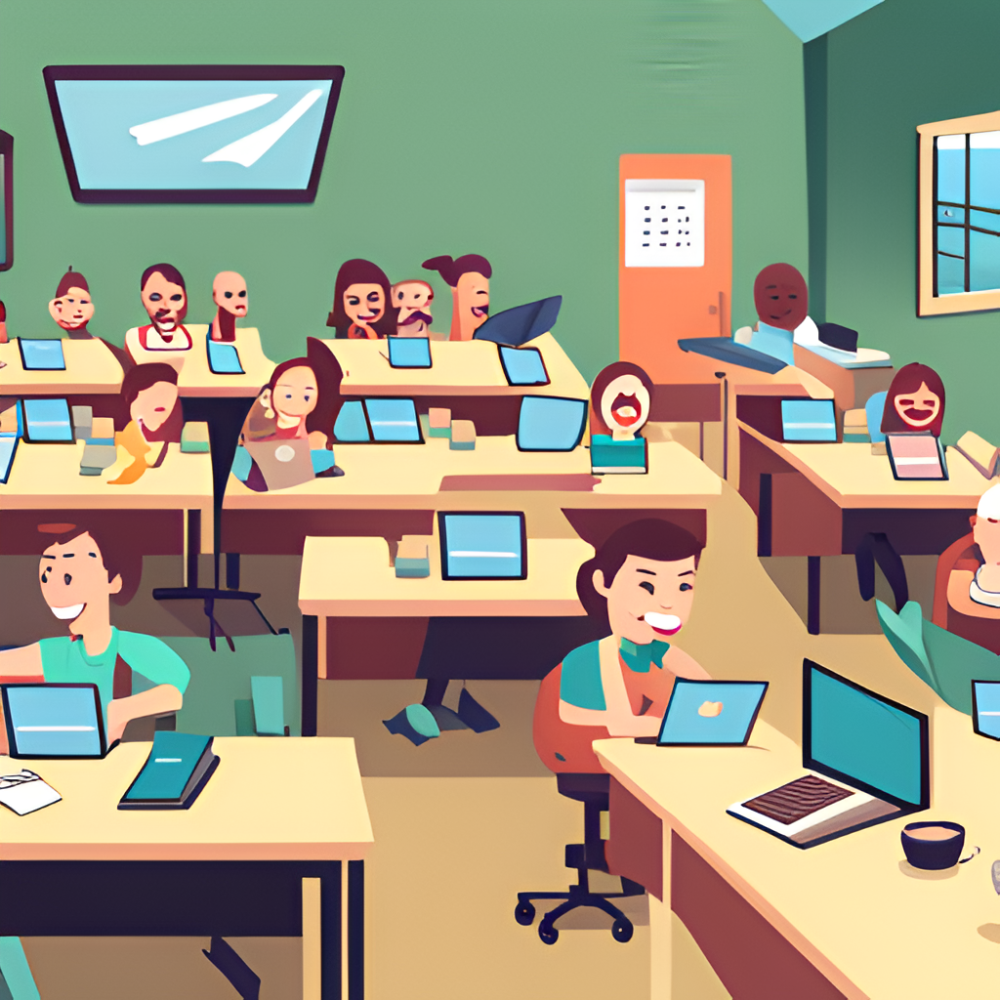

# 2023-09-09 Kulturnatten

 * Målet: att undervisa programmering till Kulturnattens besökare
 * Vem: elverna från Programmeringskursen
 * Var: Uppsala Stadsbibliotek
 * Tiderna: 11:00-19:00 (men eleverna undervisa bara flera timmar :-) )

OBS, hos Makerspacet finns också saker att göra.

## Vanliga frågor

### När är jag välkommen?

Någonsin mellan klockan 11:00 och 19:00.

Schemat är här:

När        |Vem
-----------|------------------
11:00-12:00|Richel, Herman, Leslie, Dahlia 
12:00-13:00|Richel, Herman, Angela, Leslie, Dahlia
13:00-14:00|Richel, Herman, Angela, David
14:00-15:00|Richel, Herman, David, Gunnar
15:00-16:00|Richel, Herman, Love, Edgar, Gunnar
16:00-17:00|Richel, Herman, Love, Edgar
17:00-18:00|Richel, Herman, Vidar, Erland 
18:00-19:00|Richel, Herman, Vidar, Erland

### Hur länge skulle jag hjälpa med?

Om du hjälper med en timme är Richel redan riktigt nöjd. 

Redan om du undervisar en person får du en Uppsala Makerspace 
T-shirt (vi ska skapar den i lektionen!).

Men om du kann och vill får du hjälper helt evenemangen. 
Eller tar en timme rast före kommer tillbaka.

### Vad ska vi göra?

Vi ska undervisa programmering och/eller Arduino.

### Vad måsta jag tar med?

Kort svar: ingenting :-). Du får tar med dig dina egna grejer på egen risk.

 * Mat och dryck: Richel fixar det för dig. 
   Vill du tar med din egna dryck och mat är det inget problem
 * Dator: vi har tillräckligt mycket datorer (sex, för att vara exact).
   Om du riktigt vill använder din egna, är det okay,
   men du är säkrare att har ingen skada på din dator när du
   använder Makerspacets datorer (obs, aldrig har nåt hänt med
   kursdatorer, men det behövs inte håller i evigheten)
 * Arduino: samma sak som datorer. Du får utställa dina Arduino projekter,
   men vi kan aldrig vara säkert att dina grejer är trygg

## Har gick det i 2022?

Här är bilder av 2022, på tiden att vi just började.
På slutet hade det inte varit för lugnt alls 
och har vi fått hundratals besökare!

> Sista årets Kulturnatten
