# Slutpresentation och utvärderig

> En tidigare slutpresentation

 * Vad: Slutpresentation och utvärderig
 * När: Lördag 9:e December 2023
 * Målet: att elever får visar deras mästarevärk
 * Vem: varje en
 * Var: [Uppsala Stadsbibliotek](https://bibliotekuppsala.se/web/arena/stadsbiblioteket), Svartbäcksgatan 17, 753 75 Uppsala
 * Kostnad: ingenting
 * Tiderna: 11.00-13.00

När  |Besökare                           | Elever
-----|-----------------------------------|-----------------------
11:00|Dör öpnas [G]                      | Dör öpnas [M]
11:01|Väntar med kaffe, te och kakor [G] | Förbereda presentation [M]
11:30|Kollar på presentationer  [M]      | Ger presentationer  [M]
12:00|Rast [M]                           | Rast  [M]
12:15|Utvärdering med föräldrar [M]      | Anonym utvärdering [B]
13:00|Slut                               | Slut

 * [G] Grupprum brevid Mallassal
 * [M] Mallassal
 * [B] Biblioteket

Tider är bara riklinjer, ofta slutar vi tidigare.

> Det är här

## Presentationsschema

Vem                   |Ålder|Kurs|Vad
----------------------|-----|----|----------------
Dahlia                |8    |P   |Vacker regenb...
Angela                |9    |A   |Neopixel
Enrico                |9    |P   |Random röd
Xiuchang              |9    |P   |Random
Daniel                |10   |P   |Gräsmatta Quest
Kevin                 |10   |P   |Physics Engine
Sannan                |10   |B   |Igndominus
Vide                  |11   |B   |Rabbit hat
Teo                   |12   |P   |Pizza
WALL-E 38             |11   |ABP |WALL-E 38
Team Smile.exe.co TM  |11   |B   |Battle Island
Team Smile.exe.co TM  |.    |B   |Davidsgoofyahhtree
Felipe och Pablo's lag|11   |P   |Studsar
Isaac's lag mkn       |11   |P   |Halcony Infynity
UFO                   |13   |P   |UFO 2D2

 * WALL-E 38: David L, Emil, Vidar
 * Team Smile.exe.co TM: Daniel H, David H, Felix
 * Isaac's lag med konsigt namn: Felipe, Isaac, Pablo
 * Felipe och Pablo's lag: Felipe, Pablo

## Pictures

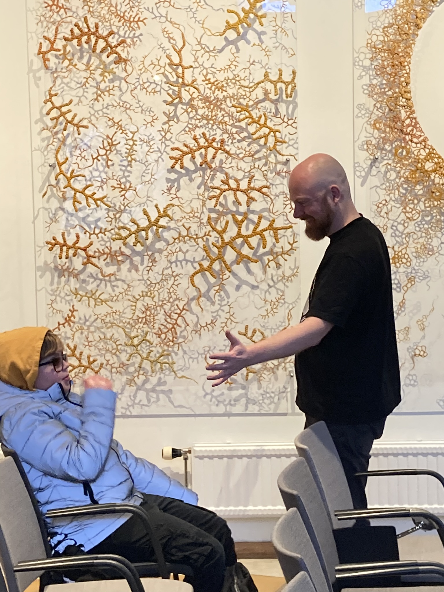

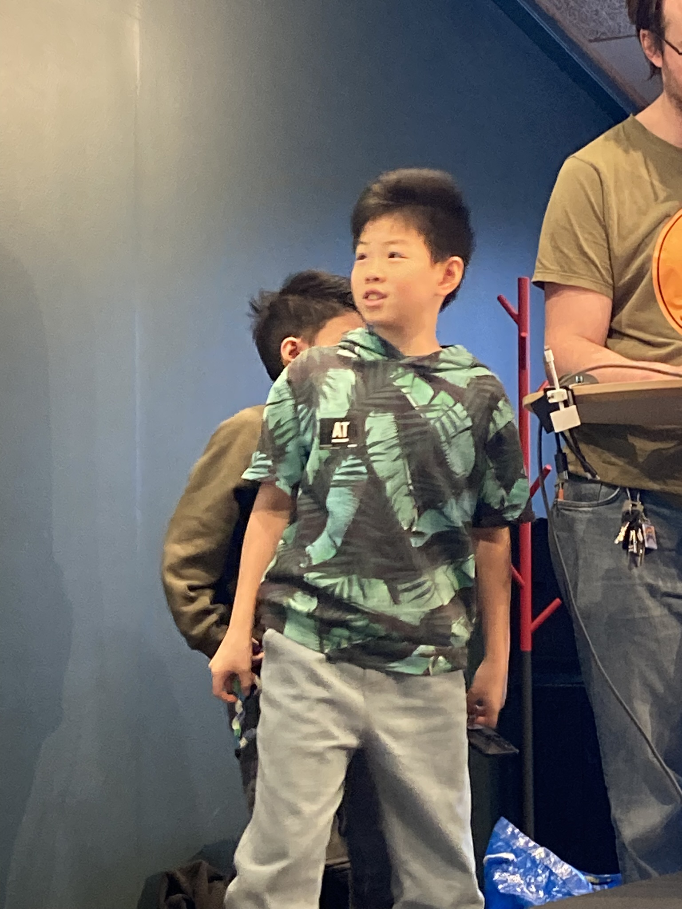

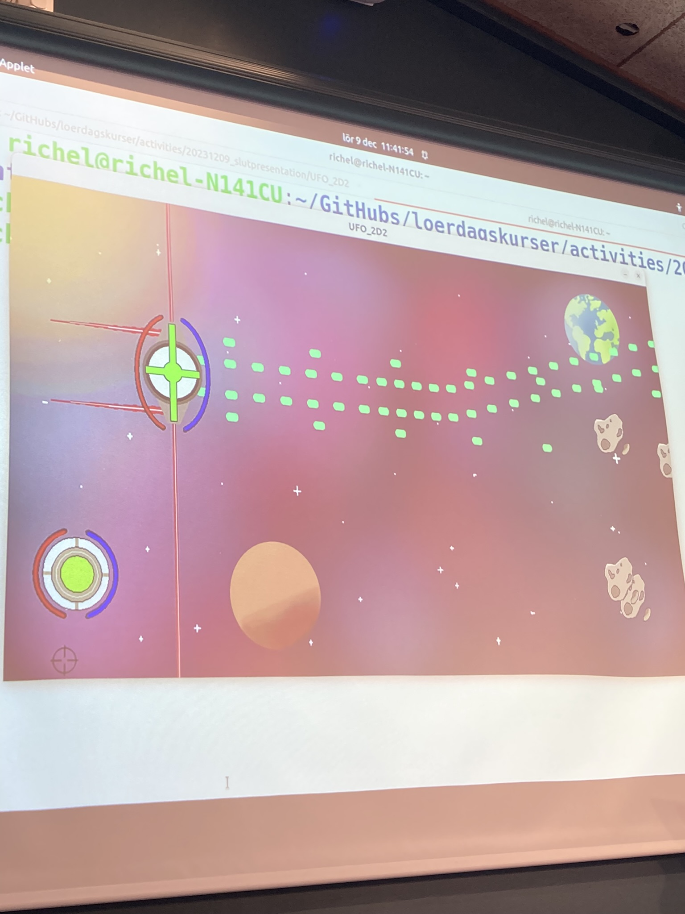

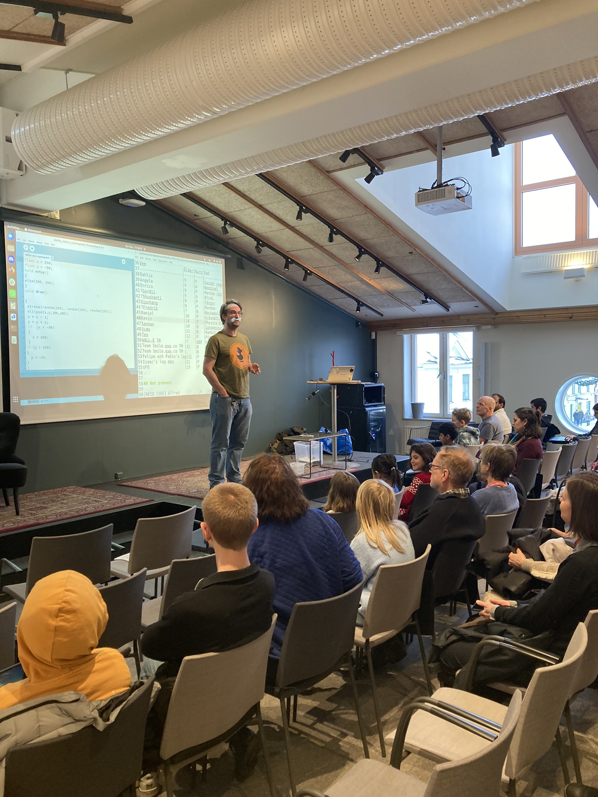
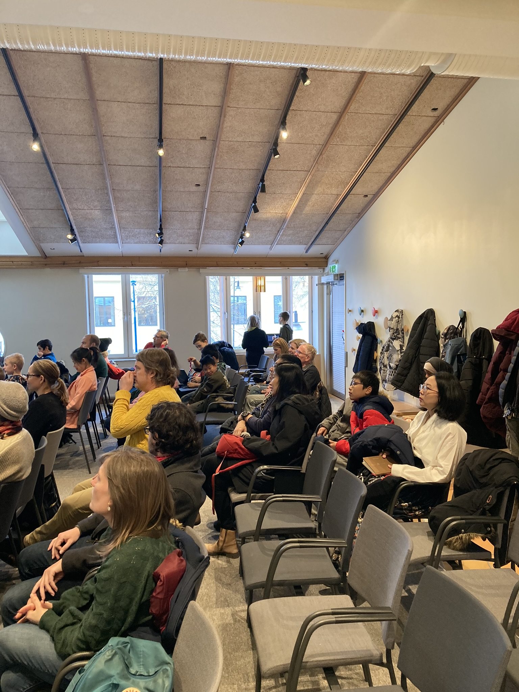

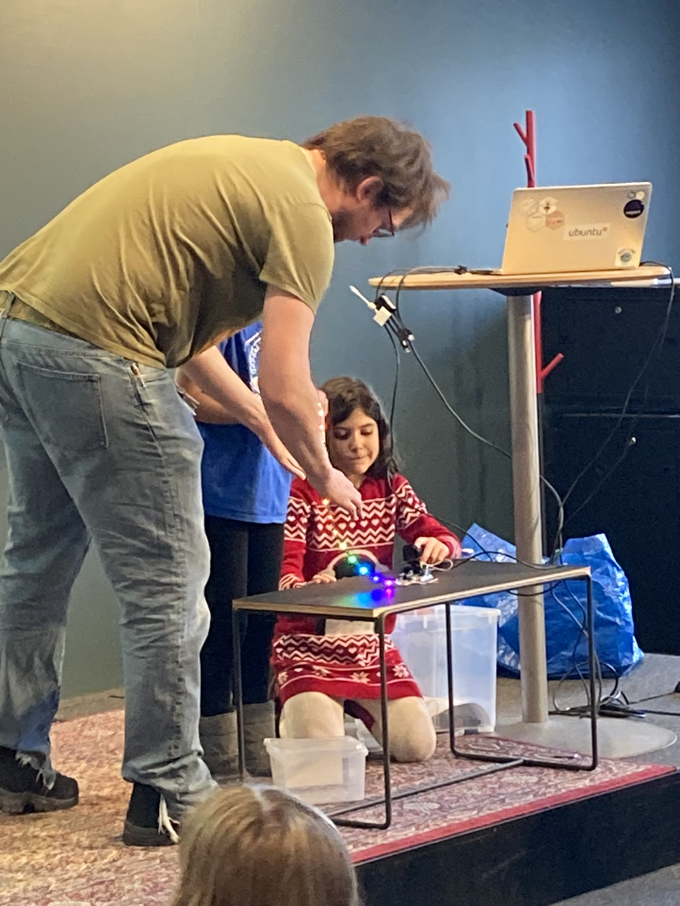

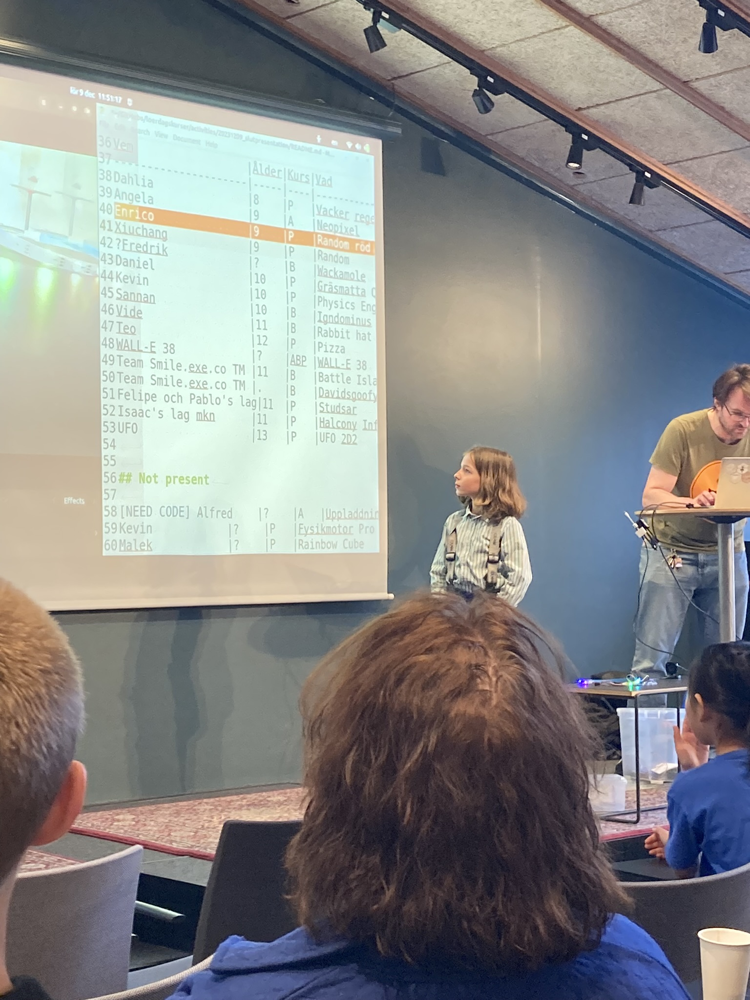

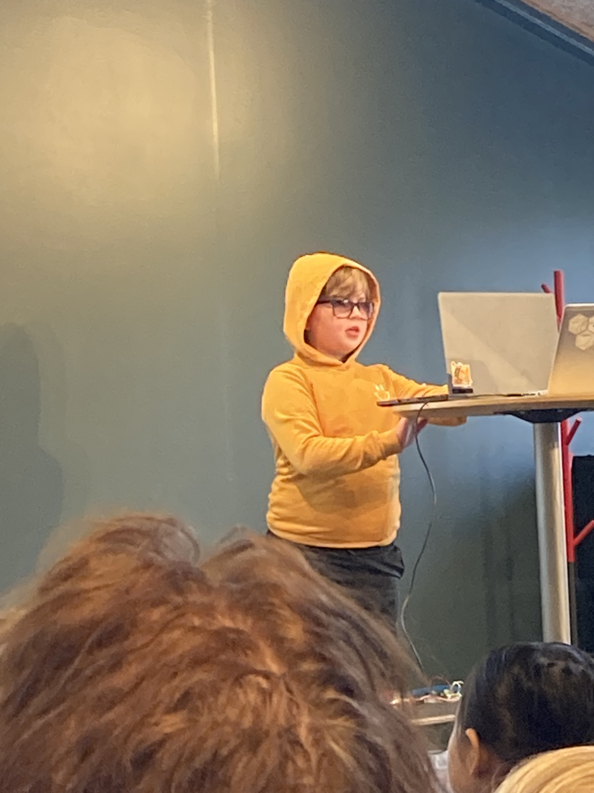

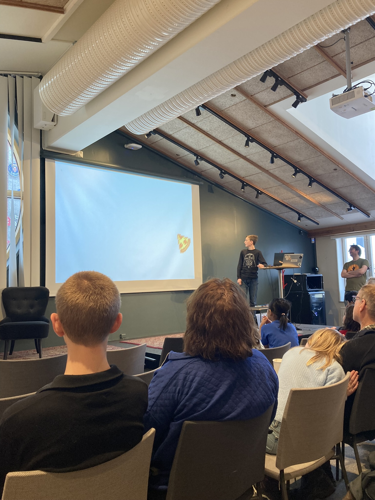
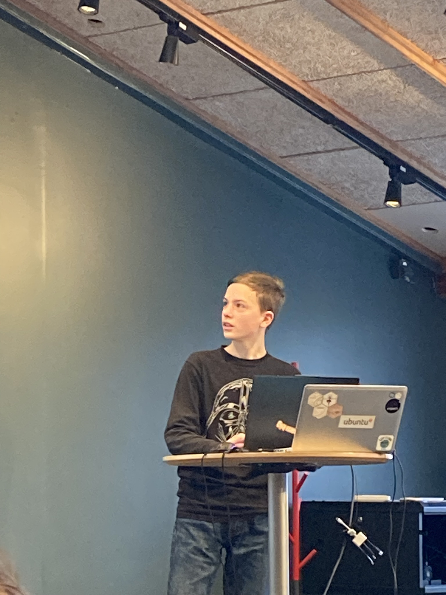
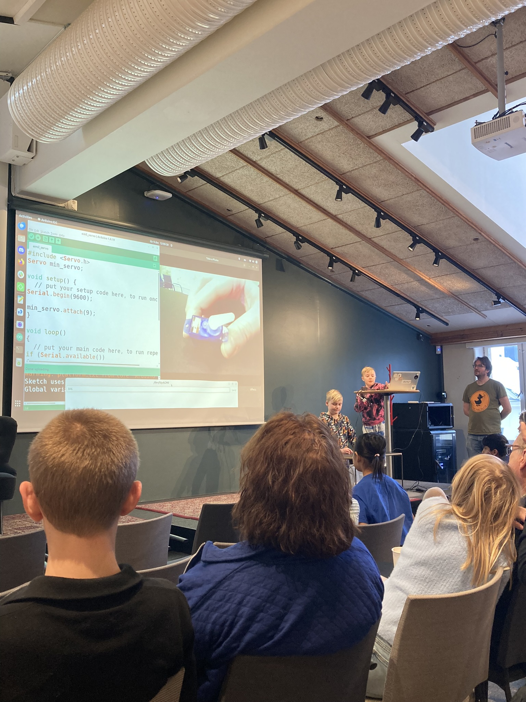

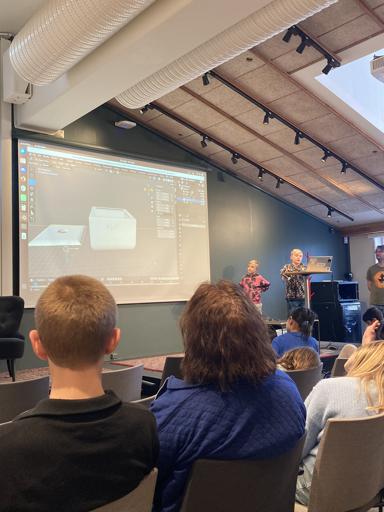

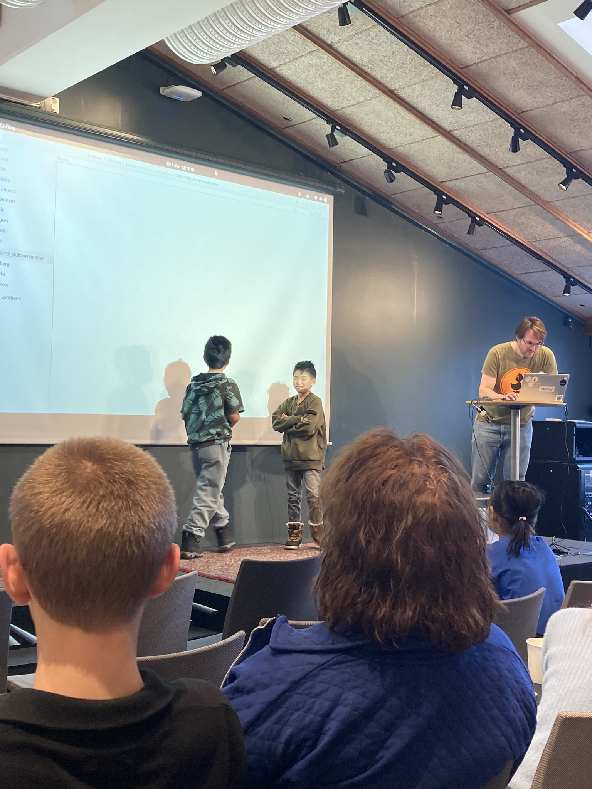

## Notes for next time

 * Build-up time was 45 minutes for 14 presentations,
   hence it takes about 3 mins per presentation

