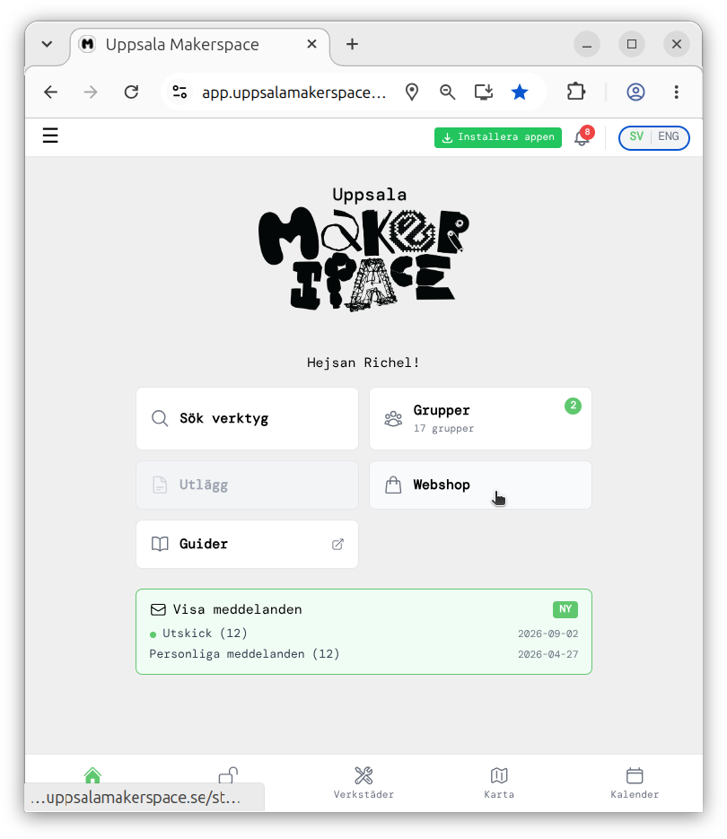
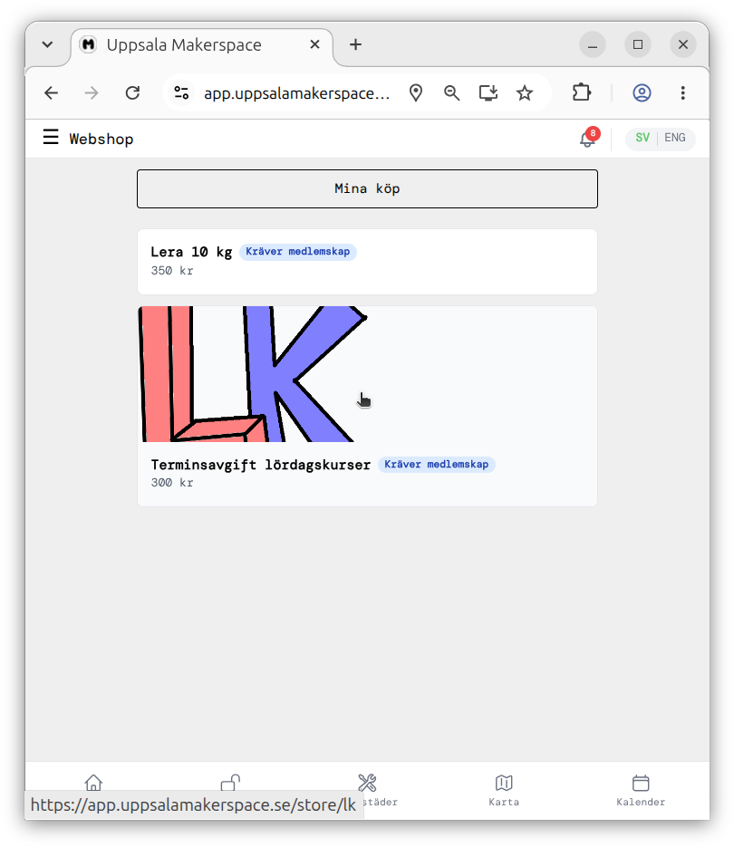
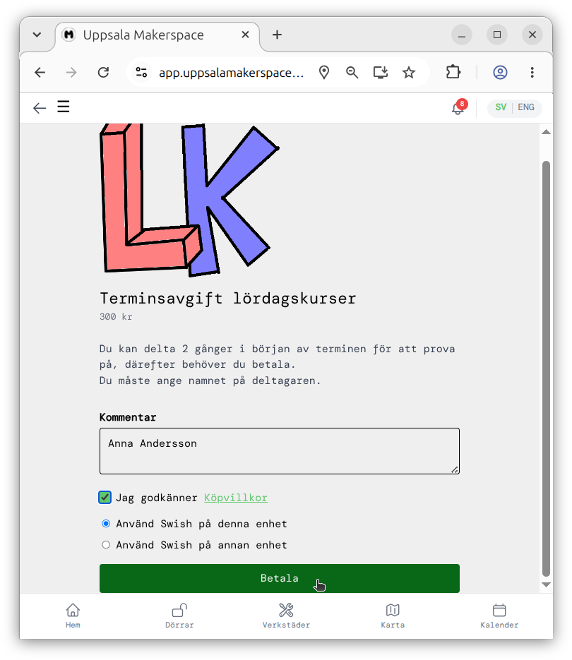
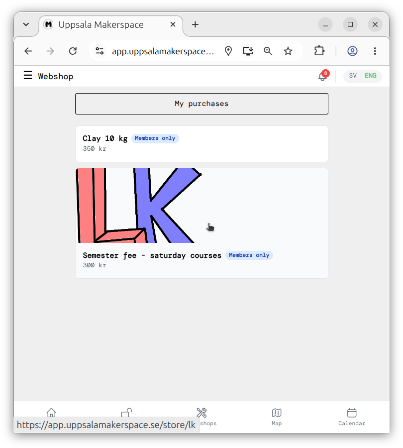

---
tags:
  - betalning
  - payment
  - contribution
  - money
  - penger
  - kostnader
---

# 🇸🇪 Betalning 🇬🇧 Contribution

=== "🇸🇪"

    Först: pengar ska aldrig vara ett hinder för att delta i lördagskurserna.
    Om du inte har möjlighet att betala kursavgiften i nuläget,
    vänligen meddela Richel
    (du behöver inte ange någon anledning),
    så är du än mer välkommen att delta.

    För att delta i lördagskurserna behöver man:

    - ha ett bas familjemedlemskap
    - betala terminsavgifter får varje halv år

    Båda delarna kan ordnas via Uppsala Makerspaces app,
    som kan användas och/eller laddas ner på
    [`https://app.uppsalamakerspace.se/`](https://app.uppsalamakerspace.se/).

    ???- question "Hur ser det ut?" 

        Så här ser Uppsala Makerspaces app ut
        när den används i en webbläsare:

        

    För att skaffa ett bas familjemedlemskap skapar du ett konto i
    [Uppsala Makerspaces app](https://app.uppsalamakerspace.se/),
    varefter du kan köpa ett bas familjemedlemskap.
    Appen guidar dig genom denna enkla process,
    men om du behöver ytterligare instruktioner hittar du dem
    [här](https://tutorial.uppsalamakerspace.se/app/newMembers/).

    För att betala kursavgiften:
    gå till webbutiken i [Uppsala Makerspaces app](https://app.uppsalamakerspace.se/),
    välj 'Terminsafgift - Lördagskurser'
    och besvara de enkla frågorna där.

    ???- question "Hur ser det ut?" 

        Klicka på 'Webshop' i
        [Uppsala Makerspaces app](https://app.uppsalamakerspace.se/)

        

        Klicka på 'Terminsafgift - Lördagskurser' i webbutiken. 

        

        Fyll i uppgifterna för betalning av terminsavgiften och klicka
        på 'Betala'. 

        

        Betala med din favorit betalningsmetod.

    Tack för att vara del av lördagskurserna!

=== "🇬🇧"

    First, money should never be a problem at the Saturday courses.
    If you cannot afford our course fee, please let Richel know (no need
    to specify a reason) and you are (even more) welcome at the courses.

    To participate in the Saturday courses, one needs to:

    - have a basic family membership
    - pay the course fee every half year

    Both can be done in the Uppsala Makerspace app,
    that can be used and/or downloaded at
    [`https://app.uppsalamakerspace.se/`](https://app.uppsalamakerspace.se/).

    ???- question "How does that look like?"

        This is how the Uppsala Makerspace app looks like,
        when run from a webbrowser:

        

    To get a basic family membership, create an account in the
    [Uppsala Makerspace app](https://app.uppsalamakerspace.se/),
    after which you can buy a family membership.
    The app guides you through this simple process,
    but if you need more instructions you can find these
    [here](https://tutorial.uppsalamakerspace.se/en/app/newMembers/).

    To pay the course fee,
    in the [Uppsala Makerspace app](https://app.uppsalamakerspace.se/),
    go to the webshop, select 'Semester fee - Saturday courses'
    and fill in the simple questions there.

    ???- question "How does that look like?"

        In the [Uppsala Makerspace app](https://app.uppsalamakerspace.se/),
        click on 'Webshop'

        

        In the webshop, click 'Semester fee - Saturday courses'.

        

        In the semester fee payment, fill in the details and click 'Pay'.

        

        Pay in your favorite way.

    Thanks for being part of the Saturday courses!
