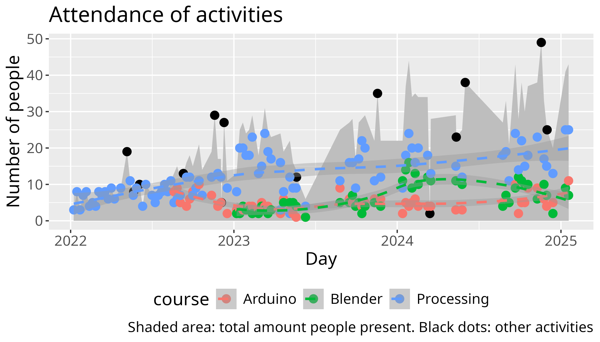
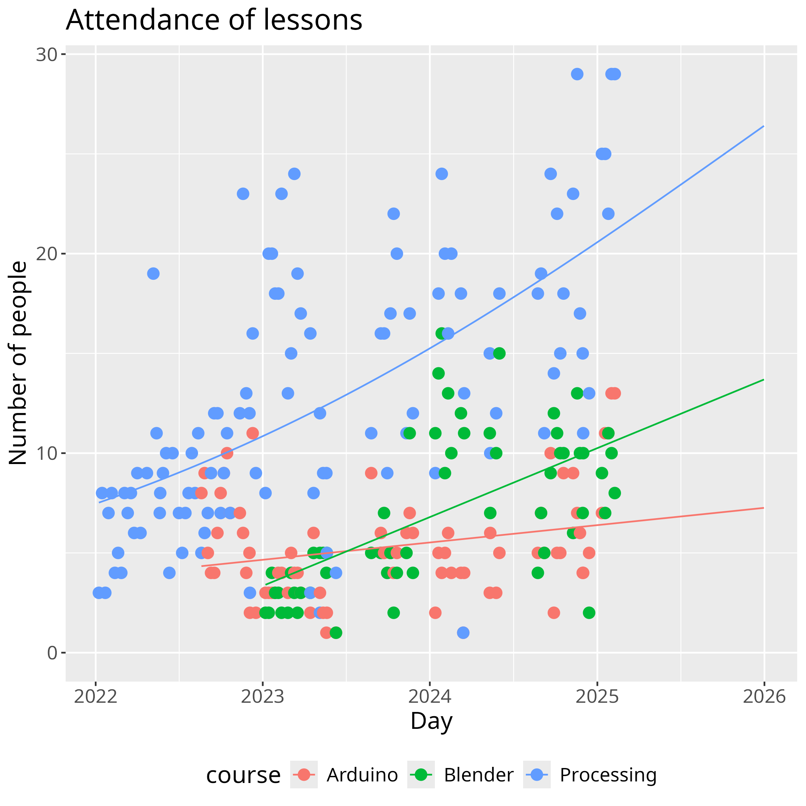

# Learners' statistics

Data:

- [n_learners_per_course_per_day.csv](n_learners_per_course_per_day.csv)
- [n_learners_per_day.csv](n_learners_per_day.csv)

As a plot:

Predictions:

> Predictions 2025, using a logistic model if it would apply,
> else using a linear model.
