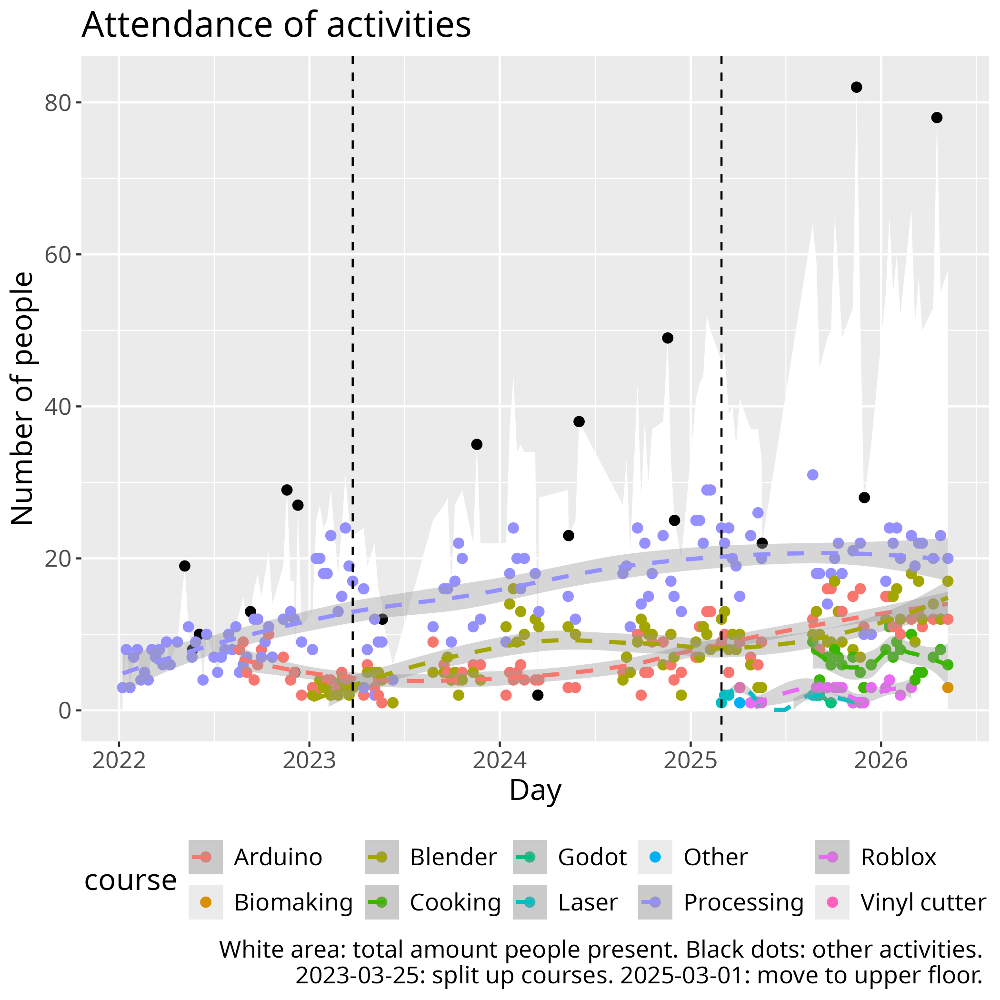
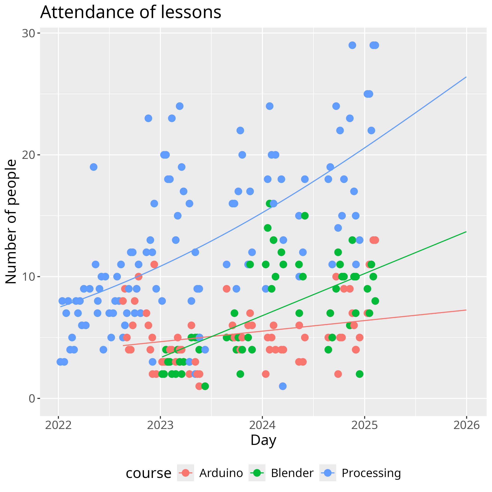
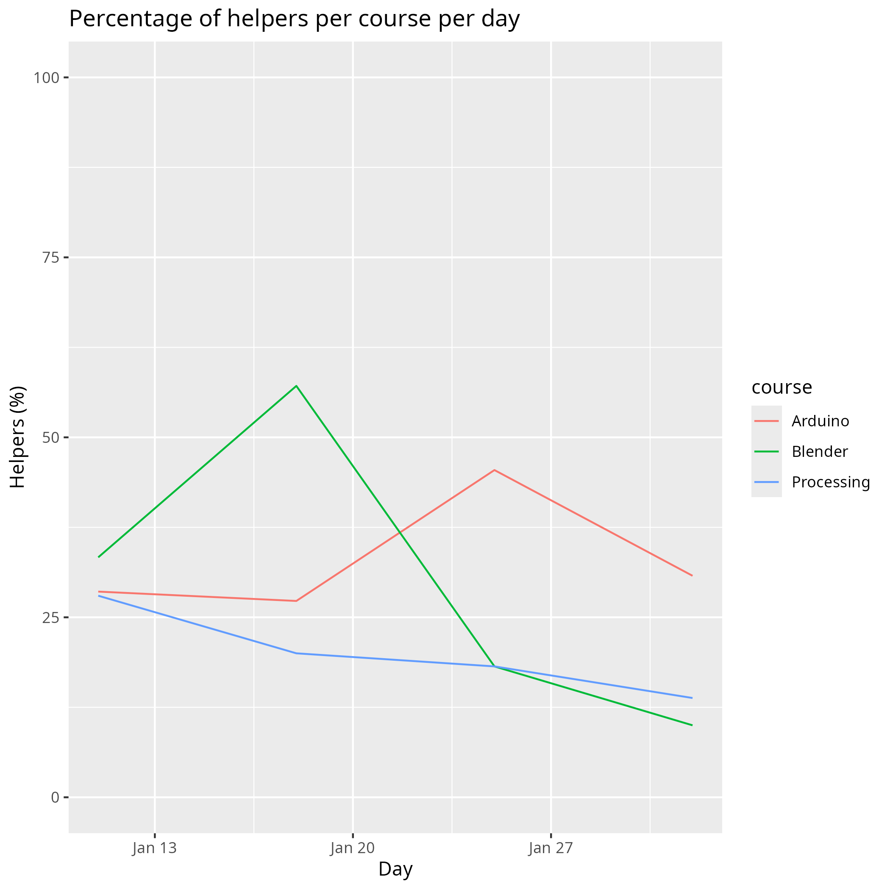

# Learners' statistics

Data:

- [n_learners_per_course_per_day.csv](n_learners_per_course_per_day.csv)
- [n_learners_per_day.csv](n_learners_per_day.csv)

As a plot:

Predictions:

> Predictions 2025, using a logistic model if it would apply,
> else using a linear model.

Percentage of learners willing to help a new learner:

## Overview

Parameter                  |2023|2024|2025
---------------------------|----|----|----
Total course visits        |637 |833 |1353
Total Arduino visits       |113 |135 |326
Total Blender visits       |110 |255 |253
Total cooking course visits|.   |.   |87
Total laser cutting visits |.   |.   |16
Total Processing  visits   |409 |443 |608
Total female visits        |83  |120 |154
Total male visits          |554 |713 |1199
Unique female visitors     |16  |30  |37
Unique male visitors       |85  |93  |120

- 'Total course visits' is the amount of courses visited.
  If a learner
  visits two courses on a day (e.g. the cooking course and the Blender
  course), this counts as two visits
- 'Total female visits' is the amount of courses visited by females.
  If a female
  visits two courses on a day (e.g. the cooking course and the Blender
  course), this counts as two visits
- 'Unique female visitors' is the amount of unique/different females
  that visited one or more courses.
  If a female
  visits two courses on a day (e.g. the cooking course and the Blender
  course), she is still counted as 1 unique person
- The dot (`.`) means 'Not applicable',
  as these courses did not exists then and/or were not formally measured
  then
