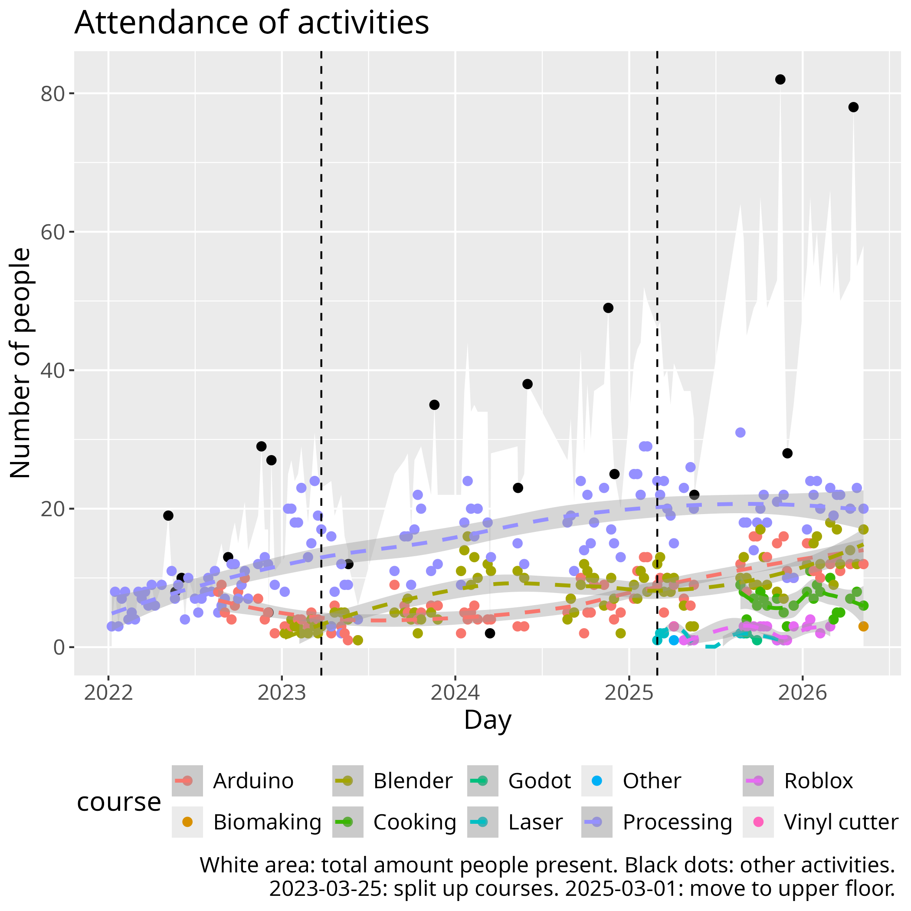
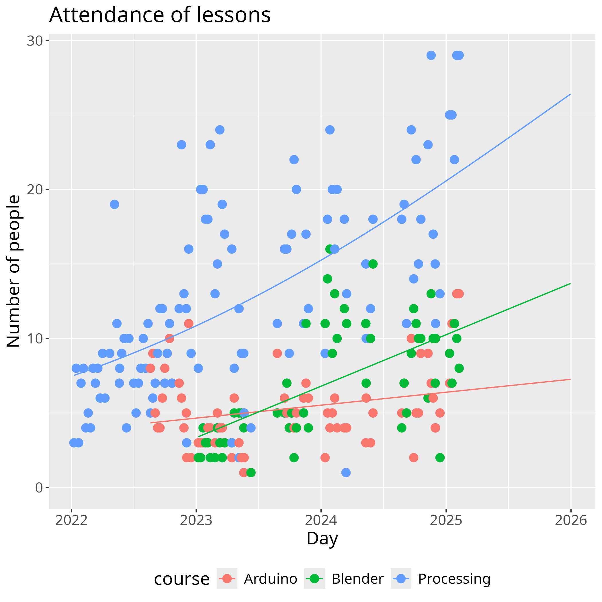
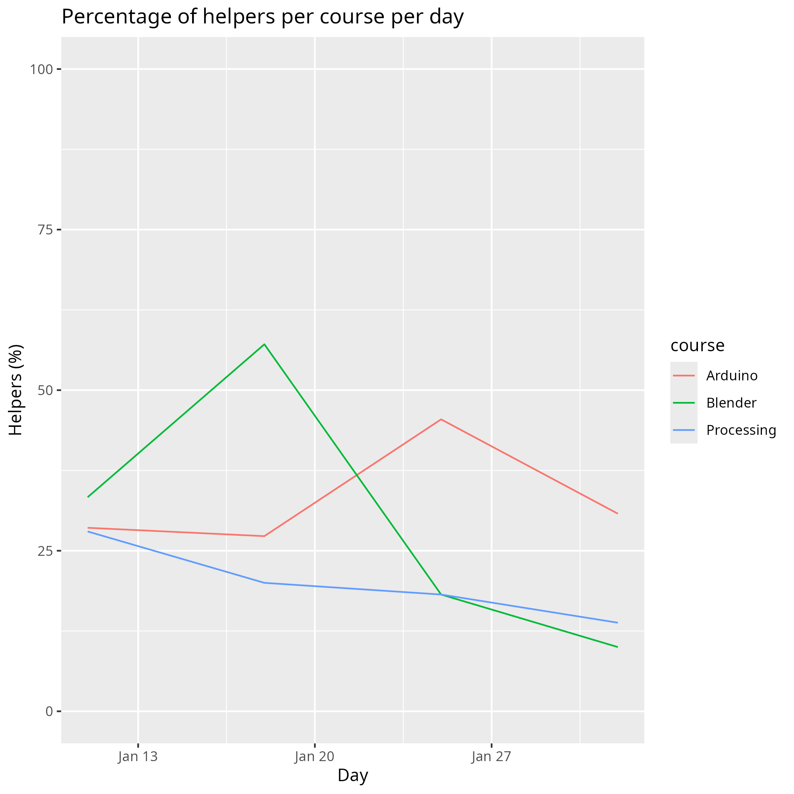

# Learners' statistics

## Overview

Parameter                  |2023|2024|2025|2026`[1]`
---------------------------|----|----|----|--------
Total course visits        |637 |833 |1353|1536
Total Arduino visits       |113 |135 |326 |344
Total Blender visits       |110 |255 |253 |388
Total cooking course visits|.   |.   |87  |214
Total laser cutting visits |.   |.   |16  |0
Total Processing  visits   |409 |443 |608 |590
Total female visits        |83  |120 |154 |186
Total male visits          |554 |713 |1199|1380
Unique female visitors     |16  |30  |37  |31
Unique male visitors       |85  |93  |120 |75
Total minor visits         |586 |788 |611 |1506
Total adult visits         |39  |45  |25  |60
Unique minor visitors      |75  |92  |75  |88
Unique adult visitors      |24  |32  |17  |18

- `[1]` Until the summer holiday
- 'Total course visits' is the amount of courses visited.
  If a learner
  visits two courses on a day (e.g. the cooking course and the Blender
  course), this counts as two visits
- 'Total `[something]` visits' is the amount of courses visited
  by `[something]` (can be male, female, adult or minor)
  If a `[something]`
  visits two courses on a day (e.g. the cooking course and the Blender
  course), this counts as two visits
- 'Unique `[something]` visitors' is the amount of unique/different
  `[something]`  (can be male, female, adult or minor)
  that visited one or more courses.
  If a `[something]`
  visits two courses on a day (e.g. the cooking course and the Blender
  course), she is still counted as 1 unique person
- The dot (`.`) means 'Not applicable',
  as these courses did not exists then and/or were not formally measured
  then

## Data and figures

Data:

- [n_learners_per_course_per_day.csv](n_learners_per_course_per_day.csv)
- [n_learners_per_day.csv](n_learners_per_day.csv)

As a plot:

Predictions:

> Predictions 2025, using a logistic model if it would apply,
> else using a linear model.

Percentage of learners willing to help a new learner:

