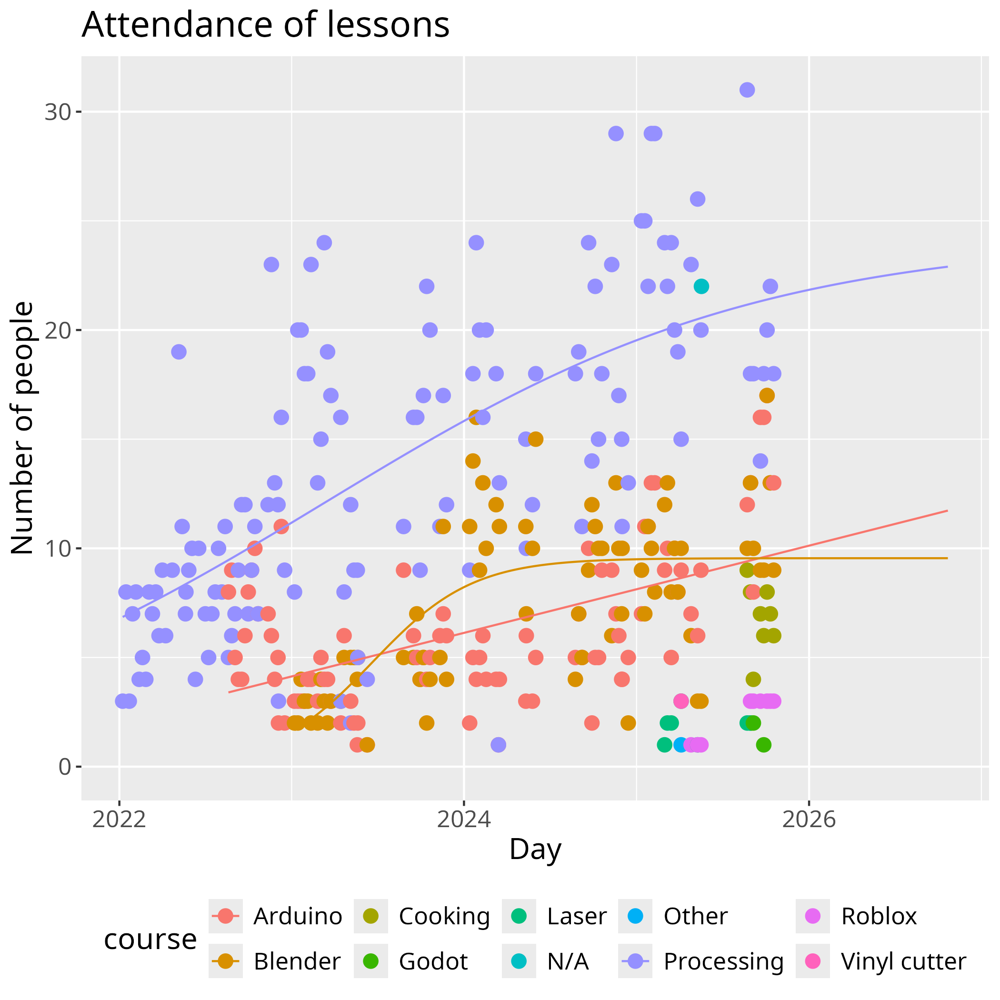

# Learners' statistics

Data:

- [n_learners_per_course_per_day.csv](n_learners_per_course_per_day.csv)
- [n_learners_per_day.csv](n_learners_per_day.csv)

As a plot:

Predictions:

> Predictions 2025 by human, using a Gompertz fit.
> Note that both Arduino and Blender did not converge,
> hence they are both set to zero. Due to this,
> the predicted Blender values exactly overlap the
> predicted Arduino values.

> Predictions 2025 by AI. Note how bad it does its predictions:
> instead of taking the last amount of learners to predict on
> (which is, for example, around 20 for Processing),
> it takes the average amount of learners of the entire period.

> Predictions 2025 by AI taking seasonality into account.
> Note how bad it does its predictions:
> instead of taking the last amount of learners to predict on
> (which is, for example, around 20 for Processing),
> it takes the average amount of learners of the entire period.
