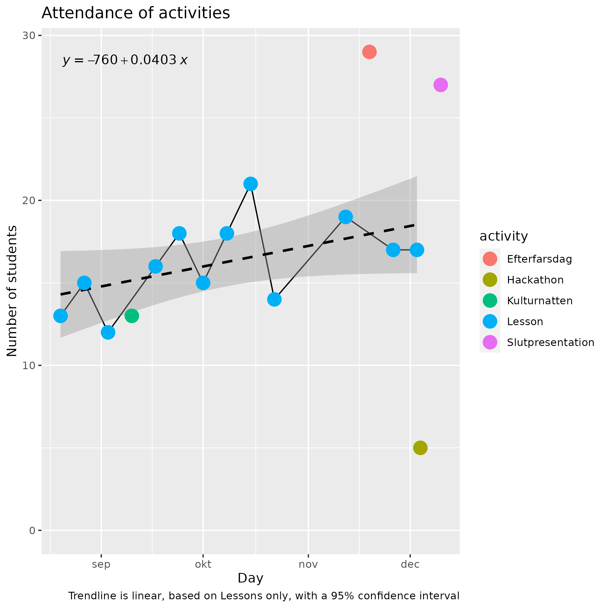
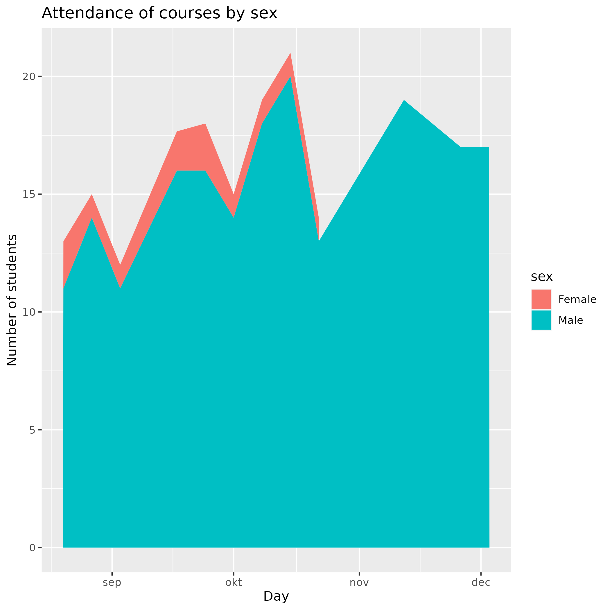

# Results

## Results from form

Note that I shuffled the order of the responses. Typos are from the kids
and me :-)

### Kursen Toppen

* Bra
* Jag tycker att det är bra för att man lär sig mycket om programmering
* 10/10
* 50/100
* Att man får lära sig om [Processing] och om arduino
* Man har saker som man behöver och dator som man kan låna
* 9/10
* 10/10
* Kursen har bra eftersom man lär sig mycket om grejer
* Rolig och lärorik
* Alla är snälla, det är kul och tiden passar bra
* Olika maskiner och verktyg som man kan låna
* Bra
* 8/10

Average: 10 + 5 + 9 + 10 + 8 = 42 / 50 = 8.4 out of 10

### Kursen Tips

* Jag tycker att det ska vara fler slutuppgifter för lär sig mycket av dom
* Gratis mat att tar
* Saft
* Det kunde vara typ 30 min längre
* Fler adaptersladdar och gjärna flytta kursen till lite senare
  * This will be hard, will need a majority vote on this
* Fler men kortare raster på varje pass
* Fler material och beställa det man behöver

### Vuxen Toppen

* Man får mycket hjälp och dem involvera sig i arbetet
* 9/10
* Många
* 9/10
* 80/100
* Bättra på at foklar
* Vuxna har hjälpt relativt mycket
* Bra att det finns vuxna som hjälper till när man behöver
* Snäll
* Bra på att hjälpa till
* 9/10
* Dett finns (nästan) alltid en vuxen att hjälpa

Average: 9 + 9 + 8 + 9 = 35 / 40 = 8.8 out of 10

* [x] Make this into 'Frivilligare'

### Vuxen Tips

* Richel har lite svårt att höra och förstå vad man säger
* Hjälpa elever mer
* Kanske lite fler vuxna (som kan hjälpa)
* Jag tycker att det ska finare fler vuxna
   för att enllan ska kunna får den hjälp dom behöver
* Den kan va ?berte

### Boken Toppen

* 90/100
* Bra
* Ger tips på vad koden betyder
* 9/10
* Boken är på relativt tydligt sätt
* Lärarik
* Den är jättebra bok som är lätt att följar
* 9/10
* Bra att det star vad man ska göra
* Den är bra mirn vet hur man ska käda olika saker

Average: 9 + 9 + 9 = 9 out of 10

### Boken Tips

* Göra boken mer noggran
* Arduino borde förklara varför sladdarna går dit dem går
* Att kunna bli godkänd för uppdrag, fast man gjort dom hemma
* Bättre svenska, mer svenva i de högre böckerna
* De flesta böckarna finns det delar som blev översatta
   som inte borde vara översatt som delay och bilder
   som inte är på svenska untan nederlänska
* Den kan förbättra genom att ha mer kapittel och längare till slutuppgiften

### Siffror

* 3 (will be 6/10)
* 555 (will not be used)
* 4/5 (will be 8/10)
* Gör bra
* 9,3333333333333...
* 10/10

Average: 6 + 8 + 9,3 + 10 = 33,3 / 40 = 8,37 / 10

* [x] Make this into five stars

## Results from interview

### How is the course?

* Det är bra i Arduino i Processing
* Rolig
* Lärorik
* Bra
* Får nya kompissar
* Samarbeta

### What should always be in the course?

* Att ha nåt att äta eller dricka
* At får lära sig processing och Arduino
* Lärare
* Schema
* Material
* 15 min paus, behöver få röra sig, läta hjärnan vila, behöver dricken

### What is the best thing about the course?

* Träffa kompisar och programmera
* Lärare bra
* Roligt arbete tillsammans
* Att få jobba i sin egen takt

### What can be improved about the course?

* Saft
* Fler slutuppgifter
* Längre kurs
* Boken kan bli tydligare
* Kortare och fler raster

### What is the least fun of the course?

* [Ingenting, det är] kul.
* Vänta på kompisarna
* Att man inte har den paus man behöver
* Att få komma när man vill och dricka saft, att ha paus

### How are the booklets?

* Bra
* Bra
* Boken lätt om man kan de olikar tangenterna
* Boken kan bli tydligare

### How can the booklets be improved?

* [...] Inkludera hur man får fram olike tangenter och vad de gör (t. ex. Ctrl)
  * [ ] Add this, do a speedrun with keys
* Boken kan bli tydligare
* Fler kapitel
* Fler uppgifter innan slutuppgiften

### How are the breaks?

* Korta
* Lagom med en rast
* Bra tid
* Behöver en paus
* Lite för långa och för få
* Bra med två raster

### How to improve the breaks?

* Längre
* Kortare och fler raster
* Få hjälp att starta Nintendo så att man hinner spel

### How are the volunteers?

* Duktiga
* Bra
* Hjälpsam
* Snälla

### What could the volunteers do better?

* Vet inte
* Hjälpa mer

### How is Björn?

* Bra, hjälper till mhf
* Bra, mest Arduino
* Bra

### What could Björn do better?

* Vet inte
* Nej

### How is Christoffer?

* Bra på programmering, hjälper
* Mest Arduino
* Bra

### What could Christoffer do better?

* Inget särskilt
* Tidigare byggt upp Nintendo - skulle vare kul om alla kunde spela en stud på rasten
  * [x] Let the Nintendo be built up 10 minutes earlier
* Nej

### How is Janne?

Bra, hjälper lite mer
Bra

### What could Janne do better?

Nej

### How is Richel?

Bra på att prata om saker
Bra
Snäll
Bra
Inte för sträng

### What could Richel do better?

Tydigare Svenska
Ibland hjälpar lite för lite för svara [helt]
Kan prate mer svensk

### How is Richel’s Swedish? Is that a problem?

Inte problem att förstå men svårare
OK, bara lite roliga fel
Inget problen, man förstår inte allt man säger, men det mesta

### Is Richel too strict?

Nej
Nej
Nej

### How is the amount of kids? Would we enjoy more?

För många
Lite många just nu igen
Kan bli fler, men biter bli fullt
Bra att det är många
Det är inte för många

### How was the Kulturnatten at Stadsbiblioteket?

Roligt, men inga teamledare
Bra, kommer nya elever
Det var bra

### What can be improved about the Kulturnatten?

Nej

### Should we do Kulturnatten again next year?

Ja, två gånger per år
JA!
Ja

### How was the Efterfarsdag?

Bra
Bra, men papporna lärde sig inte så mycket
Svårt att få hjälp ibland. Skull kunna vara fler vuxna
Roligt

### What can be improved about the Efterfarsdag?

Nej
Varmar donuts
Mer donuts

### Should we do Efterfarsdag again next year?

Ja
JA!
Ja, kull är mer föräldrar är med
Ja

## Added

Hackathon var jättebra
Det vore bra om det fanns mer vuxna på plats så att man kan få mer hjälp, speciellt Arduino
Känner igen som kan hjälper till

Slutsats: väldigt positiva

## Results from parents

* More girls would be nice

## Interpretation

As far as I can see, the kids and parents are happy
and there is little criticism to work with.
Of course, there is a survival bias, with unhappy kids
and parents leaving the course.

Last evaluation, there were some kids that wanted
to get to know one another in the break.
The team of volunteers made the break more 'open', as in
that the kids are more free what to do and, among others, explore
the Makerspace a bit.
This earlier feedback seems solved now, maybe also as the kids now work in teams.

Last evaluation, there were some kids that want to deepen their knowledge
and there were some kids that want longer lessons.
We have started the Extratimme for just those kids.
This year, again, there is at least one request for extra time,
maybe that student is unaware of the Extratimme.

* [x] show this in a flowchart on the homepage

Of the evaluation, the categories 'Vuxen' was replaced by the more
clear 'Frivilligare'. 'Siffor' has been replaced by 'Siffra' with
an added 5 stars clearly shown, to get more data in next time.

Some kids like the Nintendo. I've added to the schedule (in the `scripts` folder)
that the Nintendo can be built up 10 mins before the break.

There is disagreement about the breaks: less, more or keep it the same.
This means we'll keep the breaks the same.

There is disagreement about the amount of students:
'we can have more' versus 'we are a nicely-sized group' versus
'we are too big'.
This means we'll keep doing the same and continue growing.
Note that UMS has an upper limit of 42 people being in the building,
so around 36  students is max (we are currently at 18 students, so that
is halfway). Also, we can spread out the students more.

Being allowed to drink saft in the break is unknown to at least one student.
Let's repeat this.

I am happy that my/Richel's Swedish is criticized, as this proves
they dare say it. It is apparently not too big of a problem, let's
see when the feedback goes away :-)

I think that the first experiments to work in teams worked out postively.
I/Richel was worries about this, as not all teams were fully functional,
for example, including only half of the kids in a team.
Still, nothing on that on the evaluation.
Next season, me and Bjorn will volunteer to lead a team.

* [x] Create file `lag.md` with the team descriptions

At least one student thinks that there should be more volunteers.
I am unsure if that person is in a team yes/no.

The activitities are appreciated! Especially at Efterfarsdag,
the kids really appreciate the dads showing up.
I'll buy more donuts for them as well :-)

The volunteers, as well as the adult students are appreciated.
Well done, fellow adults!

## Conlusion

The course is received well in general. Note that there is a bias:
the students that stay are the ones that are happy.

> Number of students in time

Reading the figure above, the course is growing,
with about 1.2 student per month on average.
One could argue that maybe the amount of students is flattening off,
let's see where next year goes to.

> Number of male/female students in time

There have always been few females in the course: few female minor students,
few female adult students and never have we had female volunteers.
The parents think it would be better to have more females
and the (male) volunteers agree.
Richel has tried to recruit females, but without success still.

> Number of minor and adult students in time

When the final presentation started to be prepared, the adults hopped off
the course. They are appreciated by both the students and volunteers,
so let's try to keep them in more next year.

> Distribution of courses taken

The course/courses have become more ambiguous: one can do Arduino, Blender
or programming, either solo or in a team. Programming attracts the most new
students. I/Richel does not think programming is more important.
Instead, I/Richel will try to get more students to do Arduino.
Also, the volunteers try to get more adults to show off their Arduino projects.

Conclusion:

* we grow
* students are happy
* please more: adult students, females and Arduino projects shown
