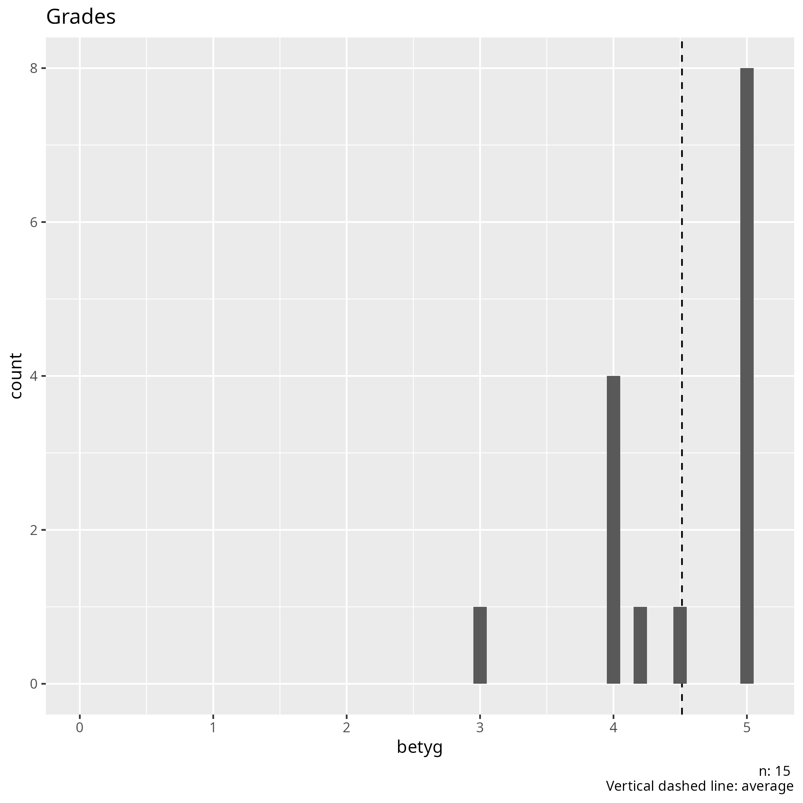

# 2024-12-07 Evaluation results

- [All evaluation results](../README.md)
- [analyse.R](analyse.R)
- [results.csv](results.csv)



## [Comments](results.csv)

```text
Fler lektioner i väckan
Jag tycker att kursen kan bli bättre om vu kunde ha längre lektioner, svårare böcker och mera kurser som vi kan välja ifrån
More game making in Processing books
Kanske programmering av Minecraft moddar
Kommer inte på något
Bra
Vet inte
Bättre rum där man jobbar
Nothing it's perfect
No thing
Får mer rolig tid, tex spela mer
Det finns inget enligt mig som kan förbättras
Jag trot kurserna är för korta
Fler böcker som är mer avancerade och komplicerade
```

