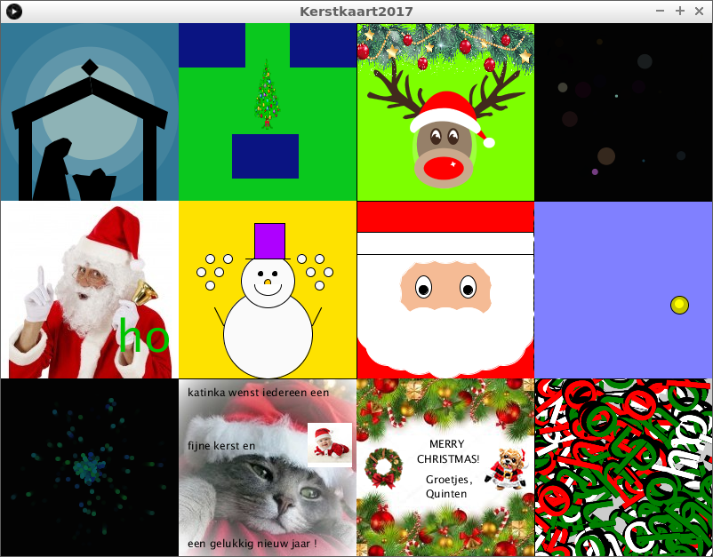
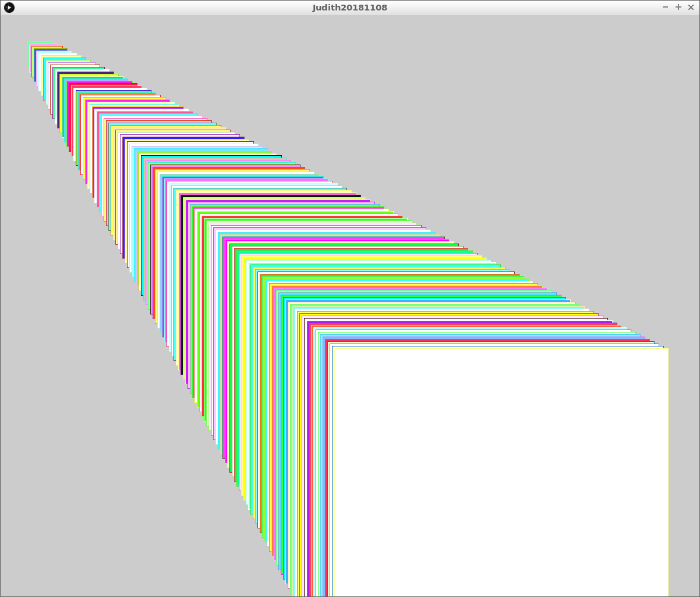
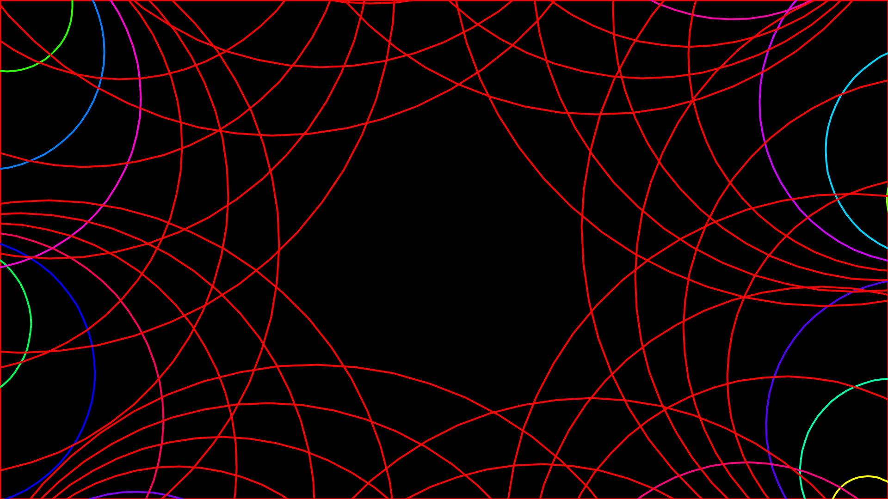
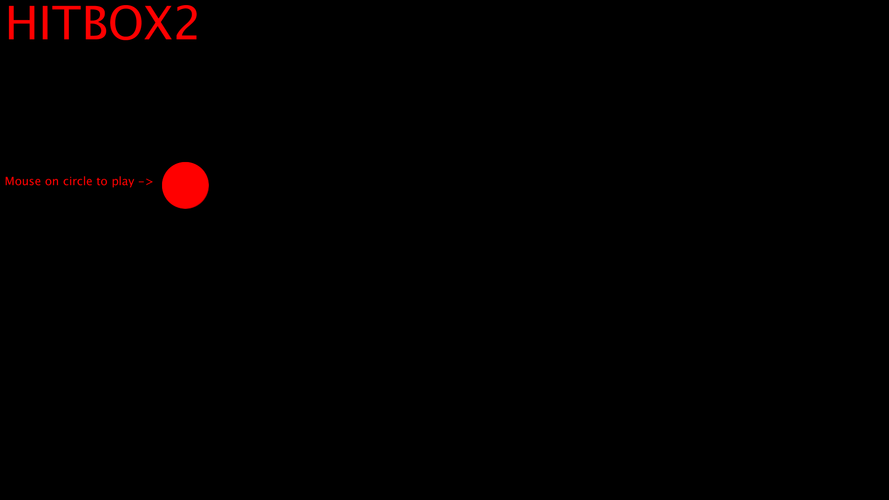
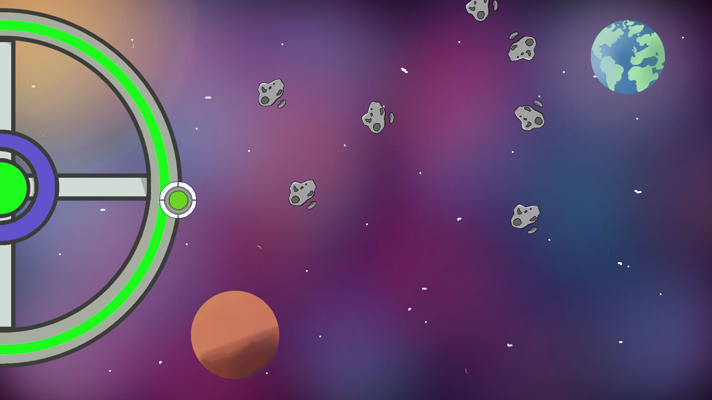
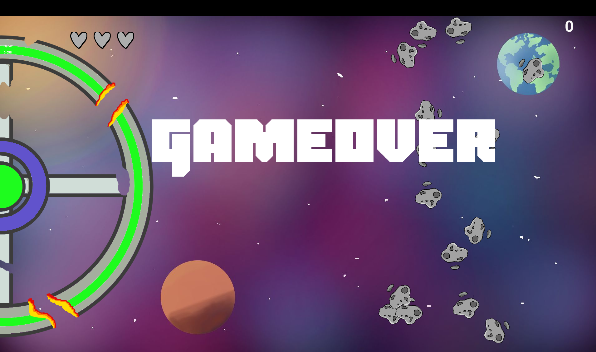

# 🇸🇪 Exempel på elevernas framsteg 🇬🇧 Examples of learners' progression

=== "🇸🇪"

    Exempel av en julkort

    Koordinaterna är:

    - `(0, 0): fyrkanten på toppen-höger
    - `(1, 0): ett fyrkant åt höger av fyrkanten på toppen-höger
    - `(0, 1): ett fyrkant nedåt av fyrkanten på toppen-höger

=== "🇬🇧"

    Example of a christmas card, created by all learners present.

    Coordinats are:

    - `(0, 0): top-left square
    - `(1, 0): one square right of the top-left square
    - `(0, 1): one square down of the top-left square

## 🇸🇪 8 år 🇬🇧 8 year)

=== "🇸🇪"

    Enkla konstverk, t.ex. `(1, 0)` och `(1, 1)`

=== "🇬🇧"

    Simple works of art, e.g `(1, 0)` and `(1, 1)`

## 🇸🇪 11 år 🇬🇧 11 year)

=== "🇸🇪"

    - mer komplexa konstverk, t.ex. `(2, 0)` och `(2, 1)`
    - återskapa enkla spel

=== "🇬🇧"

    - more complex works of art, e.g `(2, 0)` and `(2, 1)`
    - re-create simple games

## 🇸🇪 14 år 🇬🇧 14 year)

=== "🇸🇪"

    - skönhet i konstverk, t.ex. `(1, 2)`
    - komplexa spel med egna idéer

=== "🇬🇧"

    - beauty in works of art, e.g `(1, 2)`
    - complex games with own ideas

