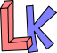

---
tags:
  - Lördagskurserna
  - Lördagskurser
  - Lördags kurser
  - Saturdaycourses
  - Saturday courses
---

# Lördagskurserna

=== "🇸🇪"

    På lördag gör vi coola grejer på Uppsala Makerspace
    för elever i ålder 8 till 88.

    Inga förkunskaper krävs:
    det viktigaste i kurserna är att lära sig nya saker tillsammans.

    - [Kurserna](kurserna/README.md)
    - [Ditt första besök](ditt_foersta_besoek/README.md)
    - [Plats](plats/README.md)
    - [Veckoschemat](veckoschemat.md)
    - [Betalning](betalning.md)
    - [Följ oss](foelj_oss/README.md)
    - [Volontärer](volontaerer/README.md)
    - [Kontakta oss](kontakta_oss.md)

=== "🇬🇧"

    On Saturday we do cool stuff at Uppsala Makerspace
    for learners aged 8 to 88.

    No prior knowledge is required:
    the most important thing in the courses is
    the will to learn new things together.

    - [Courses](kurserna/README.md)
    - [Your first visit](ditt_foersta_besoek/README.md)
    - [Place](place/README.md)
    - [Weekly schedule](veckoschemat.md)
    - [Payment](betalning.md)
    - [Follow us](foelj_oss/README.md)
    - [Volunteers](volontaerer/README.md)
    - [Contact us](kontakta_oss.md)
