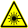

# 🇸🇪 Kurserna (🇬🇧 The courses)

=== "🇸🇪"

    Dessa är kurserna vi lär ut under Lördagskurserna:

    Kurs                                                                            |Tid        |Vad                                                                    |Bok
    --------------------------------------------------------------------------------|-----------|-----------------------------------------------------------------------|-----------------------------------------------------------------------------------------
     **Matlagning**                        |9.00-10.00 |Att skapa och äta frukost                                              | [Matlagningskurs](https://richelbilderbeek.github.io/matlagningkurs/)
     **Arduino**                   |10.15-12.00|Ett kretskort som programmeras för att bygga maskiner                  | [Arduino för ungdomar](https://richelbilderbeek.github.io/arduino_foer_ungdomar/)
     **Blender**          |10.15-12.00|Ett 3D ritnings program för, t.ex. 3D skrivning                        | [Grundkurs i Blender](https://github.com/richelbilderbeek/grundkurs_i_blender)
     **Programmering**              |12.15-14.00|Skapa datorspel, med bland annat, programmerspråket Processing         | [Processing för ungdomar](https://github.com/richelbilderbeek/processing_foer_ungdomar)
     **Biomaking**                     |13.15-15.00|Att använda biologiskt material för att skapa (på Engelska)            | .

    Varje tillfälle du deltar vid får du välja en av kurserna för det tillfället.

    Se [ditt första besök](../ditt_foersta_besoek/README.md) hur ditt första besök kommer ske!

    Om du är ännu mer avancerad, kan du också göra:

    Kurs                                                             |Bok
    -----------------------------------------------------------------|---------------------------------------------------------------------------------------------------------
     **git**                        | [git for youngsters](https://codeberg.org/richelbilderbeek/git_for_youngsters)
     **laserskärare** | [laserskärare](https://uppsala-makerspace.github.io/laser_cutter_guide/)
     **vinylskärare**       | [vinylskärare](https://uppsala-makerspace.github.io/vevor_vinyl_cutter_to_t_shirt_manual/)

=== "🇬🇧"

    These are the courses we teach at the Saturday courses:

    Course                                                                          |Time       |What                                                                    |Book
    --------------------------------------------------------------------------------|-----------|------------------------------------------------------------------------|-----------------------------------------------------------------------------------------------------------
     **Cooking**                           |9:00-10:00 |Preparing and having breakfast                                          | [Matlagningskurs](https://richelbilderbeek.github.io/matlagningkurs/)
     **Arduino**                   |10:15-12:00|A programmable printed circuit board to build electronical machines with| [Arduino för ungdomar](https://richelbilderbeek.github.io/arduino_foer_ungdomar/)
     **Blender**          |10:15-12:00|A program to create 3D models for, among others, 3D printing            | [Grundkurs i Blender](https://github.com/richelbilderbeek/grundkurs_i_blender)
     **Programmering**              |12:15-14:00|Create games with, among others, the programming language Processing    | [Processing för ungdomar](https://github.com/richelbilderbeek/processing_foer_ungdomar)
     **Biomaking**                     |13:15-15:00|Use biologic material for making things (in English)                    | .

    Each time you come in, you get to pick a course to follow that day.

    See [your first visit](../ditt_foersta_besoek/README.md) to find out how your first visit will go!

    When you are even more advanced, you can also do:

    Course                                                           |Book
    -----------------------------------------------------------------|-------------------------------------------------------------------------------------------
     **git**                        | [git for youngsters](https://codeberg.org/richelbilderbeek/git_for_youngsters)
     **laser cutter** | [laser cutter](https://uppsala-makerspace.github.io/laser_cutter_guide/)
     **vinyl cutter**       | [vinyl cutter](https://uppsala-makerspace.github.io/vevor_vinyl_cutter_to_t_shirt_manual/)

