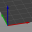
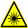

# Kurser hos Lördagskurser

Dessa är kurserna vi lär ut under Lördagskurserna:

Kurs                                                                            |Tid        |Vad                                                                    |Bok
--------------------------------------------------------------------------------|-----------|-----------------------------------------------------------------------|-----------------------------------------------------------------------------------------
 **Matlagning**                        |9.00-10.00 |Att skapa och äta frukost                                              | .
 **Arduino**                   |10.15-12.00|Ett kretskort som programmeras för att bygga maskiner                  | [Arduino för ungdomar](https://richelbilderbeek.github.io/arduino_foer_ungdomar/)
 **Blender**          |10.15-12.00|Ett 3D ritnings program för, t.ex. 3D skrivning                        | [Grundkurs i Blender](https://github.com/richelbilderbeek/grundkurs_i_blender)
 **Programmering**              |12.15-14.00|Skapa datorspel, med bland annat, programmerspråket Processing         | [Processing för ungdomar](https://github.com/richelbilderbeek/processing_foer_ungdomar)
 **OpenSCAD**                        |13.15-15.00|Ett 3D ritnings program för, t.ex. 3D skrivning                        | [OpenSCAD kurs](https://uppsala-makerspace.github.io/openscad_kurs/boecker/)

Varje tillfälle du deltar vid får du välja en av kurserna för det tillfället.

Se [ditt första besök](https://uppsala-makerspace.github.io/loerdagskurser/ditt_foersta_besoek) hur ditt första besök kommer ske!

Om du är ännu mer avancerad, kan du också göra:

Kurs                                                                            |Bok
--------------------------------------------------------------------------------|---------------------------------------------------------------------------------------------------------
 **3D skrivning** | [3D skrivningskurs](https://uppsala-makerspace.github.io/3d_skrivningskurs/)
 **git**                                       | [git for youngsters](https://codeberg.org/richelbilderbeek/git_for_youngsters)
 **laserskärare**                | [laserskärarekurs](https://uppsala-makerspace.github.io/laser_cutter_guide/)
 **lödning**                   | [lödningskurs](https://uppsala-makerspace.github.io/loedningskurs/)
 **vinylskärare**                      | [vinylskärarekurs](https://uppsala-makerspace.github.io/vevor_vinyl_cutter_to_t_shirt_manual/)

Här är ett översikt av när vilken kurs är:

Course     |9:00-10:00                               |10:15-11:00                                               |11:15-12:00                                               |12:15-13:00                                     |13:15-14:00                                     |14:15-15:00
-----------|-----------------------------------------|----------------------------------------------------------|----------------------------------------------------------|------------------------------------------------|------------------------------------------------|-------------------------------------------
Matlagning ||.                                                         |.                                                         |.                                               |.                                               |.
Arduino    |.                                        |         |         |.                                               |.                                               | (för vuxna)
Blender    |.                                        |||.                                               |.                                               | (för vuxna)
Processing |.                                        |.                                                         |.                                                         ||| (för vuxna och advancerade programmerare)
OpenSCAD   |.                                        |.                                                         |.                                                         |.                                               |     |
Vuxen timme|.                                        |.                                                         |.                                                         |.                                               |.                                               |

