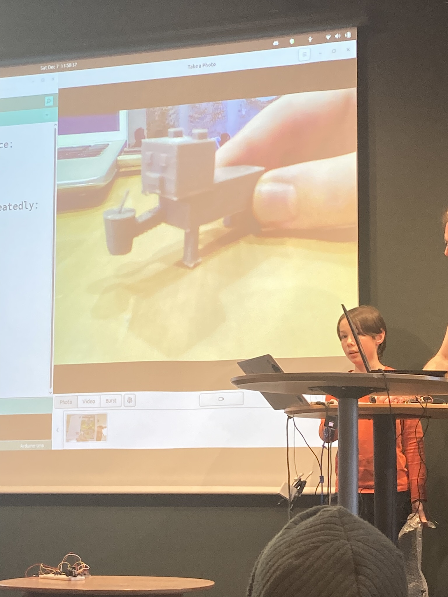

# 🇸🇪 Om 3D skrivningskursen 🇬🇧 About the 3D printing course

=== "🇸🇪"

    3D skrivningskursen är en av den [kurser](README.md)
    av [Lördagskurserna](https://uppsala-makerspace.github.io/loerdagskurser/).

    Under 3D skrivningskursen lär man sig att skriva ut i 3D.

=== "🇬🇧"

    The 3D printing course is one of [the courses](README.md)
    of [the Saturday courses](https://uppsala-makerspace.github.io/loerdagskurser/).

    During the 3D printing course you learn how to print in 3D.

=== "🇸🇪"

    > En av den 3D skrivarna som blir använd. 

    Man börjar med att lära sig att använda 3D skrivaren själv.
    Efter detta blir det mer hur att 3D skriva och 3D modellera smart.
    3D skrivningskursen använder kursmaterialet
    [3D skrivningskurs](https://uppsala-makerspace.github.io/3d_skrivningskurs/)

=== "🇬🇧"

    > One of the 3D printers used.

    You start by learning how to use the 3D printer itself.
    After this, it becomes more about how to 3D print and 3D model smart.
    The 3D printing course uses the course material
    [3D printing course](https://uppsala-makerspace.github.io/3d_skrivningskurs/)

=== "🇸🇪"

    > En [Lördagskurserna slutpresentation med en 3D skriving](https://uppsala-makerspace.github.io/loerdagskurser/verksamheter/20241207_slutpresentation/)

    För att lära sig att 3D modellera, finns det
    [Blenderkursen](om_blenderkursen.md)
    och [OpenSCAD kursen](om_openscad_kursen.md).

=== "🇬🇧"

    > A [Saturday courses student presentation with a 3D print](https://uppsala-makerspace.github.io/loerdagskurser/verksamheter/20241207_slutpresentation/)

    To learn how to 3D model, there is
    [Blender course](om_blenderkursen.md)
    and [OpenSCAD course](om_openscad_kursen.md).
    The course uses the (English and Swedish) course material
    [3D printing course](https://uppsala-makerspace.github.io/3d_skrivningskurs/)
