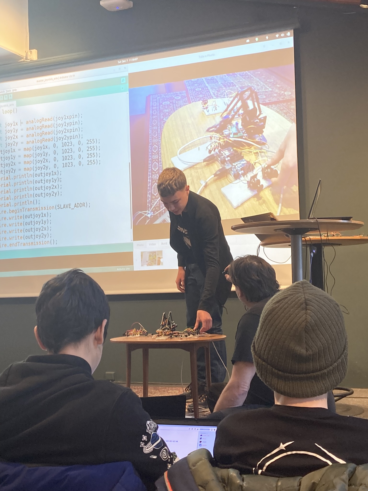

# Om Arduinokursen

Arduinokursen är en av den [kurser](https://uppsala-makerspace.github.io/loerdagskurser/kurserna)
av [Lördagskurserna](https://uppsala-makerspace.github.io/loerdagskurser/).

Under Arduinokursen lär man sig att använda en Arduino.

Arduino är ett kretskort som programmeras för att bygga
elektroniska maskiner (t.ex. robotar).

Under kursen får du lära dig att programmera samtidigt som
du utvecklar din förståelse för hur elektronik fungerar.
Senare under kursen, tar du också [lödningskursen](https://uppsala-makerspace.github.io/loerdagskurser/kurserna/om_loedningskursen).

Arduinokursen använder kursmaterialet
[Arduino för ungdomar](https://richelbilderbeek.github.io/arduino_foer_ungdomar/).

=== "🇸🇪"

En Arduino

En [Lördagskurserna slutpresentation som använder Arduino](https://uppsala-makerspace.github.io/loerdagskurser/verksamheter/20241207_slutpresentation/)

