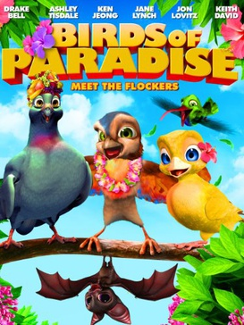
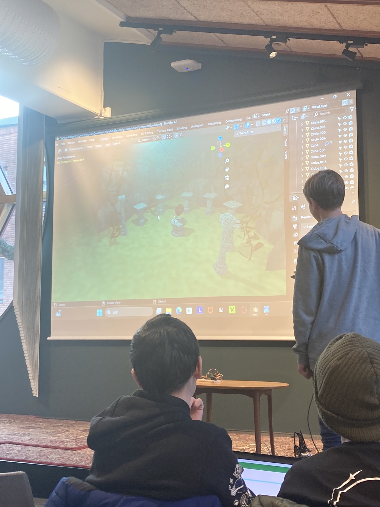

# Om Blenderkursen

Blenderkursen är en av den [kurser](https://uppsala-makerspace.github.io/loerdagskurser/kurserna)
av [Lördagskurserna](https://uppsala-makerspace.github.io/loerdagskurser/).

Under Blenderkursen lär man sig att använda programmet Blender.

Blender är ett öppet programm för att skapa 3D modeller.
3D modellerna används för [3D-utskriftskursen](https://uppsala-makerspace.github.io/loerdagskurser/kurserna/om_3d_skrivningskursen)
eller för att skapa filmer.

Blenderkursen använder kursmaterialet
[Grundkurs i Blender](https://github.com/richelbilderbeek/grundkurs_i_blender)

> En [exampel film som är helt skapad i Blender](https://en.wikipedia.org/wiki/Plum%C3%ADferos)

> En [Lördagskurserna slutpresentation som använder Blender](https://uppsala-makerspace.github.io/loerdagskurser/verksamheter/20241207_slutpresentation/)

