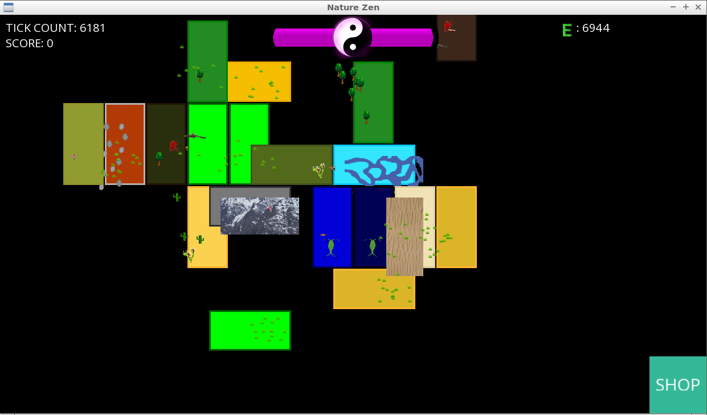

# Om gitkursen

`git` kursen är en av den [kurser](https://uppsala-makerspace.github.io/loerdagskurser/kurserna)
av [Lördagskurserna](https://uppsala-makerspace.github.io/loerdagskurser/).

Under `git`-kursen lär man sig att använda `git`,
ett versionshanteringsprogramm
som tillåter att programmera tillsammans.
Kursen är en självstudiekurs
och krävs att du kan tar hand om dig själv.
Du kan tar hand om dig själv om du är eller vuxen eller har klarat av
några lektioner av en vanligt [kurs](https://uppsala-makerspace.github.io/loerdagskurser/kurserna).

> `git` logon

Du börjar med att lära dig hur du skapar en webbplats för din kod och hur
du arbetar med den. Följande övningar kräver samarbete.

Kursen använder (bara Engelska) kursmaterialet
[git for youngsters](https://codeberg.org/richelbilderbeek/git_for_youngsters)

> [Nature Zen](https://github.com/richelbilderbeek/djog_unos_2018) är ett
> spel skapad av 13 utvecklare.

