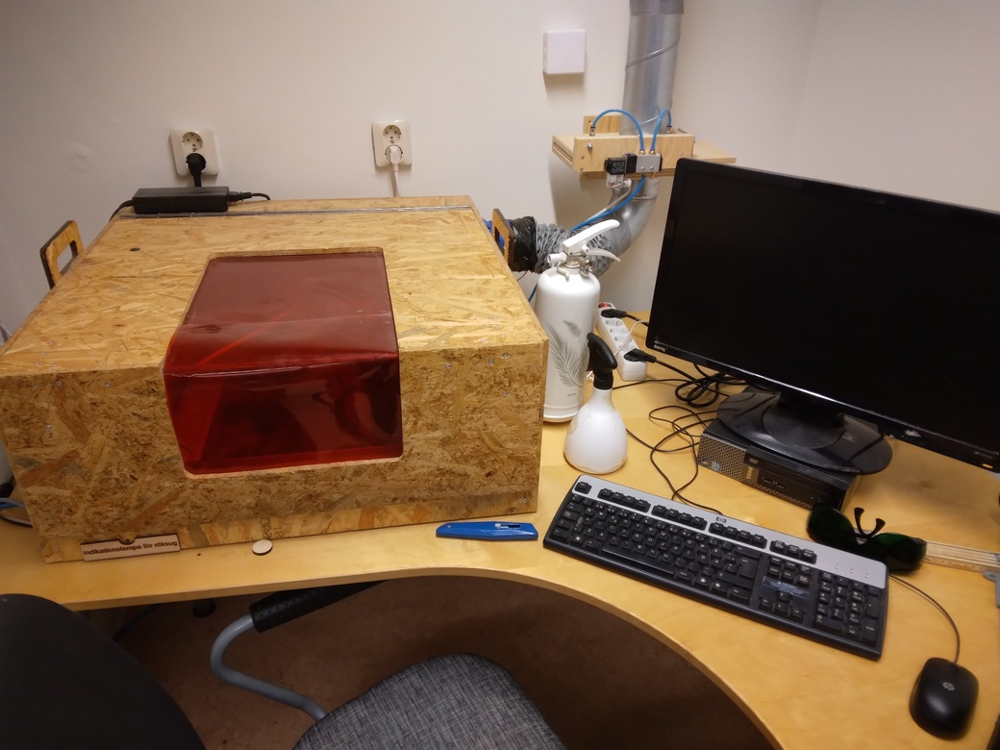

# Om laserskärarekursen

Laserskärarekursen är en av [kurserna](https://uppsala-makerspace.github.io/loerdagskurser/kurserna) som utgör
[Lördagskurserna](https://uppsala-makerspace.github.io/loerdagskurser/).

Under laserskärarekursen lär man sig att använda en laserskärare.

Kursen är en självstudiekurs för vuxna:
i moment har vi ingen volontär som kan undervisa laserskäraren
åt tonåringar.

> Vår laserskärare

Kursen använder (bara Engelska) kursmaterialet
[laser cutter manual](https://uppsala-makerspace.github.io/laser_cutter_guide/)

