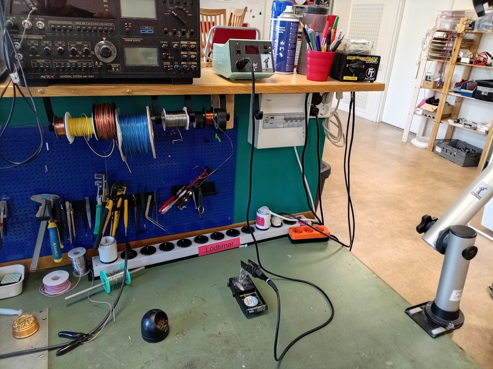

# Om loedningskursen

Lödningskursen är en av den [kurser](https://uppsala-makerspace.github.io/loerdagskurser/kurserna)
av [Lördagskurserna](https://uppsala-makerspace.github.io/loerdagskurser/).

Under Lödningskursen lär man sig att löda.
Kursen är en del av [Arduinokursen](https://uppsala-makerspace.github.io/loerdagskurser/kurserna/om_arduinokursen).

> Vårt lödningsbord

Kursen använder kursmaterialet
[lödningskurs](https://uppsala-makerspace.github.io/loedningskurs/)

> En lödat maskin

