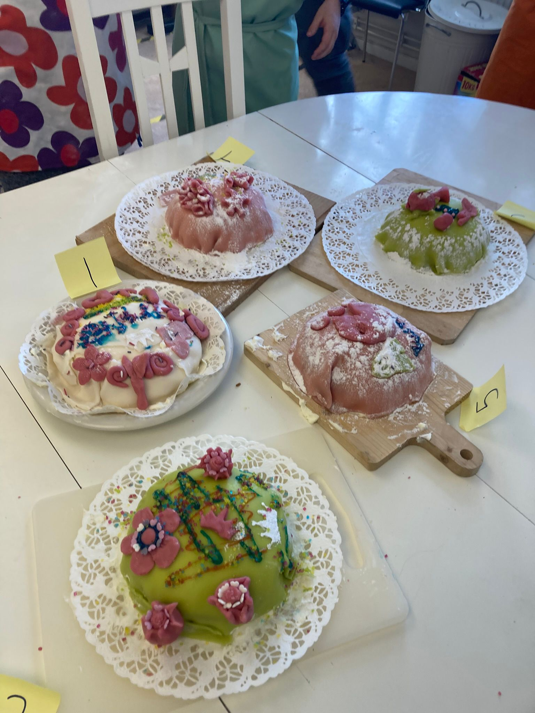

# Om matlagningskursen

Matlagningskursen är en av den [kurser](https://uppsala-makerspace.github.io/loerdagskurser/kurserna)
av [Lördagskurserna](https://uppsala-makerspace.github.io/loerdagskurser/).

Under matlagningskursen lär man sig att laga mat.

Kursen lär ut de första grunderna i matlagning,
inklusive städning, diskning och dukning.
Vi lagar enkla måltider (t.ex. nudlar, pannkakor etc.),
varefter vi äter frukost tillsammans.

