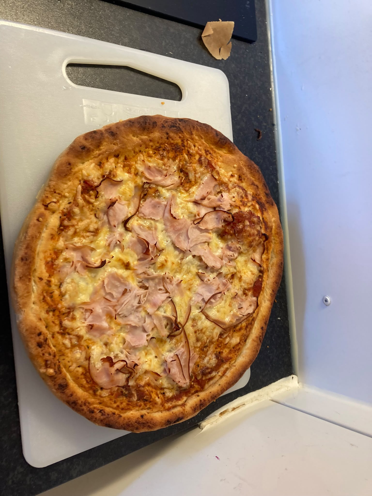
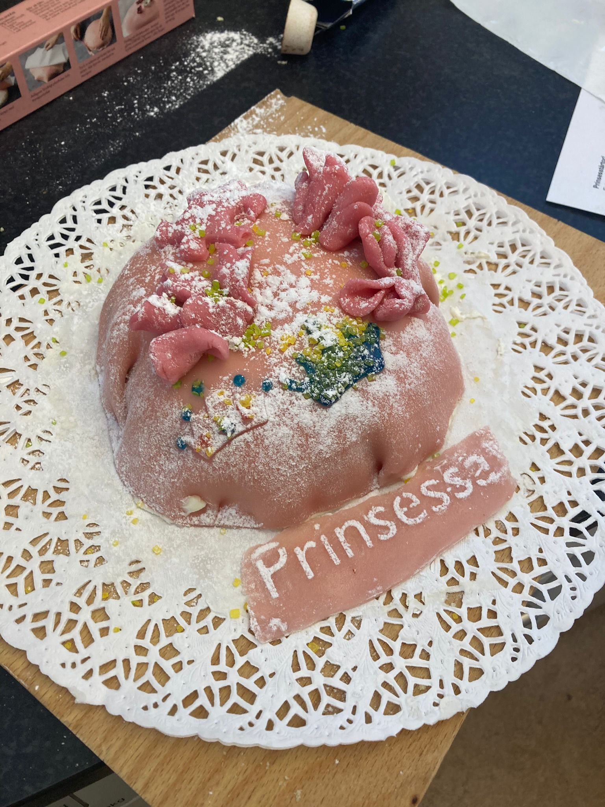

# Om matlagningskursen

Matlagningskursen är en av [kurserna](https://uppsala-makerspace.github.io/loerdagskurser/kurserna) som utgör
Lördagskurserna.

Under kursen lär man sig att laga enklare mat.

> En pizza lagad under matlagningskursen

Kursen lär ut de första grunderna i matlagning, inklusive städning,
diskning och dukning.
Vi lagar enklare måltider (t.ex. nudlar, pannkakor, potatismos, etc.),
och sedan äter vi tillsammans.
Kursen fokuserar både på kreativitet och självförtroende i köket!

> En prinsesstårta lagad under matlagningskursen

