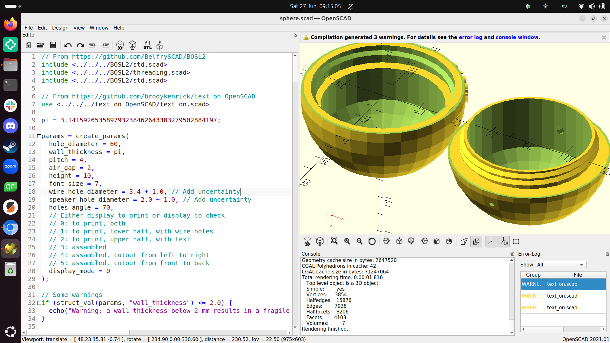

# About the OpenSCAD course

The OpenSCAD course is one of [the courses](https://uppsala-makerspace.github.io/loerdagskurser/kurserna) of
[the Saturday courses](https://uppsala-makerspace.github.io/loerdagskurser/),
<<<<<<< HEAD
which is also taught on other days
([veckoschemat av OpenSCAD kursen](https://uppsala-makerspace.github.io/openscad_kurs/veckoschemat/)).
=======
which is also taught on Wednesday evenings.
>>>>>>> ee97e01893901a712f77a02e206dc1ed811b0cfa

In the OpenSCAD course one learns how to use the program called OpenSCAD.

During this course we will learn how to create 3D models in OpenSCAD.
We can use the models for
[the 3D printing course](https://uppsala-makerspace.github.io/loerdagskurser/kurserna/om_3d_skrivningskursen).

The course uses the (Swedish-only!) course material
[OpenSCAD kurs](https://uppsala-makerspace.github.io/openscad_kurs/)
