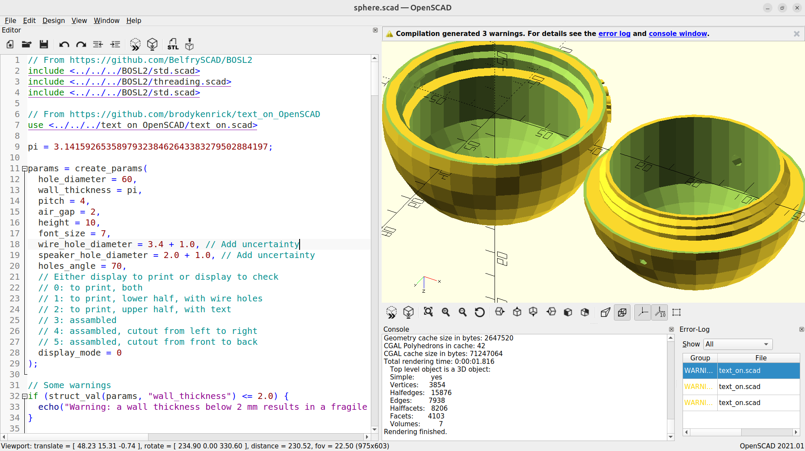
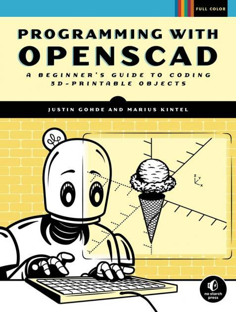

# About the OpenSCAD course

The OpenSCAD course is one of [the courses](https://uppsala-makerspace.github.io/loerdagskurser/kurserna) of
[the Saturday courses](https://uppsala-makerspace.github.io/loerdagskurser/),
which is also taught on other days
([veckoschemat av OpenSCAD kursen](https://uppsala-makerspace.github.io/openscad_kurs/veckoschemat/)).

In the OpenSCAD course one learns how to use the program called OpenSCAD.

During this course we will learn how to create 3D models in OpenSCAD.
We can use the models for
[the 3D printing course](https://uppsala-makerspace.github.io/loerdagskurser/kurserna/om_3d_skrivningskursen).

The course uses the book 'Programming with OpenSCAD',
with some additional Swedish course material for those that
struggle with English and/or have not had 3D geometry yet.
This additional Swedish course material can be found at
[OpenSCAD kurs hemsidan](https://uppsala-makerspace.github.io/openscad_kurs/).
