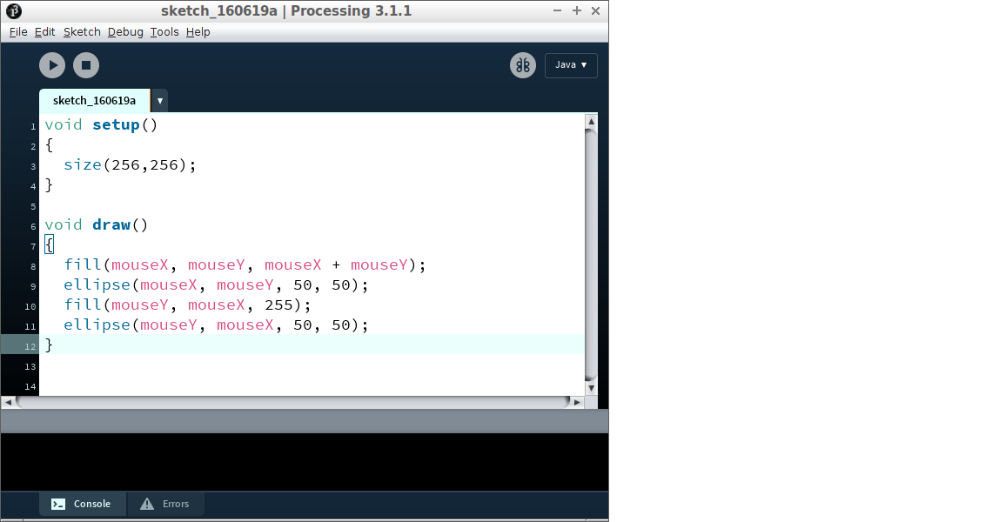
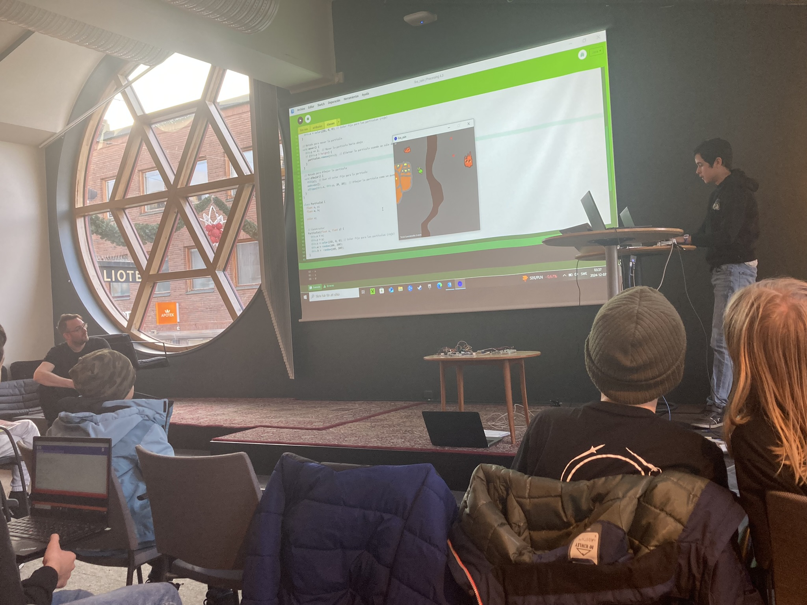

# Om programmeringskursen

Programmeringskursen är en av den [kurser](https://uppsala-makerspace.github.io/loerdagskurser/kurserna)
av [Lördagskurserna](https://uppsala-makerspace.github.io/loerdagskurser/).

Under programmeringskursen kursen lär man sig att programmera.

> Programmeringskod i vårt första programmeringsspråk kallad 'Processing'

=== "🇸🇪"

Att programmera är att berätta till en dator vad den måste göra,
t.ex. att låta en användare spelar en datorspel.

Senare i kursen kommer ni att göra [`git` kursen](https://uppsala-makerspace.github.io/loerdagskurser/kurserna/om_gitkursen)]
för att kunna arbeta tillsammans med ett programmeringsprojekt.

Kursen använder kursmaterialet
[Processing för ungdomar](https://github.com/richelbilderbeek/processing_foer_ungdomar)

> En [Lördagskurserna slutpresentation som använder Processing](https://uppsala-makerspace.github.io/loerdagskurser/verksamheter/20241207_slutpresentation/)

