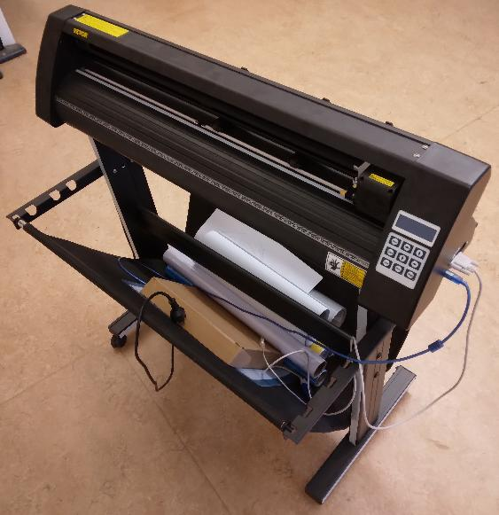
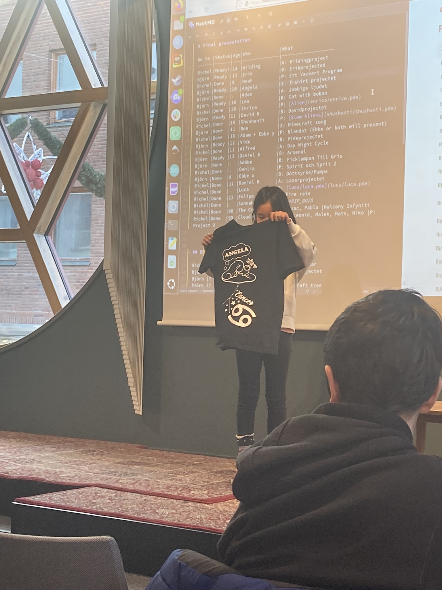

# 🇸🇪 Om vinylskärarekursen 🇬🇧 About the vinyl cutter course

=== "🇸🇪"

    Vinylskärarekursen är en av den [kurser](README.md)
    av [Lördagskurserna](https://uppsala-makerspace.github.io/loerdagskurser/).

    Under vinylskärarekursen lär man sig att använda vinylskäraren.
    Kursen är en självstudiekurs
    och krävs att du kan tar hand om dig själv.
    Du kan tar hand om dig själv om du är eller vuxen eller har klarat av
    några lektioner av en vanligt [kurs](README.md).

=== "🇬🇧"

    The vinyl cutter course is one of [the courses](README.md)
    of [the Saturday courses](https://uppsala-makerspace.github.io/loerdagskurser/).

    In the vinyl cutter course one learns how to use the vinyl cutter.
    The course is a self-study course
    and requires that you can take care of yourself.
    You can take care of yourself if you are either an adult or have completed
    a few lessons of a regular [course](README.md).

=== "🇸🇪"

    > Vår vinylskärare

    Kursen använder (bara Engelska) kursmaterialet
    [Vevor vinyl cutter to T-shirt manual](https://uppsala-makerspace.github.io/vevor_vinyl_cutter_to_t_shirt_manual/)

=== "🇬🇧"

    > Our vinyl cutter

    The course uses the course material of
    [Vevor vinyl cutter to T-shirt manual](https://uppsala-makerspace.github.io/vevor_vinyl_cutter_to_t_shirt_manual/)

=== "🇸🇪"

    > En [Lördagskurserna slutpresentation med en T-shirt tryckt med hjälp av vinylskärare](https://uppsala-makerspace.github.io/loerdagskurser/verksamheter/20241207_slutpresentation/)

=== "🇬🇧"

    > A [Saturday courses student presentation with T-shirt that has a print on it created by the vinyl cutter](https://uppsala-makerspace.github.io/loerdagskurser/verksamheter/20241207_slutpresentation/)

