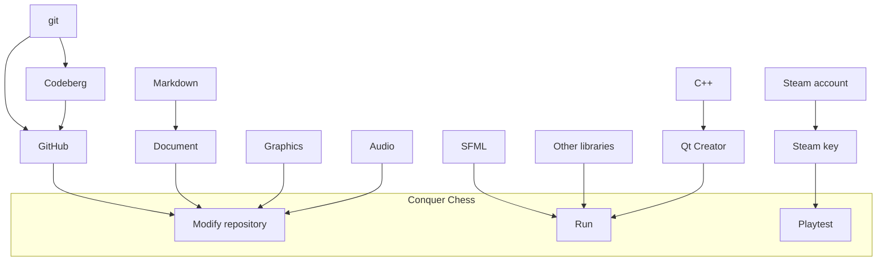

# 2025-09-27

A C++ group intends to start

- [ ] Download and install the free Qt Creator version,
  <https://www.qt.io/download-open-source> .
  If that fails, you can use Visual Studio Code for C++ development
  too; I can make it compile Conquer Chess too with some effort...

- [ ] Download the book Thinking C++ volume 1 by Bruce Eckel,
  e.g. <https://archive.org/details/eckel_-_thinking_in_c_volume_1>

- [ ] Write and run a C++ 'Hello World' program

- [ ] Get a GitHub account.
  If you are too young and you feel uncomfortable,
  you can use Codeberg to get started with a code hosting website.
  Let Richel know your username and/or follow him.
  His username is `richelbilderbeek`

- [ ] Get connected to Lördagskurserna Discord,
  e.g. via <https://discord.gg/mSrmSMdRKf>

- [ ] Make your first git commits.
  Follow the book 'Git for youngsters',
  <https://codeberg.org/richelbilderbeek/git_for_youngsters>

- [ ] Download and install SFML

- [ ] Explore the Conquer Chess repository: what is on the website,
  where is the code, where is the artwork, etc. You can already contribute!

