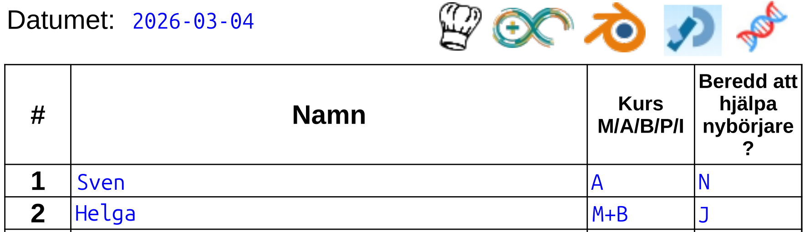

# Atombjörns sida

Den här sida är för Atombjörn,
så han kann hitta saker lättare.
Det är ofta bråttom under Lördagskurserna :-) .


- [Närvarolista](../../naervarolista/presence_list.pdf)
- [Närvarolista legenda](../../naervarolista/presence_list_legenda.pdf)
- [Kurserna tidsoversiktet](../../kurserna/overview.pdf)
- 3D skrivningskurs
    - [3D skrivningskurs lektionskort 1](https://richelbilderbeek.github.io/3d_skrivningskurs/lesson_card/lesson_card_1.pdf)
    - [3D skrivningskurs bok 1 på Svenska](https://richelbilderbeek.github.io/3d_skrivningskurs/books/booklet_1_sv.pdf)
    - [3D skrivningskurs bok 1 på Engelska](https://richelbilderbeek.github.io/3d_skrivningskurs/books/booklet_1_en.pdf)
- Arduino
    - [Arduino lektionskort 1](https://richelbilderbeek.github.io/arduino_foer_ungdomar/lektionskort/lektionskort_1.pdf)
    - [Arduino lektionskort 2](https://richelbilderbeek.github.io/arduino_foer_ungdomar/lektionskort/lektionskort_2.pdf)
    - [Arduino bok 1](https://richelbilderbeek.github.io/arduino_foer_ungdomar/boecker/haefte_1.pdf)
    - [Arduino bok 2](https://richelbilderbeek.github.io/arduino_foer_ungdomar/boecker/haefte_2.pdf)
    - [Arduino bok 3](https://richelbilderbeek.github.io/arduino_foer_ungdomar/boecker/haefte_3.pdf)
    - [Arduino bok 4](https://richelbilderbeek.github.io/arduino_foer_ungdomar/boecker/haefte_4.pdf)
    - [Arduino bok 5](https://richelbilderbeek.github.io/arduino_foer_ungdomar/boecker/haefte_5.pdf)
    - [Arduino bok 6](https://richelbilderbeek.github.io/arduino_foer_ungdomar/boecker/haefte_6.pdf)
    - [Arduino bok 7](https://richelbilderbeek.github.io/arduino_foer_ungdomar/boecker/haefte_7.pdf)
    - [Arduino bok 8](https://richelbilderbeek.github.io/arduino_foer_ungdomar/boecker/haefte_8.pdf)
    - [Arduino bok 9](https://richelbilderbeek.github.io/arduino_foer_ungdomar/boecker/haefte_9.pdf)
    - [Arduino bok 10](https://richelbilderbeek.github.io/arduino_foer_ungdomar/boecker/haefte_10.pdf)
    - [Arduino bok 11](https://richelbilderbeek.github.io/arduino_foer_ungdomar/boecker/haefte_11.pdf)
    - [Arduino bok 12](https://richelbilderbeek.github.io/arduino_foer_ungdomar/boecker/haefte_12.pdf)
    - [Arduino bok 13](https://richelbilderbeek.github.io/arduino_foer_ungdomar/boecker/haefte_13.pdf)
    - [Arduino bok 14](https://richelbilderbeek.github.io/arduino_foer_ungdomar/boecker/haefte_14.pdf)
- Blender:
    - [Blender bok 1](https://github.com/richelbilderbeek/grundkurs_i_blender/blob/master/blenderkurs_bok_1.pdf)
    - [Blender bok 2](https://github.com/richelbilderbeek/grundkurs_i_blender/blob/master/blenderkurs_bok_2.pdf)
- git:
    - [git lektionskort 1](https://richelbilderbeek.github.io/git_for_youngsters/lesson_cards/lesson_card.pdf)
    - [git bok 1](https://richelbilderbeek.github.io/git_for_youngsters/books/booklet_1.pdf)
- Laserskärare
    - [Laserskärare lektionskort 1](https://richelbilderbeek.github.io/laser_cutter_guide/lesson_card/lesson_card_1.pdf)
    - [Laserskärare bok 1](https://richelbilderbeek.github.io/laser_cutter_guide/pdfs/theory_booklet.pdf)
- Lödning:
    - [Lödningskurs lektionskort 1](https://richelbilderbeek.github.io/loedningskurs/lesson_card/lesson_card_1.pdf)
    - [Lödningskurs bok 1](https://richelbilderbeek.github.io/loedningskurs/books/booklet_1.pdf)
- Matlagningskurs:
    - [Matlagningskurs lektionkort 1, 2 och 3](https://github.com/richelbilderbeek/matlagningkurs/blob/main/lektionskort_foer_matlagningskursen.pdf)
    - Matlagningskurs har ingen bok i nutiden
- OpenSCAD:
    - [OpenSCAD lektionkort 1](https://richelbilderbeek.github.io/openscad_kurs/lesson_card/lesson_card_1.pdf)
    - [OpenSCAD bok 1](https://richelbilderbeek.github.io/openscad_kurs/books/booklet_1.pdf)
- Processing:
    - [Processing lektionskort 1](https://richelbilderbeek.github.io/processing_foer_ungdomar/lesson_cards/lektionskort_1.pdf)
    - [Processing lektionskort 2](https://richelbilderbeek.github.io/processing_foer_ungdomar/lesson_cards/lektionskort_2.pdf)
    - [Processing lektionskort 3](https://richelbilderbeek.github.io/processing_foer_ungdomar/lesson_cards/lektionskort_3.pdf)
    - [Processing bok 1](https://richelbilderbeek.github.io/processing_foer_ungdomar/books/haefte_1.pdf)
    - [Processing bok 2](https://richelbilderbeek.github.io/processing_foer_ungdomar/books/haefte_2.pdf)
    - [Processing bok 3](https://richelbilderbeek.github.io/processing_foer_ungdomar/books/haefte_3.pdf)
    - [Processing bok 4](https://richelbilderbeek.github.io/processing_foer_ungdomar/books/haefte_4.pdf)
    - [Processing bok 5](https://richelbilderbeek.github.io/processing_foer_ungdomar/books/haefte_5.pdf)
    - [Processing bok 6](https://richelbilderbeek.github.io/processing_foer_ungdomar/books/haefte_6.pdf)
    - [Processing bok 7](https://richelbilderbeek.github.io/processing_foer_ungdomar/books/haefte_7.pdf)
    - [Processing bok 8](https://richelbilderbeek.github.io/processing_foer_ungdomar/books/haefte_8.pdf)
- Vinylskärare
    - [Vinylskärare lektionkort 1](https://richelbilderbeek.github.io/vevor_vinyl_cutter_to_t_shirt_manual/lesson_card/lesson_card_1.pdf)
    - [Vinylskärare bok 1](https://richelbilderbeek.github.io/vevor_vinyl_cutter_to_t_shirt_manual/pdfs/theory_booklet.pdf)

## Hur att digitalisera närvarolista

Här har vi en exampel närvarolista:



Den måste blir till texten:

```text
2026-03-14,Sven,A,N
2026-03-14,Helga,M,J
2026-03-14,Helga,B,J
```

Texten kan blir skapad hur som helst :+1:
