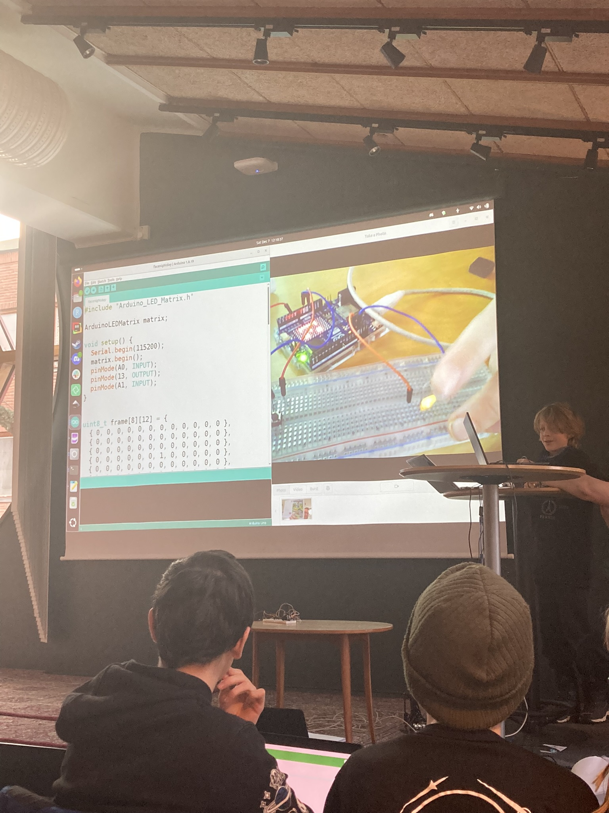
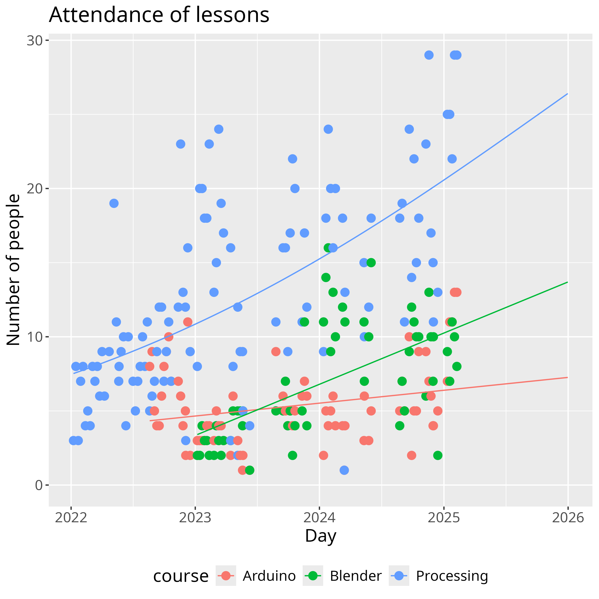

# Penger

Dear funder,

I am the initiator and coordinator of the Lördagskurser
and I could definitely use your help. With this writing,
I hope to convince you of our awesomeness and needs.

The awesomeness of our courses started in january 2022,
where I taught the first lesson to three participants,
after which we grew with around 15 participants per year.
The exact amount of vistors is publicly available at
[https://uppsala-makerspace.github.io/loerdagskurser/data/statistiker_besoekare/](https://uppsala-makerspace.github.io/loerdagskurser/data/statistiker_besoekare/),
including this plot shown below, which shows the amount of visitors in time:

This plot allows me to introduce what we teach:

- Arduino: a printed circuit board that can be programmed to act as the
  brain of an electrical machine
- Blender: a 3D modeling program, suitable for -among others-
  3D printing those images
- Processing: a programming language that is similar to the programming
  languages in the software development industry

The shaded area in the plot shows our success,
as it shows the total amount of participants per day.
The black dots show activities we do besides regular lessons,
such as presentation by all participants in the public library.

> A presentation on 2024-12-06

The mention of these presentations allow me to introduce our anonymous
evaluation we do after each of these. Here, our participants fill
in a form anonymously to help improve our courses.
These evaluation results are publicly available at
[https://uppsala-makerspace.github.io/loerdagskurser/data/utvaerderingar/](https://uppsala-makerspace.github.io/loerdagskurser/data/utvaerderingar/).

One of the things I am most proud of, is that I can say/write that,
for my courses, money is never a problem. The Lördagskurser only uses
volunteers for teaching and we are hosted by the Uppsala Makerspace,
which has similar idealistic ideas. 
The course asks 900 kroner per minor. This money is used to cover expenses,
mostly electronic components, printing costs and the obligatory pizza
at a hackathon.
Although the course is very cheap compared to commercial ones,
around 1 in 20 adults (all parents)
uses the option to follow the course for free, sharing their financial
problems.

The future of the Lördagskurser looks bright: we are still growing.
Below is a plot similar to the one above, that is tuned to make
predictions.

The details (and programming code) can also be found at
[https://uppsala-makerspace.github.io/loerdagskurser/data/statistiker_besoekare/](https://uppsala-makerspace.github.io/loerdagskurser/data/statistiker_besoekare/).

These predictions of the future brings us to our needs:
our participants, mostly minors, some from lower socio-economic status,
need a computer to be able to learn.
Already since the courses started, members of the Uppsala Makerspace
donated their old laptops to my courses. These laptops are have their
quirks and ultimately break down. The biggest bottleneck of things
that can be solved with money, are these laptops.
Currently, we have 15 laptops that are not enough, due to which
we resort to -among others- lending out our own laptops.

Ideally, I would have had 20 laptops today and 30 laptops in a year:
we grow hard. The Uppsala Makerspace has just doubled its size by buying
an extra floor, which was just in time for our course, as the
30 participants cap was looming. With that amount of extra space,
we can continue to grow.

The laptops we need do not need to be the best, nor be bought first-hand,
nor have a proprierary operating system. However,
they must not be Chromebooks, as these are unsuitable for programming.
We don't need much, I mostly need them to be reliable. Taking a look at
[webhallen.com](webhallen.com) it seems 5000 kr per laptops is a reasonable
baseline.

Here, I request 150,000 kronor, which is the financial means to buy 30
laptops of 5000 kronor. 

This amount of money may not be much to this fund, but to me it would
mean a world of difference, in which my students would finally be able
to just pick a laptop and work with it, without any hassle.

In case you wonder what will happen to the older laptops: me and
Uppsala Makerspace consider to lend/give these to the participants of the lowest
socio-economic status, so that they can practice the useful skills
we teach them in their free time too.

In case of questions, never hesitate to email
me at `rjcbilderbeek@gmail.com`.

Thanks for your time and good luck allocating the funds wisely,
Richèl Bilderbeek
