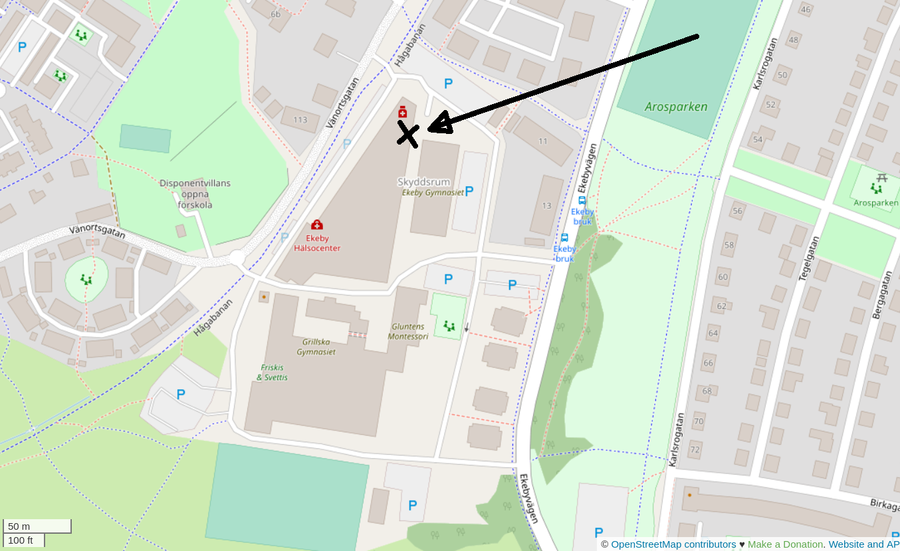
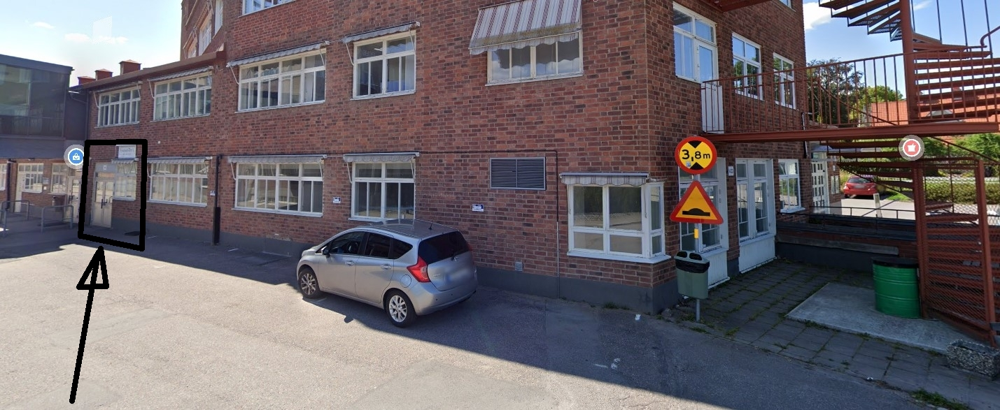

# 🇸🇪 Plats (🇬🇧 location)

=== "🇸🇪"

    Lördagskurserna är hos Uppsala Makerspace i Ekeby Bruk:

=== "🇬🇧"

    The Saturday course are at Uppsala Makerspace in Ekeby Bruk:

```text
Uppsala Makerspace
Ekeby Bruk 6M, 752 63 Uppsala
```

=== "🇸🇪"

    Ekeby Bruk är 2 kilometer sydväst av Uppsala centrum:

=== "🇬🇧"

    Ekeby Bruk is 2 kilometer southwest of the Uppsala city center:


=== "🇸🇪"

    Makerspacet är nära parkeringsplatsen:

=== "🇬🇧"

    The Makerspace is close to the parking lot:



=== "🇸🇪"

    Där kann du ringa på dörren eller knacka på fönstret:

=== "🇬🇧"

    Here you can ring the bell or knock on the window:


