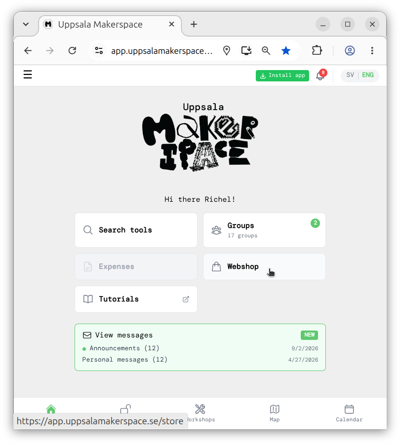
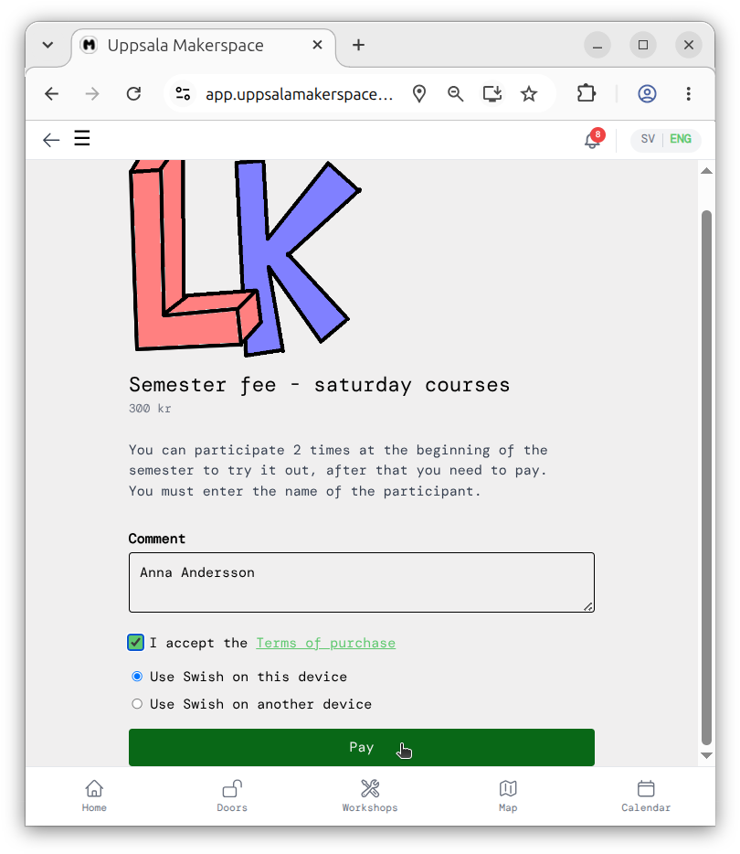

# 20260919_new_payment_system

The cooking course requested not to be advertised.

- [General flyer (pdf)](20260919_new_payment_system.pdf)
- [General flyer (odg)](20260919_new_payment_system.odg)

New payment system

Dear parents,

Twice a year, the Lördagskurser asks for a course fee of 300 kr,
from which we buy our course materials.

If you have already paid for this season (i.e. September 2026-December)
you can stop reading. Thanks!

The Lördagskurser have changed their payment system.

In a webbrowser, go to [`https://app.uppsalamakerspace.se/`](https://app.uppsalamakerspace.se/)
and click 'Webshop'

Click 'Semester fee - Saturday courses'

Fill in the details and click 'Pay'.

Complete the payment. Thanks!
