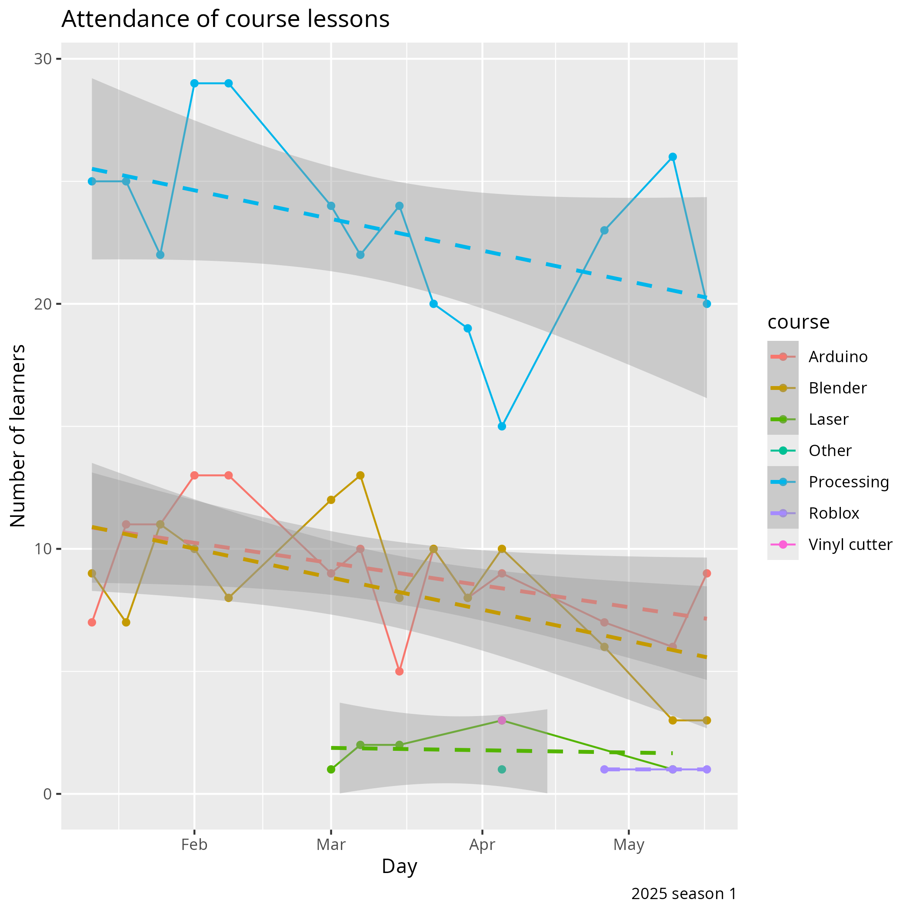

# Reflection 2025-05-24 by Richel

I think this season went great,
thanks to all people (volunteers, parents, kids) involved.

One event that showed how awesome the team of volunteers is,
is when I had to leave unexpectedly due to personal reasons:
Atom Björn took over being boss and the regular volunteers
took over all other matters. This went super smooth and I had never
found the teaching room as clear.

Things that are being worked on:

- Getting a registerutdrag for all volunteers.
  I've been working on this, but slowly, as there were
  matters of higher priority.
  The UMS styrelse is helping me with this
- Collecting the emergency telephone numbers of parents.
  The procedure to do so has been delegated to Atom Björn and Store Björn:
  it's in good hands.
- Rules about
  [reporting concern for a child's welfare](https://www.socialstyrelsen.se/kunskapsstod-och-regler/omraden/barn-och-unga/barn-som-far-illa/):
  I think it's great someone found this out. I'll discuss the details
  with Styrelsen.
- Rules about kids staying longer than me: this is now forbidden, according
  to a UMS flyer. Great that Styrelsen made it explicit and I will
  absolutely leave that flyer with our reception desk.
- Printing certificates: the Dutch company I used to print certificates
  has closed. I have trouble finding another one.

Things that can be improved:

- More learner helpers.
- Having fewer new learners leave the course. I feel the main reason is
  that there is no proper first contact. This first contact must be done
  with a social fellow learner at the right level.
- The electronics workshop's routines. Last time, I had to clean 46 minutes,
  due to 3 kids leaving a mess. I will discuss this with the kids.
  Also, I am worried about the safety of the kids. 
  I will add the rule: 'If working with a capacitor, wear safety glasses'.
  There is a rule already 'Do not solder batteries'.
  Maybe the kids should be trained for safety first?
  I consider to only
  open up the workshop if there is a volunteer to keep an eye on the kids.
- Active scheduling for volunteers.
  Now it is unclear who will be there and for multiple occassions, I was
  the only one teaching. I think this will help the volunteers into
  showing up too
- Improvements to booklets
    - Processing website to MkDocs
    - Add a 3rd lesson card

To discuss with Styrelse:

- [Reporting concern for a child's welfare](https://www.socialstyrelsen.se/kunskapsstod-och-regler/omraden/barn-och-unga/barn-som-far-illa/):
  are we at Lördagskurser recommended or required to do so?

## Courses changes

- We moved to the new upper floor. We had too: we got too big

- We added a reception desk, commonly manned by Atom Björn: it
  makes the course room so much more quiet, with all the paperwork out
  of the way. Also parents now have someone to ask questions to that
  actually has/takes the time to do so. Adding the reception desk has
  been a genius idea

- Team of volunteers:
    - 'veteran' volunteers that continue:
      Janne (Processing), Kristoffer (Processing),
      Store Björn (Blender): it is great having such experienced
      volunteers.
    - volunteers that left: Leslie (Blender): it is too bad, but, indeed,
      the Blender course's attendance did go down.
    - new volunteers: Atom Björn (reception desk),
      Dennis (Processing), Elisha (Processing), Fredrik (Arduino),
      Nikita (Processing): these are all great volunteers and I am
      very happy to have them.

## Future plans

- Cooking course, 9:00-10:00, as part of the regular course

## Extra thanks to these kids

## Previous reflection

> - Ask UMS for +30 person limit on Eftermorsdag

Done! It worked out great.

> - Presentation rule: zero or one questions

Done! This worked out great, so we'll keep this rule.

> - No evaluations after presentation. Instead, do parent evaluations
  during preparing the main room. Let learners fill in form during preparations
  too

This got postponed. Instead, we had presentations for the parents,
where the kids evaluated after the presentations as usual.
We forgot to let the kids evaluate while waiting.

## Course statistics

Course attendance has gone down for all courses.

I feel there is no need to worry at all:
this has happened before when there was an other big change (in 2023-03-25),
where we lost a third of all learners (do note that the learners can
officially sign in for more courses since ~April.
The effect of learners doing so on the graph below is minor).

I predict we'll bounce back after the summer holidays.

## Evaluation results

Taking a look [at the evaluation results](../../data/utvaerderingar/20250524/README.md),

There were 20 evaluation forms being filled in.
The learners seemed quite happy, as a lot went well: e.g. 3x it was
states that 'allt' went well.

What could be improved, according to the learners

- More time
    - Start earlier

This will come true with the next cooking course. Maybe this learners will
also come in at 9:00 and start his/her course then already.

- More books
    - [Explain sine and cosine better in the Processing books](https://github.com/richelbilderbeek/processing_foer_ungdomar/issues/8)
    - [Add a Processing lesson on how to detect a mouse click](https://github.com/richelbilderbeek/processing_foer_ungdomar/issues/9)
    - [Add an Arduino lesson on a color sensor](https://github.com/richelbilderbeek/arduino_foer_ungdomar/issues/8)

This is put into issues.

- More volunteers

This I cannot control.

- More courses

    - Roblox
    - Java
    - Minecraft mods

If there are volunteers for this, I'd be happy to help them!

- Breaks:
    - 11 minutes (instead of 15)
    - 2x Cookies
    - More pan pizzas

I think the breaks should be 15 minutes, as 11 is quite an unexpected
duration that makes the schedule look all funky.
I hope the cooking course reduces the need for cookies and pan pizzas.

