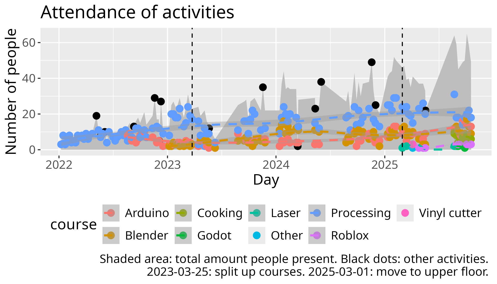

# Reflection 2025-05-24 by Richel

## Courses changes

- We moved to the new upper floor. We had too: we got too big

- We added a reception desk, commonly manned by Atom Björn: it
  makes the course room so much more quiet, with all the paperwork out
  of the way. Also parents now have someone to ask questions to that
  actually has/takes the time to do so. Adding the reception desk has
  been a genius idea

- Team of volunteers:
    - 'veteran' volunteers that continue:
      Janne (Processing), Kristoffer (Processing),
      Store Björn (Blender): it is great having such experienced
      volunteers.
    - volunteers that left: Leslie (Blender): it is too bad, but, indeed,
      the Blender course's attendance did go down.
    - new volunteers: Atom Björn (reception desk),
      Dennis (Processing), Elisha (Processing), Fredrik (Arduino),
      Nikita (Processing): these are all great volunteers and I am
      very happy to have them.

## Future plans

- Cooking course, 9:00-10:00, as part of the regular course

## Extra thanks to these kids

## Previous reflection

> - Ask UMS for +30 person limit on Eftermorsdag

Done! It worked out great.

> - Presentation rule: zero or one questions

Done! This worked out great, so we'll keep this rule.

> - No evaluations after presentation. Instead, do parent evaluations
  during preparing the main room. Let learners fill in form during preparations
  too

This got postponed. Instead, we had presentations for the parents,
where the kids evaluated after the presentations as usual.
We forgot to let the kids evaluate while waiting.

## Course statistics

Course attendance has gone down for all courses.

I feel there is no need to worry at all:
this has happened before when there was an other big change (in 2023-03-25),
where we lost a third of all learners (do note that the learners can
officially sign in for more courses since ~April.
The effect of learners doing so on the graph below is minor).

I predict we'll bounce back after the summer holidays.

## Evaluation results

Taking a look [at the evaluation results](../../data/utvaerderingar/20250524/README.md),

There were 20 evaluation forms being filled in.
The learners seemed quite happy, as a lot went well: e.g. 3x it was
states that 'allt' went well.

What could be improved, according to the learners

- More time
    - Start earlier

This will come true with the next cooking course. Maybe this learners will
also come in at 9:00 and start his/her course then already.

- More books
    - [Explain sine and cosine better in the Processing books](https://github.com/richelbilderbeek/processing_foer_ungdomar/issues/8)
    - [Add a Processing lesson on how to detect a mouse click](https://github.com/richelbilderbeek/processing_foer_ungdomar/issues/9)
    - [Add an Arduino lesson on a color sensor](https://github.com/richelbilderbeek/arduino_foer_ungdomar/issues/8)

This is put into issues.

- More volunteers

This I cannot control.

- More courses

    - Roblox
    - Java
    - Minecraft mods

If there are volunteers for this, I'd be happy to help them!

- Breaks:
    - 11 minutes (instead of 15)
    - 2x Cookies
    - More pan pizzas

I think the breaks should be 15 minutes, as 11 is quite an unexpected
duration that makes the schedule look all funky.
I hope the cooking course reduces the need for cookies and pan pizzas.

