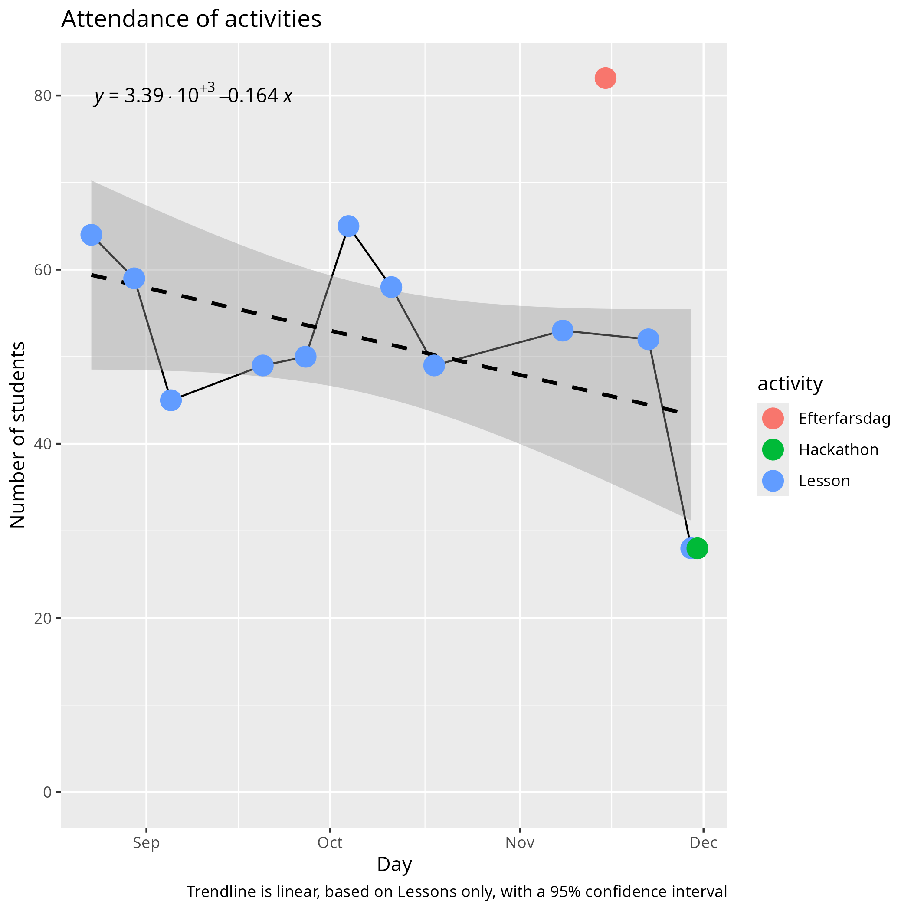

# Reflection 2025-12-06 by Richel

- [Evaluation results](../../data/utvaerderingar/20251206/README.md)
- [Reflection](../../reflektioner/20251206_richel/README.md)

I think this season went well.

The biggest changes were:

- The addition of a cooking course, as lead by Store Björn and assisted by
  Johanna
- Maturation of the Gyllene Rummet, as lead by Leonid and Herman
- No Arduino volunteer, yet more Arduino learners
- AtomBjörn upgrading the reception desk
- AtomBjörn collecting parents' phone numbers

## Course attendance

Taking the average number of learners per year,
the course seems to grow:

However, this growth can be explained by how attendance is measured:
if a learners takes more courses, he/she is counted multiple times.
We can conclude that **we have increased attendance over the day**.

By other means, the numbers of learners seems to have stabilized:
here we plot the distribution of the learners over the year:

This graph shows when in the year, most learners are present. Where
2022 shows that most learners attend at the end of the year, this
shows a growth. Where 2024 and 2025 show that learners show up equally
over the year. This hints that **growth may have stopped**.

When looking at the last season on its own, we
see a slight decrease:

This decrease, however, seems to be most explained by the outlier
at the end. Removing it, seems to hint that **growth may have stopped**.

Taking a look at course attendence over the last season:

Adding a trendline and showing the equation to get the slope:

From this, per course, we can see how many learners for a course
per month:

Course    |Change of learners per day|Change of learners per 30 days
----------|--------------------------|------------------------------
Arduino   |0.018                     |0.54
Laser     |-0.0122                   |-0.366
Roblox    |-0.0264                   |-0.792
Cooking   |-0.0309                   |-0.927
Godot     |-0.0383                   |-1.149
Processing|-0.0594                   |-1.782
Blender   |-0.0619                   |-1.857

Arduino is growing for unknown reasons. I really have no idea
what is so attractive there ...? Blender and Processing are the courses
that are taking the biggest dives. Also here, I have no idea
why this is. In summary:
**I have no idea why the attendance of courses go up or down**.

Before deciding to take action, let's take at the bigger picture:

The vertical scale has a big range, because of
**Efterfarsdag was a big success**.

Let's zoom in a bit on regular course attendance:

Based on this graph, I would say
**course attendance has a high variability and seems stable**.

In conclusion, I would say that
**attendance and course attendance have stopped growing**.
and **no action seems needed**.

## Team

Course        |Team before                    |Team after               |Verdict
--------------|-------------------------------|-------------------------|-------------------------------------
Cooking       |Store Björn                    |Store Björn, Johanna     |Great!
Arduino       |Fredrik                        |None                     |Could use a volunteer here
Blender       |Store Björn                    |Store Björn              |Seems good
Processing    |Christoffer,Dennis,Janne,Sjoerd|Christoffer,Fredrik,Janne|A group that can be relied upon
Reception desk|AtomBjörn                      |AtomBjörn                |A person that can be relied upon
Laser         |Lars                           |Lars                     |Unpredictable when someone is present
Vinyl cutter  |None                           |None                     |Could use a volunteer here

The team consists out of 7 people, of which 1 new.
I am quite proud how this -quite experienced- team rolls.

## Finances

As I have no access to the finances, I have no idea how many parents
pay the half-yearly course fee. I can imagine AtomBjörn gets questions
about this and that parents pay their dues. On the other hand, I can
perfectly imagine parents forgetting this.

- [ ] Check with finances person (I do not remember the name)
  how many people paid for the course the last half year

## Evaluation results

New is that also parents were allowed to fill in suggestions:
these are quite helpful ones.

What goes well:

- Bra som det är, kommer inte på ngt
- Matlagning
- Ha kul!
- Kul
- Lektioner
- Matlagningskurser (allt på den)!
- Mentorskop (äldre barn lär yngre/nyare)
- Keep all the patience you have
- Great job!
- Jättebra. Tack för allt jobb ni gör!
- Fortsätt vara som det är. Uppsala Makerspace är bäst!
- Keep working like it is!
- Nästan allt
- Baka mera kakor
- Vi är otroligt nöjda med allt!
  Speciellt att deltagarna får mer ansvar,
  får hjälpa varandra unsv. Tack!
- The cooking courses are such a nice addition
  this year. Our kid loves his time at Makerspace.
  Thanks so much for volunteering your time
  to enrich kids' lives. You are making
  good memories for them
- Kurserna är lärorik och inspirerande.
  Många praktiska övning. Väl organiserade.
  Personalen är mycket hjälpsam och snäll
- Fortsätt som ni gör, allt är toppen
- Laga mat
- Tack för allt ni gör
- Ni har en välkommande undervisning som
  passar barnens utveckling!
- All is perfect! Thanks you for offering this

This is all nice.

### What could be improved?

- Jag önskar att barnen kan ha fler lektionstillfällen
  i veckan, speciellt för de barn som är
  intresserade och vill fördjupa sig mer

This will be impossible without more volunteers

- Lördag + söndag + lärogutecreater

This will be impossible without more volunteers

- Minecraft modding kurs

This will be impossible without a volunteer teaching this

- Making couse för minecraft and roboxs

This will be impossible without a volunteer teaching this

- Matlagningskurs: mera mat som inte kräver värme (some kan göra
  ensam nima hemma)

I think this is an interesting suggestion!
I am not the boss about this course, but I will let them know :-)

- [ ] Store Björn: share this suggestion

- Programmering: her ett project från början av terminen
  (type: jag ska lära mig att skriva 10 rader kod,
  jag ska få min 3D modell utprintad)

I think this is an interesting idea.

- [ ] Consider how to get more project-based work in

- Tomt
- Empty
- Kanske hitta ett störe rum för det Gyllene Rummet

I enjoy the suggestion. I do think it is even better that the room is small:
it helps enforce stricter rules.

- Tuggummi i shopen
- [A heart]
- I honestly cannot think of anything.
  Maybe eile parents who can
  contribute can be told how?
  I'm sure some of the food and ingredients
  cost money, for example. We parents
  can always offer, though

I am sure -even more thanks to this suggestions- that parents are quite
willing to help. I will forward this suggestion to the cooking course.

- [ ] Let cooking course know that parents can help to do the shopping

- Barn är mycket gläda att de ha ett plats
  att göra någonting
  speciellt och rolig. Tack!
- Som vi upplever de verkar allt fungera jättebra.
  Sonen är väldigt nöjd och trivs
- Skapa en bok/häfte med recepter

I know the cooking course is pondering doing so. Maybe this suggestion
will encourage them even more to do so.

- [ ] Let cooking course know about this suggestion

- Peppa gärna barnen att göra projekt, eller
  saker, tillsammans. Vissa barn kan behöva
  lite social training. Även push för att
  alla ska fika samtidigt

- Veckobrev, tack!

