# Reflection 2026-05-30 by Richel

- [Evaluation results](../../data/utvaerderingar/20260530/README.md)
- [Reflection](../../reflektioner/20260530_richel/README.md)

I think this season went well.

## Number of learners seems stable

The number of visits seems stable or slightly decreasing:

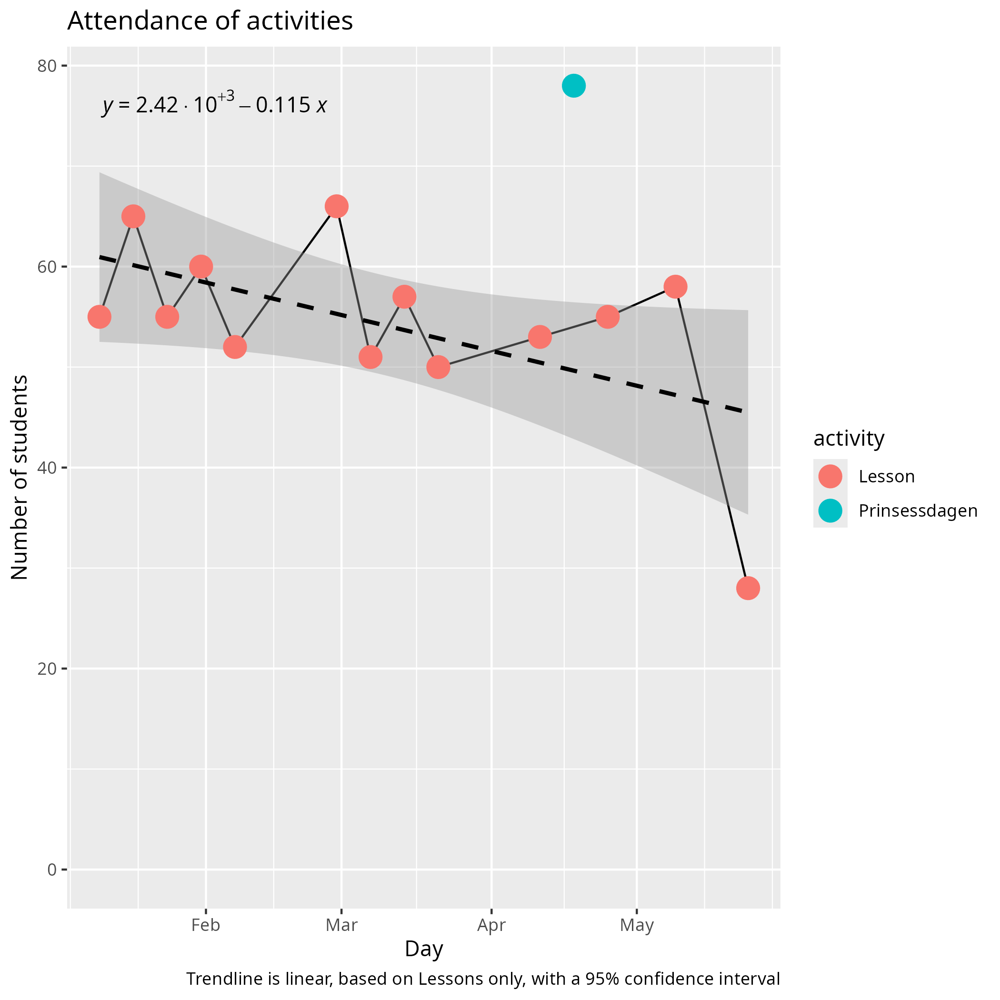

The low amount of visitors at the practice presentations is a recurring thing.

The number of visitors still increases:

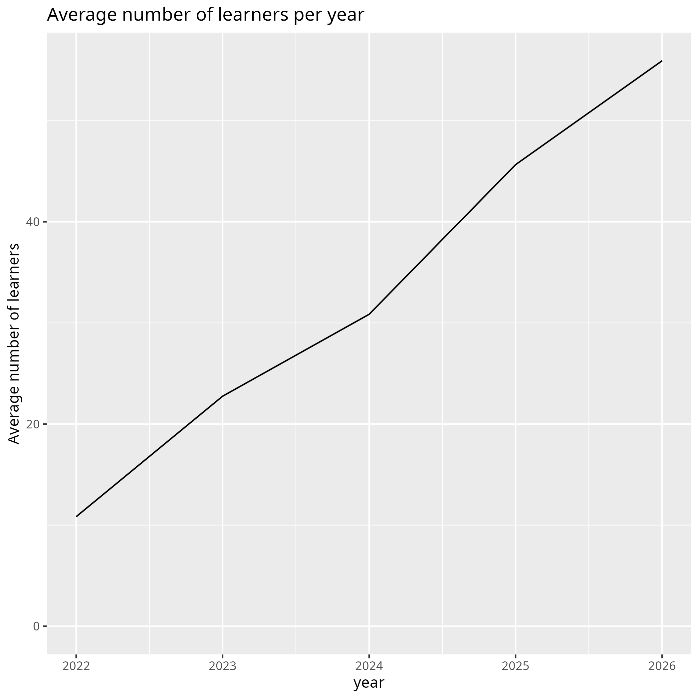

This can be caused by the introduction of the cooking course: most learners
that follow this course, do take another course afterwards.

Over the year, the number of learners is stable:

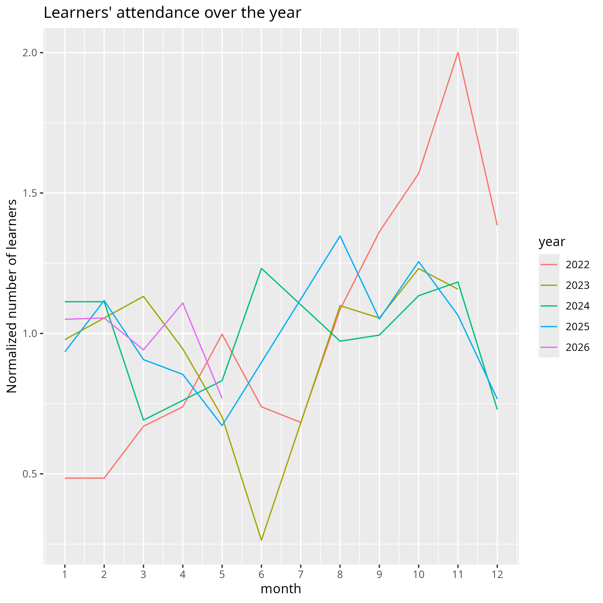

## One in five learners stays

One in five learners stays longer than 1 season
and some learners stay very long:

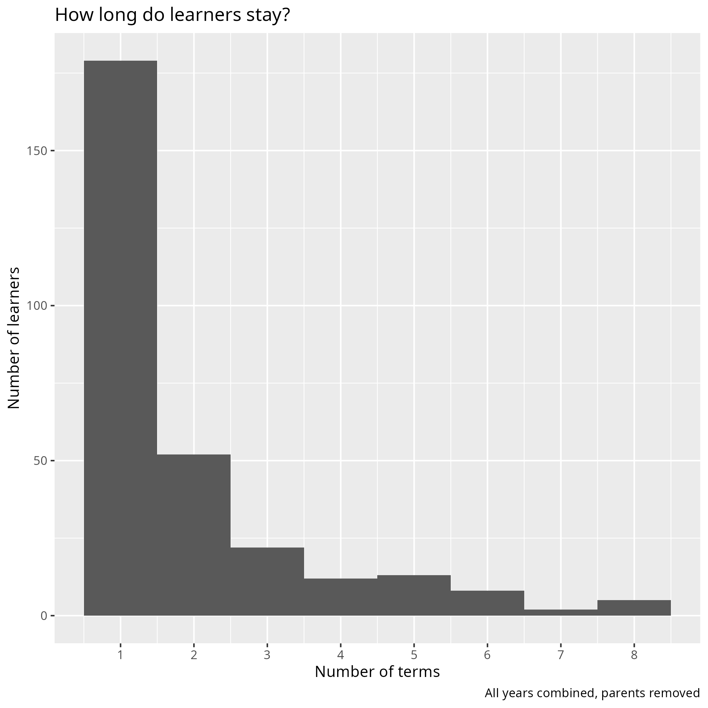

I have my worries with an old/veteran/in-crowd group that stays
and new learners that drop out.
I do see that, for example, the Gyllene Rummet is comfortable with
absorbing new learners, even though the room is crowded.

## A quarter of all learners help out

And I do see that it is the veterans that ruthlessly
offer to help (and hence help newbies to stay)
at all places (i.e. Gyllene Rummet, Platina Rummet, Electronik verstad)
with 2 out of the top-14 helpers being newbies themselves:

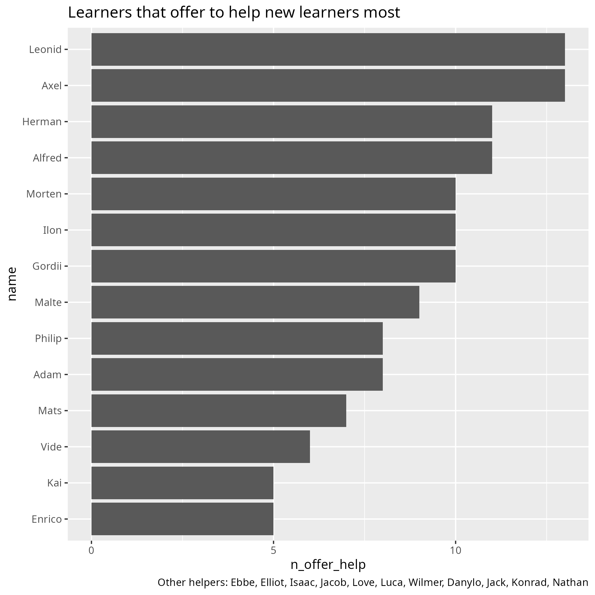

When people help is unpredictable, but it is around 25%:

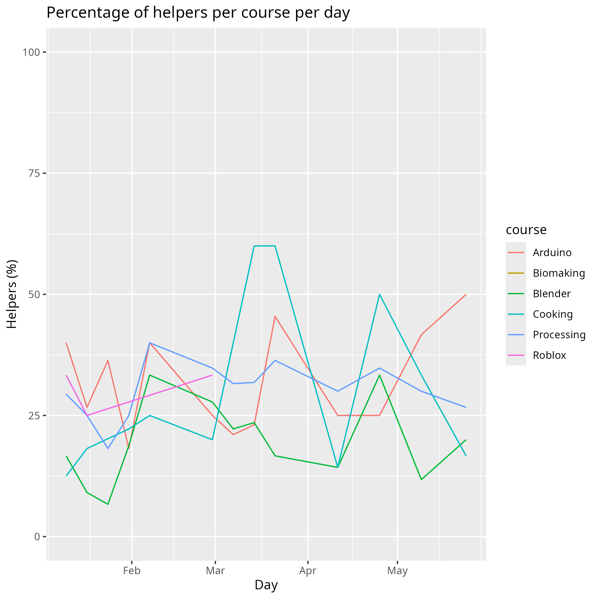

## Courses

## Number of learners per course seems stable

Which courses are visited seems stable:

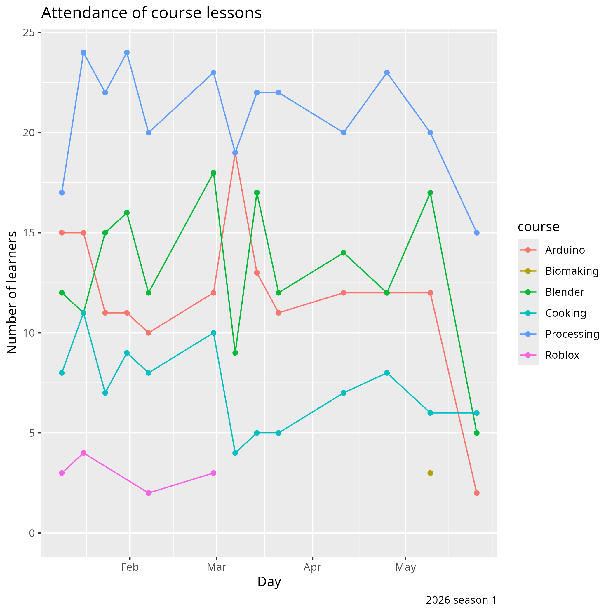

Here I use that same data to make predictions:

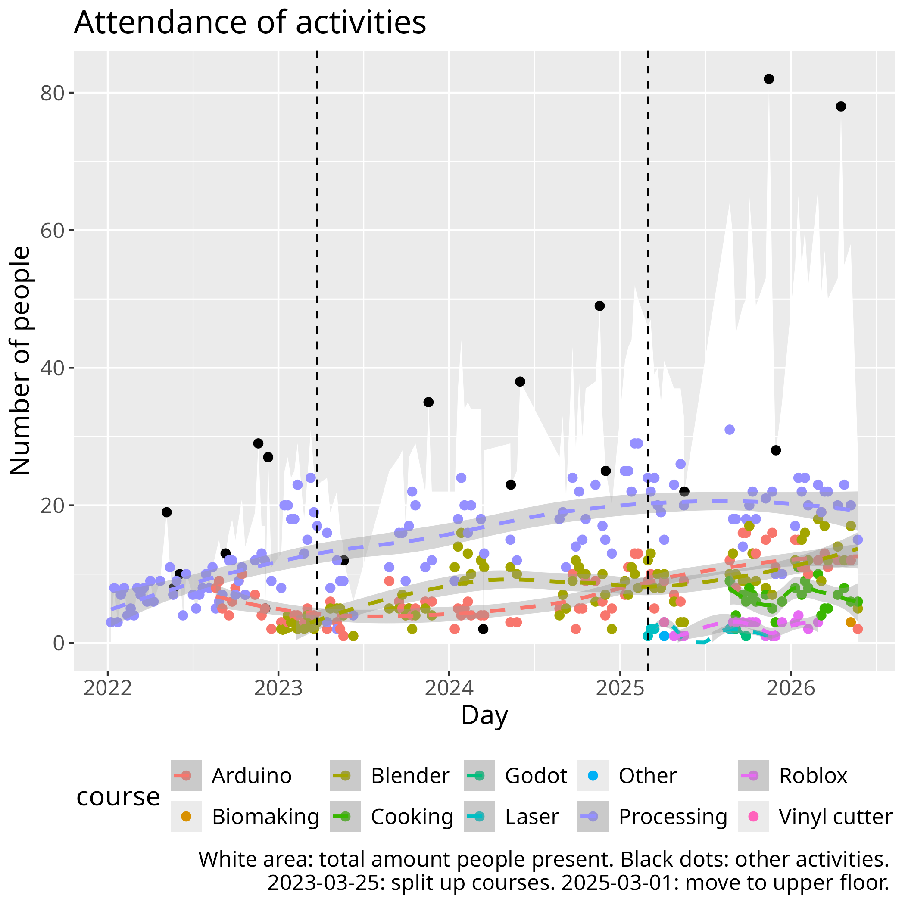

The prediction model assuming a logistic growth for
courses now states that Blender and Processing are
now at carrying capactity, where Arduino and the cooking course
are still growing:

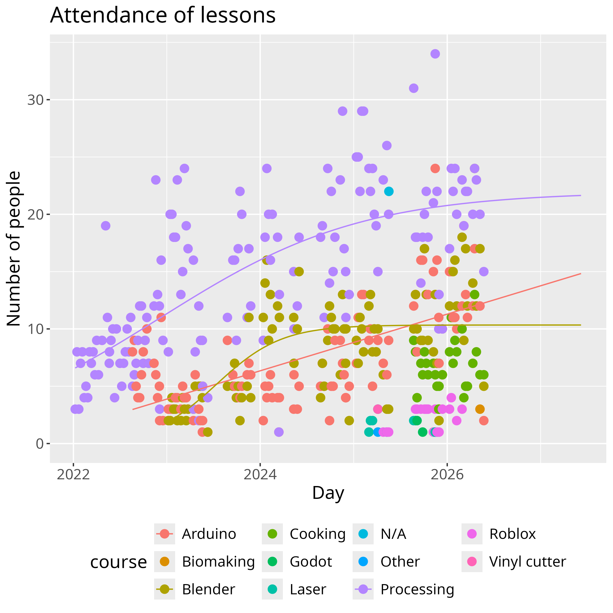

## Arduino does fine

The Arduino course does fine.

One innovation is an Arduino-specific electronic component organizers,
where the drawers are organized based on the lessons, with the top-left
drawer having the component for lesson 1.

The Arduino course still has a weakness:

- [ ] Update the connect-buttons lesson (?8) on the first lesson card

The Arduino course has had its first certificates since a long time,
with two learners having finished the first lesson card.
I have started working on the next lesson card, but the lessons
there were rushed and I am not happy with them yet.
These new lessons also required an investment, as new components needed to be
bought.

One thing I did wrong with designing the learning line of lesson card 2,
is that I followed the same structure as in lesson card 1, with 1 lesson
on connecting a component, 1 lesson on measuring a component and 1 lesson
on using an Arduino to use a component: this does not work anymore
for the more complex components. Instead, I want lesson card 2 to focus more
on **combining multiple components**.

- [ ] Work on lesson card two

## Blender does fine

The Blender course seems to do fine.

The amount of learners seems to be stable.
Me and the Blender course leader are always on the lookout
to make Blender more important, such as by asking learners to create
3D printed things for the Arduino or cooking course.
One example is a 3D printed thing/?shield to get powdery sugar into a text
on a cake.

The Blender books seems to be fine. We have our first learner
that is on track to do all the lessons and get the first Blender
certificate ever. Let's see if he finishes that lesson card :+1:

The Blender course learners have found the 3D printers.
In the background, a UMS member fixes these outside of course hours
and he notices that 3D printers break too often.
To help him out and to make sure the 3D printers are in good shape,
we've added two rules about 3D printing: 

- For the first print, you need to see the print from start to end
- For the second and later prints, you need to be within hearing distance 

## Cooking does fine

The cooking course seems to do fine.

The course has a stable group of participants.

The course does not use a booklet yet.

They have developed a lesson card and the first learner
finishing it is near.

## Laser cutter seems dormant

The laser cutter course seems to be dormant.

Only few times the laser cutter volunteer was present.
Due to this, few learners learned to use the laser cutter.

## Processing seems fine

The programming course seems to do fine.

The amount of learners seems to be stable.

The course has two lesson cards, which have been completed by multiple
learners. The Gyllene and Platinum Rummet are where these elite programmers
end up. In both rooms, these learners seem to develop into doing group
projects.

## New Biomaking course worked fine

This season had two occurrances of the Biomaking course,
the first English-only course,
taking place from 13:00-15:00,
with 4 and 3 learners being present, with
4 (or 6?) weeks between the two sessions.
The language seemed not to be a deterrant.
The time the course took place, however, may have reduced attendance:
at the same time, in the programming course, there are stable
groups of friends, that will be hard to break up.

## Reception desk

The reception desk is a joy.

The main volunteer running it is given more responsibility (read:
admin!) and seems to be happy with that:

- maintain a list of learner, parents and phone numbers:
  ongoing, I estimate 2 out of 3 learners is on this list
- maintain a list of allergies:
  ongoing, started later, I estimate 1 out of 5 learners
  is on this list. This needs more work

Additionally, the reception desk is happy to take up another
task: the presence lists. I will happily instruct him
how to do so :+1:

The reception desk is also a great place for questions.
I happily and commonly redirect people to the reception desk
under course hours.

## Gyllene Rummet

The Gyllene Rummet is lead by two learners,
holds many veteran learners and can be recognized
from its liveliness (i.e. noise). I think the leaders of the
room do an excellent job at running this room: they even
have stricter rules than the other rooms.

I want to keep the Gyllene Rummet as it is,
keep its leadership and and follow the rules they decide upon.

## Platina Rummet

The Platina Rummet is not lead by one or more people,
holds many veteran and more individualistic
learners and can be recognized from its high focus and silence.
It is this room where, during the Extratimme, we have a shared project.
The shared project, however, is not the main project for any of the
learners, but at 14:15 they seem to agree to work on it.
Due to this, progress is slow. However, I am happy with how it is
going: it is the first time that these people see code
written by others.

I want to keep the Platina Rummet as it is
and I hope that an extra term will help the people
in the Platina Rummet to become more of a group.

## Percentage of adult visitors is decreasing

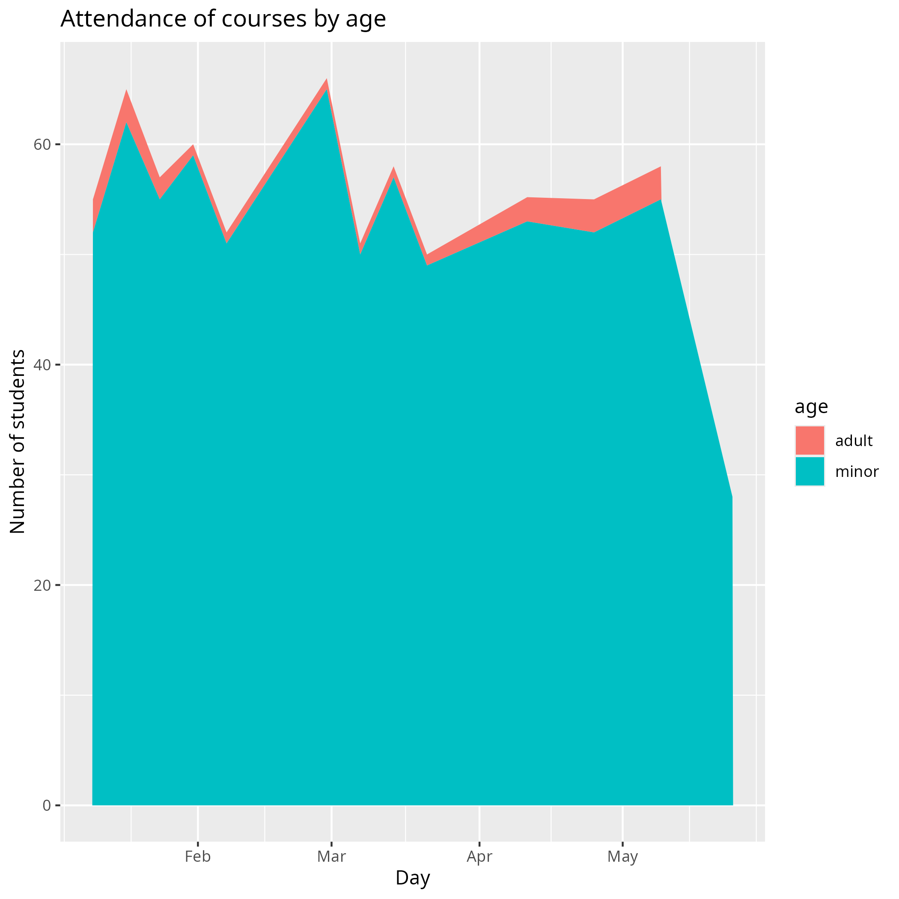

I enjoy having adults. The minors -from earlier evaluations- like having
adults. Even though I put extra care into keeping adults,
I failed to increase the percentage of adults in the LK.
One reason for this is that I used the Extratimme -the hour for adults-
to lead an advanced programming team: I could only do one thing.

One of the volunteers intends to start teaching something himself,
at hours outside of the LK. Maybe he can be the connecting factor here.
If will do I all can to make that happen :+1:

## Team

The team consists out of 7 people, of which 1 new.
I am quite proud how this -quite experienced- team rolls.

## The shortage of volunteers is stable

Most volunteers have been active for at least a year now
and it a joy to work with all of them:
they know what to do and could take over would something urgent pop up.
I did fail to attract more volunteers, even though I have been
actively visiting UMS events that I can use to recruit new volunteers.

There **was** a very enthusiastic volunteer. However, after three times
showing up (and teaching the whole day!) he suddenly disappeared.
His first name is common and I failed to remember his last name,
so I could not contact him. I hope he is OK.

These are some number showing how much percentage of the times there
is a volunteer, where 100% denotes that there is 1 volunteer on average:

Course      |Volunteer density
------------|-----------------
Arduino     |110%
Biomaking   |100%
Blender     |100%
Cooking     |175%
Laser cutter|10%
Processing  |50%

## Thank you meeting for volunteers

I organized the first thank-you meeting for the direct volunteers,
with 3 out of 7 volunteers showing up. I can be blamed for this low
amount, as I organized this last-minute.

- [x] Schedule thank-you meeting earlier

I do intend to add a thank-you meeting for all volunteers at UMS:
there are so many that indirectly help LK.

## Percentage of females is increasing

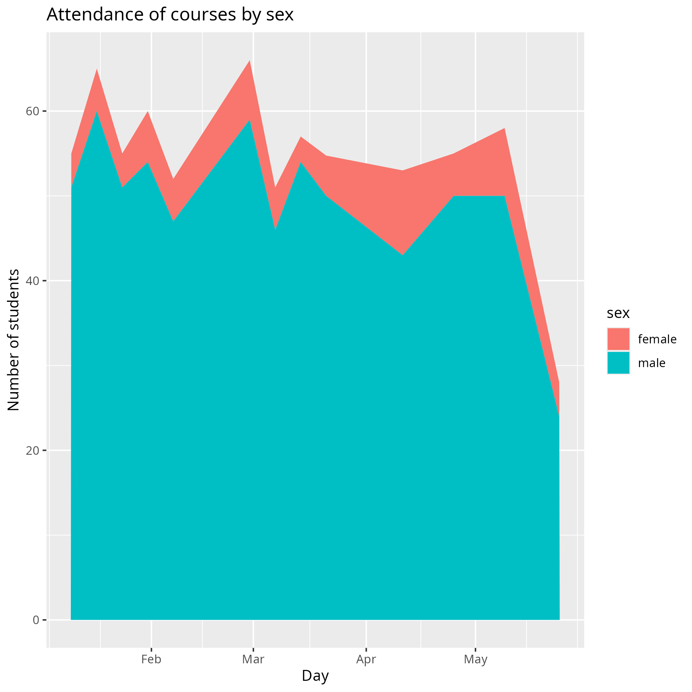

In the 2026 data so far, I see that 12% of all visits is by a female.
and 29% of all unique visitors is a female.
Compared to 2025, where 11% of all visits is by a female.
and 24% of all unique visitors is a female,
this is a 10-20% increase.
I feel the cooking course is the main cause of this,
with 2 girls (out of 8 learners) being part of the core group.

## Prinsessdagen

The Prinsessdagen was visited well
and worked out great. As we use 'prinsess' instead of 'mor', some
learners brought a classmate. I think that that is superior,
so I want to stick to the females-in-general theme.

I did not like the title however
and I will use 
[International Women's Day](https://en.wikipedia.org/wiki/International_Women's_Day)
next time, around March 8th.

I already started this, by using International Men's Day instead of
Efterfarsdag.

## Finances

As I have no access to the finances, I have no idea how many parents
pay the half-yearly course fee. I do know that Uppsala Kommun
donates a sum of money to UMS
that easily covers all course expenses.

This season, there were more expenses, due to some Arduino
learners going through new lessons of which the components
had not yet been bought.

## Evaluation results

What goes well:

What could be improved?

<!--
## Future plans

- [ ] Consider how to get more project-based work in
- [x] Let cooking course know about a suggestion to learn to cook food that does
  not require heating (and hence, can be done when home alone)
- [x] Let cooking course know that parents can help to do the shopping
- [x] Let cooking course know about a suggestion to create a recipe book

Also, there needs to be more booklets about Arduino: we
have our first ever Swedish learner that finished all booklets!

Offline Simulators:

- Fritzing: awesome, 8 USD, programming does not work yet
- Proteus: commerial, not free
- SimulIDE:

- UNOArdusim: Windows only, [download](https://sites.google.com/site/unoardusim/simulator-download)

Arduino IO Simulator|
Paulware Arduino Simulator

Online Simulators:

- Tinkercad: requires an email address, strict on COPPA
- PICSIMLAB
- WOKWI
- Microsoft Maker Code
- Virtualbreadboard

## Conclusion

- Course attendance seems stable (i.e. not growing anymore)
- Learners stay long: we have 5 that have stayed all 7 seasons (!)
- The team is experienced (hence easy to works with), yet too small
- The evaluation results are very positive,
  although there is a selection bias that happy participants
  tend to stay :-)
- Much praise and suggestions for the new cooking course
- Financially we seem to do fine

-->
