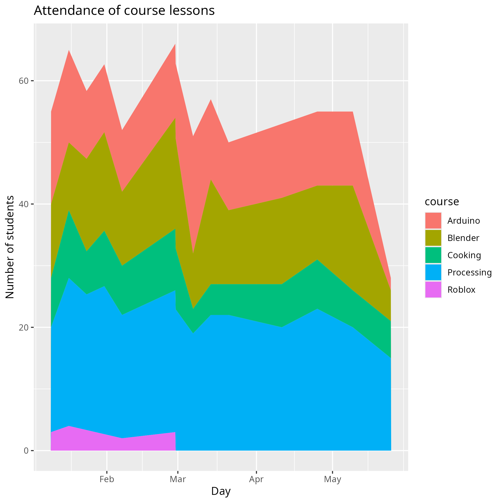

# Reflection 2026-05-30 by Richel

- [Evaluation results](../../data/utvaerderingar/20260630/README.md)
- [Reflection](../../reflektioner/20260530_richel/README.md)

I think this season went well.

## Number of learners seems stable

The number of visits seems stable or slightly decreasing:

The low amount of visitors at the practice presentations is a recurring thing.

The number of visitors still increases:

This can be caused by the introduction of the cooking course: most learners
that follow this course, do take another course afterwards.

Which courses are visited seems stable:

The prediction model assuming a logistic growth for
courses now states that Blender and Processing are
now at carrying capactity, where Arduino and the cooking course
are still growing:

Some learners stay very long:

I have my worries with an old/veteran/in-crowd group that stays
and new learners that drop out.
I do see that, for example, the Gyllene Rummet is comfortable with
absorbing new learners, even though the room is crowded.

And I do see that it is the veterans that ruthlessly
offer to help (and hence help newbies to stay)
at all places (i.e. Gyllene Rummet, Platina Rummet, Electronik verstad)
with 2 out of the top-14 helpers being newbies themselves:

## New Biomaking course worked fine

This season had two occurrances of the Biomaking course,
the first English-only course,
taking place from 13:00-15:00,
with 4 and 3 learners being present, with
4 (or 6?) weeks between the two sessions.
The language seemed not to be a deterrant.
The time the course took place, however, may have reduced attendance:
at the same time, in the programming course, there are stable
groups of friends, that will be hard to break up.

## Gyllene rummet

## Platina rummet

## Percentage of adult visitors is decreasing

I enjoy having adults. The minors -from earlier evaluations- like having
adults. Even though I put extra care into keeping adults,
I failed to increase the percentage of adults in the LK.
One reason for this is that I used the Extratimme -the hour for adults-
to lead an advanced programming team: I could only do one thing.

One of the volunteers intends to start teaching something himself,
at hours outside of the LK. Maybe he can be the connecting factor here.
If will do I all can to make that happen :+1:

## The shortage of volunteers is stable

Most volunteers have been active for at least a year now
and it a joy to work with all of them:
they know what to do and could take over would something urgent pop up.
I did fail to attract more volunteers, even though I have been
actively visiting UMS events that I can use to recruit new volunteers.

There **was** a very enthusiastic volunteer. However, after three times
showing up (and teaching the whole day!) he suddenly disappeared.
His first name is common and I failed to remember his last name,
so I could not contact him. I hope he is OK.

These are some number showing how much percentage of the times there
is a volunteer, where 100% denotes that there is 1 volunteer on average:

Course      |Volunteer density
------------|-----------------
Arduino     |110%
Biomaking   |100%
Blender     |100%
Cooking     |175%
Laser cutter|10%
Processing  |50%

## Percentage of females is increasing

In the 2026 data so far, I see that 12% of all visits is by a female.
and 29% of all unique visitors is a female.
Compared to 2025, where 11% of all visits is by a female.
and 24% of all unique visitors is a female,
this is a 10-20% increase.
I feel the cooking course is the main cause of this,
with 2 girls (out of 8 learners) being part of the core group.

<!-- 

The biggest changes were:

- The addition of a cooking course, as lead by Store Björn and assisted by
  Johanna
- Maturation of the Gyllene Rummet, as lead by Leonid and Herman
- No Arduino volunteer, yet more Arduino learners
- AtomBjörn upgrading the reception desk
- AtomBjörn collecting parents' phone numbers

## Course attendance

Taking the average number of learners per year,
the course seems to grow:

However, this growth can be explained by how attendance is measured:
if a learners takes more courses, he/she is counted multiple times.
We can conclude that **we have increased attendance over the day**.

By other means, the numbers of learners seems to have stabilized:
here we plot the distribution of the learners over the year:

This graph shows when in the year, most learners are present. Where
2022 shows that most learners attend at the end of the year, this
shows a growth. Where 2024 and 2025 show that learners show up equally
over the year. This hints that **growth may have stopped**.

When looking at the last season on its own, we
see a slight decrease:

This decrease, however, seems to be most explained by the outlier
at the end. Removing it, seems to hint that **growth may have stopped**.

Taking a look at course attendence over the last season:

Adding a trendline and showing the equation to get the slope:

From this, per course, we can see how many learners for a course
per month:

Course    |Change of learners per day|Change of learners per 30 days
----------|--------------------------|------------------------------
Arduino   |0.018                     |0.54
Laser     |-0.0122                   |-0.366
Roblox    |-0.0264                   |-0.792
Cooking   |-0.0309                   |-0.927
Godot     |-0.0383                   |-1.149
Processing|-0.0594                   |-1.782
Blender   |-0.0619                   |-1.857

Arduino is growing for unknown reasons. I really have no idea
what is so attractive there ...? Blender and Processing are the courses
that are taking the biggest dives. Also here, I have no idea
why this is. In summary:
**I have no idea why the attendance of courses go up or down**.

Before deciding to take action, let's take at the bigger picture:

The vertical scale has a big range, because of
**Efterfarsdag was a big success**.

Let's zoom in a bit on regular course attendance:

Based on this graph, I would say
**course attendance has a high variability and seems stable**.

Learners stay long, with seven that have stayed all seven seasons of the
course:

n_terms|n_learners
-------|----------
1      |157
2      |42
3      |19
4      |13
5      |11
6      |3
7      |5

This means that from the 157 there are (157 - 42 - 19 - 13 - 11 - 3 - 5 =)
64 that leave the course within one season. This means ((157 - 64) / 157 =)
60% have properly been part of the course.

I tend to reflect after a season of Lördagskurserna. In case you are interested, my thoughts about the courses can be found at this LK webpage. Some highlights:

In conclusion, I would say that
**attendance and course attendance have stopped growing**.
and **no action seems needed**.

## Team

Course        |Team before                    |Team after               |Verdict
--------------|-------------------------------|-------------------------|-------------------------------------
Cooking       |Store Björn                    |Store Björn, Johanna     |Great!
Arduino       |Fredrik                        |None                     |Could use a volunteer here
Blender       |Store Björn                    |Store Björn              |Seems good
Processing    |Christoffer,Dennis,Janne,Sjoerd|Christoffer,Fredrik,Janne|A group that can be relied upon
Reception desk|AtomBjörn                      |AtomBjörn                |A person that can be relied upon
Laser         |Lars                           |Lars                     |Unpredictable when someone is present
Vinyl cutter  |None                           |None                     |Could use a volunteer here

The team consists out of 7 people, of which 1 new.
I am quite proud how this -quite experienced- team rolls.

## Finances

As I have no access to the finances, I have no idea how many parents
pay the half-yearly course fee. I can imagine AtomBjörn gets questions
about this and that parents pay their dues. On the other hand, I can
perfectly imagine parents forgetting this.

- [/] Check with finances person (I do not remember the name)
  how many people paid for the course the last half year
    - Contacted person on 2025-12-14

Additionally, Uppsala Kommun donated 250k kroner to UMS, largely to the LK.
Below the relevant snippet from the UMS Newsletter:

> Uppsala Municipality has granted our association an operating grant of SEK
> 250,000 for children's and young people's free time for 2026.
> The support depends largely on our Saturday courses,
> where there are many children.
> The municipality also takes into account that children and young people
> under 26 are members of our association and enjoy the workshops
> to work on their own projects.

With that donation, I think we cannot be in the negative whatever I would
do :-)

## Evaluation results

New is that also parents were allowed to fill in suggestions:
these are quite helpful ones.

What goes well:

- Bra som det är, kommer inte på ngt
- Matlagning
- Ha kul!
- Kul
- Lektioner
- Matlagningskurser (allt på den)!
- Mentorskop (äldre barn lär yngre/nyare)
- Keep all the patience you have
- Great job!
- Jättebra. Tack för allt jobb ni gör!
- Fortsätt vara som det är. Uppsala Makerspace är bäst!
- Keep working like it is!
- Nästan allt
- Baka mera kakor
- Vi är otroligt nöjda med allt!
  Speciellt att deltagarna får mer ansvar,
  får hjälpa varandra unsv. Tack!
- The cooking courses are such a nice addition
  this year. Our kid loves his time at Makerspace.
  Thanks so much for volunteering your time
  to enrich kids' lives. You are making
  good memories for them
- Kurserna är lärorik och inspirerande.
  Många praktiska övning. Väl organiserade.
  Personalen är mycket hjälpsam och snäll
- Fortsätt som ni gör, allt är toppen
- Laga mat
- Tack för allt ni gör
- Ni har en välkommande undervisning som
  passar barnens utveckling!
- All is perfect! Thanks you for offering this

This is all nice.

### What could be improved?

- Jag önskar att barnen kan ha fler lektionstillfällen
  i veckan, speciellt för de barn som är
  intresserade och vill fördjupa sig mer
- Lördag + söndag + lärogutecreater

This will be impossible without more volunteers

- Minecraft modding kurs
- Making couse for Minecraft and Robloxs

This will be impossible without a volunteer teaching this

- Matlagningskurs: mera mat som inte kräver värme (some kan göra
  ensam nima hemma)

I think this is an interesting suggestion!
I am not the boss about this course, but I will let them know :-)

- [x] Let cooking course know about a suggestion to learn to cook food that does
  not require heating (and hence, can be done when home alone)

- Programmering: her ett project från början av terminen
  (type: jag ska lära mig att skriva 10 rader kod,
  jag ska få min 3D modell utprintad)

I think this is an interesting idea.

- [ ] Consider how to get more project-based work in

- Tomt
- Empty
- Kanske hitta ett störe rum för det Gyllene Rummet

I enjoy the suggestion. I do think it is even better that the room is small:
it helps enforce stricter rules.

- Tuggummi i shopen
- [A heart]
- I honestly cannot think of anything.
  Maybe eile parents who can
  contribute can be told how?
  I'm sure some of the food and ingredients
  cost money, for example. We parents
  can always offer, though

I am sure -even more thanks to this suggestions- that parents are quite
willing to help. I will forward this suggestion to the cooking course.

- [x] Let cooking course know that parents can help to do the shopping

- Barn är mycket gläda att de ha ett plats
  att göra någonting
  speciellt och rolig. Tack!
- Som vi upplever de verkar allt fungera jättebra.
  Sonen är väldigt nöjd och trivs
- Skapa en bok/häfte med recepter

I know the cooking course is pondering doing so. Maybe this suggestion
will encourage them even more to do so.

- [x] Let cooking course know about a suggestion to create a recipe book

- Peppa gärna barnen att göra projekt, eller
  saker, tillsammans. Vissa barn kan behöva
  lite social training. Även push för att
  alla ska fika samtidigt

- Veckobrev, tack!

There is an emaillist, but it is not used weekly.
I see that there are twenty people on the list, including me twice,
hence 18 real users :-)

## Future plans

- [ ] Consider how to get more project-based work in
- [x] Let cooking course know about a suggestion to learn to cook food that does
  not require heating (and hence, can be done when home alone)
- [x] Let cooking course know that parents can help to do the shopping
- [x] Let cooking course know about a suggestion to create a recipe book

Also, there needs to be more booklets about Arduino: we
have our first ever Swedish learner that finished all booklets!

Offline Simulators:

- Fritzing: awesome, 8 USD, programming does not work yet
- Proteus: commerial, not free
- SimulIDE:

- UNOArdusim: Windows only, [download](https://sites.google.com/site/unoardusim/simulator-download)

Arduino IO Simulator|
Paulware Arduino Simulator

Online Simulators:

- Tinkercad: requires an email address, strict on COPPA
- PICSIMLAB
- WOKWI
- Microsoft Maker Code
- Virtualbreadboard

## Conclusion

- Course attendance seems stable (i.e. not growing anymore)
- Learners stay long: we have 5 that have stayed all 7 seasons (!)
- The team is experienced (hence easy to works with), yet too small
- The evaluation results are very positive,
  although there is a selection bias that happy participants
  tend to stay :-)
- Much praise and suggestions for the new cooking course
- Financially we seem to do fine

-->
