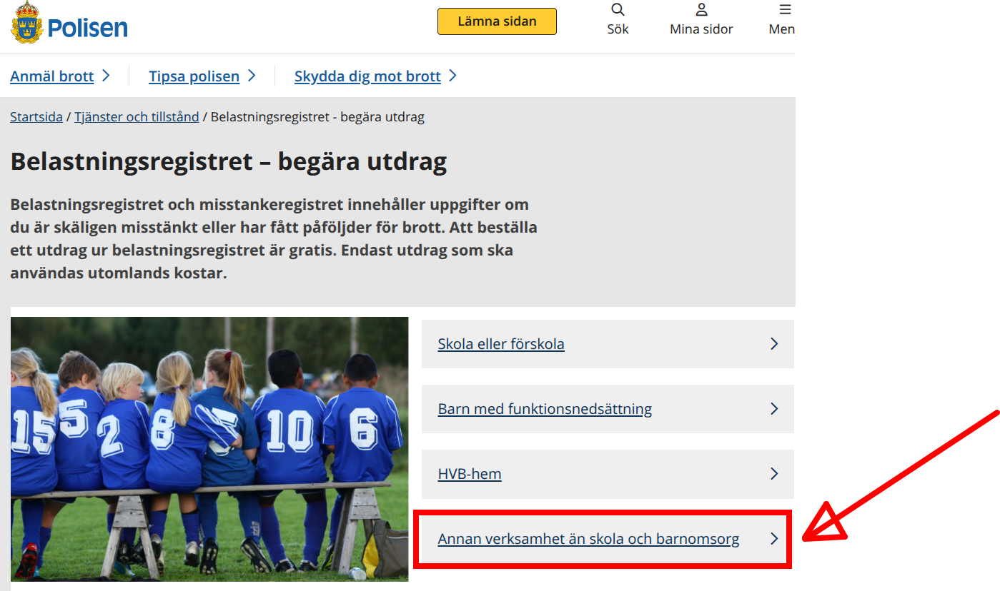
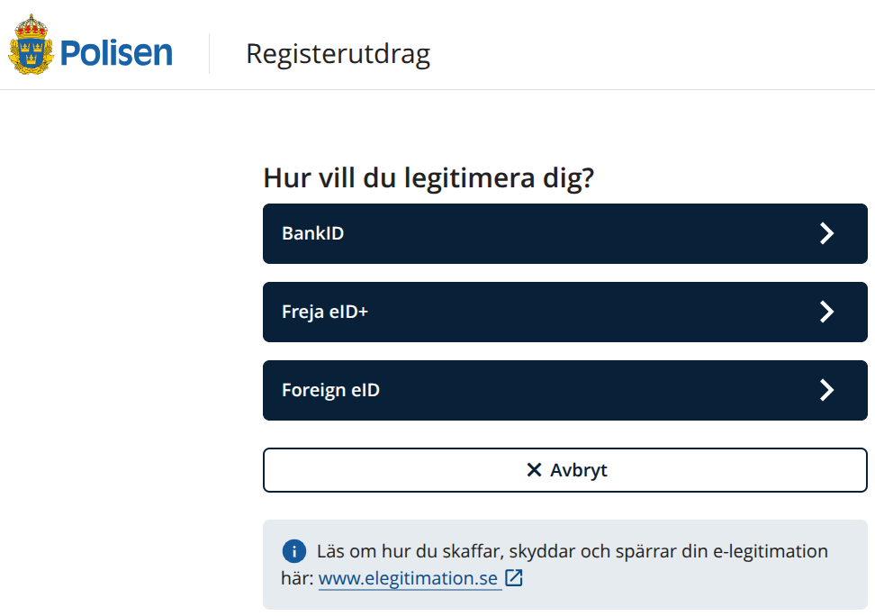
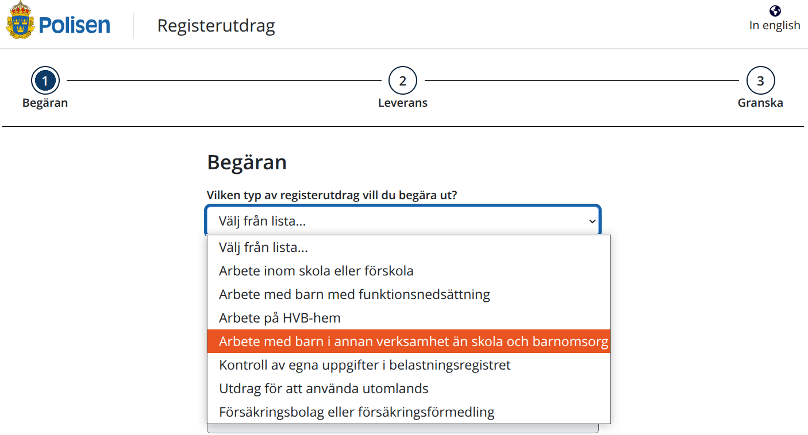

---
tags:
  - volunteers
  - frivilligare
  - volontäre
  - registerutdrag
  - polis
  - police
  - polismyndigheten
---

# Registerutdrag

=== "🇸🇪"

    På den här sidan går vi tillväga för att begära ett så kallat Registerutdrag.

    För att hjälpa till att säkerställa att Lördagskurserna är en säker miljö,
    varje volontär behöver ett så kallat Registerutdrag.

    Den kan beställas gratis hos
    [polisen](https://polisen.se/tjanster-tillstand/belastningsregistret/).

    Gå till
    [https://polisen.se/tjanster-tillstand/belastningsregistret/](https://polisen.se/tjanster-tillstand/belastningsregistret/)
    och klicka på 'Annan verksamhet än skola och barnomsorg':

=== "🇬🇧"

    This page shows the procedure how to request a so-called 'Registerutdrag'.

    To help assure the Lördagskurserna are a safe environment,
    every volunteer needs a so-called 'Registerutdrag'.

    It can be requested for free at
    [the police](https://polisen.se/tjanster-tillstand/belastningsregistret/).
    Go to
    [https://polisen.se/tjanster-tillstand/belastningsregistret/](https://polisen.se/tjanster-tillstand/belastningsregistret/)
    and click on 'Annan verksamhet än skola och barnomsorg':

=== "🇸🇪"

    Du kommer att föras till
    [https://polisen.se/tjanster-tillstand/belastningsregistret/barn-annan-verksamhet/](https://polisen.se/tjanster-tillstand/belastningsregistret/barn-annan-verksamhet/).

    Klicka på 'Begär utdrag' och klicka på 'Annan verksamhet än skola och barnomsorg':

=== "🇬🇧"

    You will be taken to
    [https://polisen.se/tjanster-tillstand/belastningsregistret/barn-annan-verksamhet/](https://polisen.se/tjanster-tillstand/belastningsregistret/barn-annan-verksamhet/).
    Click on 'Begär utdrag'.
    and click on 'Annan verksamhet än skola och barnomsorg':

=== "🇸🇪"

    Du kommer att föras till
    [https://polisen.se/tjanster-tillstand/belastningsregistret/barn-annan-verksamhet/](https://polisen.se/tjanster-tillstand/belastningsregistret/barn-annan-verksamhet/).

    Klicka på 'Begär utdrag'. och klicka på "Annan verksamhet än skola och barnomsorg".

    Nu kommer du att bli ombedd att identifiera dig. Gör det :-)

=== "🇬🇧"

    You will be taken to
    [https://polisen.se/tjanster-tillstand/belastningsregistret/barn-annan-verksamhet/](https://polisen.se/tjanster-tillstand/belastningsregistret/barn-annan-verksamhet/).
    Click on 'Begär utdrag'.
    and click on 'Annan verksamhet än skola och barnomsorg'.

    Now you will asked to identify yourself. Do so  :-)

=== "🇸🇪"

    Nu kommer du att få frågan igen vilken typ av Registerutdrag du behöver.
    Välj återigen "Annan verksamhet än skola och barnomsorg". 

    Klicka på "Nästa" för att komma till skärmen "Begäran".

=== "🇬🇧"

    Now you will asked again what type of Registerutdrag you need.
    Again choose 'Annan verksamhet än skola och barnomsorg'.

    Click 'Nästa' to go to the 'Begäran' screen.

=== "🇸🇪"

    Nu kommer du att få frågan igen vilken typ av Registerutdrag du behöver.
    Välj återigen "Annan verksamhet än skola och barnomsorg".

    De andra frågorna handlar om dig. Dessa borde ni veta :-)

    Klicka på "Nästa" för att komma till skärmen "Leverans".

    På skärmen "Leverans" väljer du "Via post" för att få
    Registerutdraget per post.

=== "🇬🇧"

    Now you will asked again what type of Registerutdrag you need.
    Again choose 'Annan verksamhet än skola och barnomsorg'.

    The other questions are about you. These you should know :-)

    Click 'Nästa' to go to the 'Leverans' screen.

    On the 'Leverans' screen, select 'Via post' to get the Registerutdrag
    per mail.

=== "🇸🇪"

    De andra frågorna handlar om dig. Dessa bör du känna till :-)

    När du har fyllt i allt, visa gärna det -helst oöppnade- kuvert
    till kursansvarig.

    Du kommer att tackas djupt för besväret :-)

=== "🇬🇧"

    The other questions are about you. These you should know.

    When you've filled in everything, please show the -ideally unopened-
    envelope to the course coordinator.

    You will be thanked deeply for the hassle :-)
