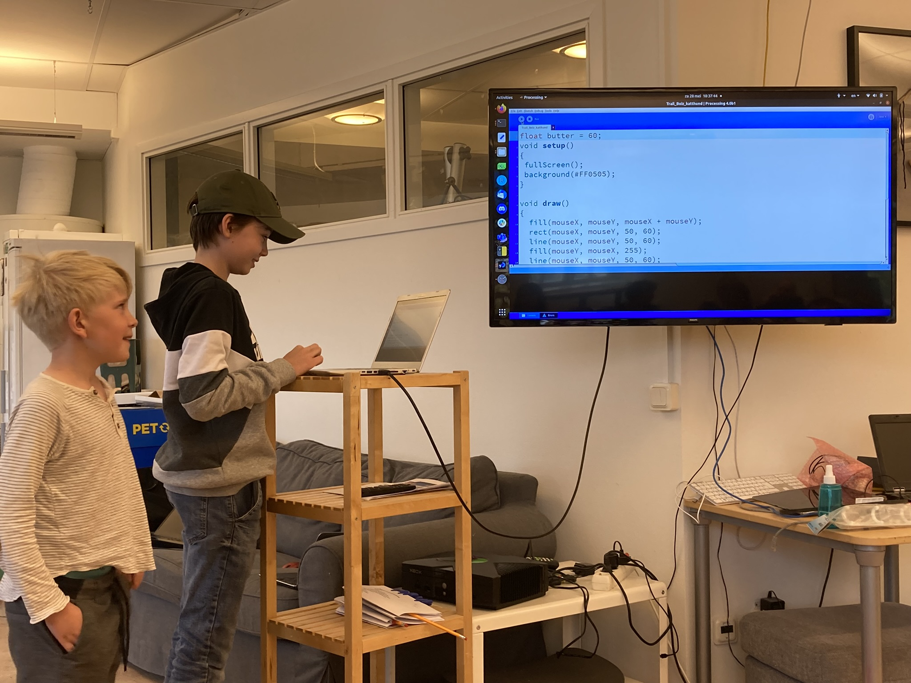
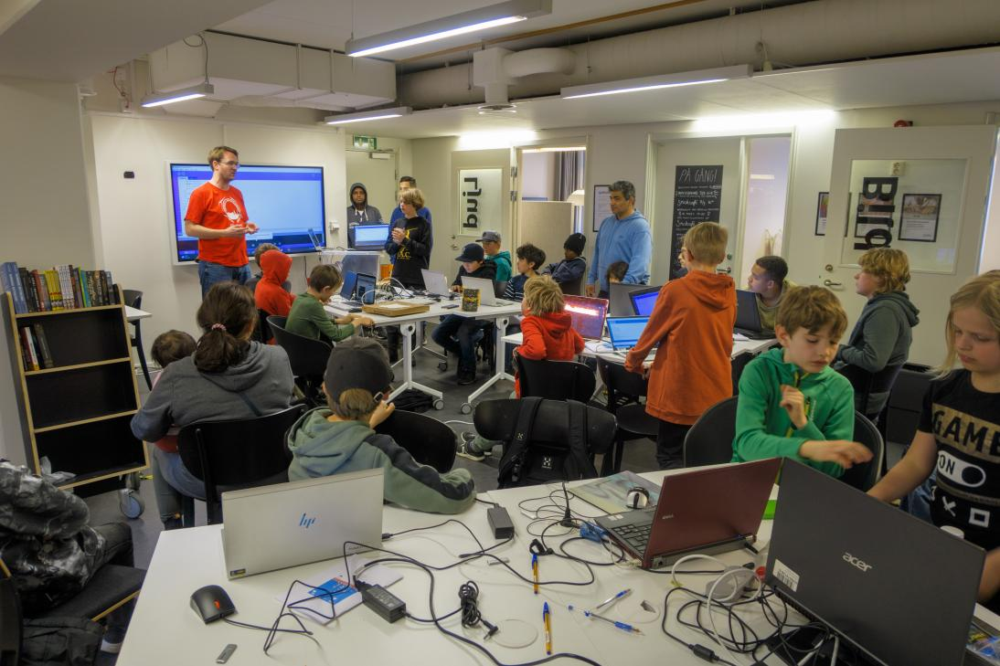

# FAQ

- 🇸🇪 Vanliga frågor
- 🇬🇧 Frequently asked questions: see below the Swedish ones
- 🇺🇦 Часті запитання: див. англійську чи шведську

## 🇸🇪 Vanliga frågor

Nedan har jag listat ett antal vanliga frågor / fakta. För bättre översik har jag delat in dem i följande kategorier:

- Komma igång
- Ålder på deltagare
- Kursmaterial
- Programmeringsspråk - Arduino (C++): se [FAQ om Arduino](faq_arduino.md)
- Programmeringsspråk - Processing (Java): se [FAQ om Processing](faq_processing.md)
- Förväntningar för deltagande (barn)
- Förväntningar för tillhörande vuxna
- Förväntningar på volontärer / frivilliga
- Kostnad för kursen
- Köpa komponenter
- [Volontärer](volontaerer/README.md)
- Hemsidan

## Komma igång

### 🇸🇪 När kan jag börja? 🇬🇧 When can I start?

=== "🇸🇪"

    Du kan börja när som helst!

    Det är bäst att börjar med en kurs under en vanligt vecka:
    [Veckoschemat](veckoschemat.md) visar vad händer varje vecka.

    Se [ditt första besök](ditt_foersta_besoek/README.md) har detta ska bli!

=== "🇬🇧"

    You can start any day!

    It is best to start a course on a regular day:
    [the weekly schedule](veckoschemat.md) shows what happens each week.

    Se [ditt första besök](ditt_foersta_besoek/README.md) har detta ska bli!

### 🇸🇪 Kan jag prova på en gång? 🇬🇧 Can I try out the course first?

=== "🇸🇪"

    Javisst!

    Det kostar ingenting första gången,
    det är viktigt att deltagarna känner att de hamnat rätt!

=== "🇬🇧"

    Absolutely!

    There is no need to pay the first few times,
    as it is more important that our learners feel right being with us.

### 🇸🇪 Kan jag sluta när som helst? 🇬🇧 Can I quit any time?

=== "🇸🇪"

    Självklart kan du sluta när som helst!

    Våra kurser är inte en hobby för alla.

    Det är jättebra att du har upptäckt
    att du gillar andra saker mer!

=== "🇬🇧"

    Of course can you quit anytime!

    Our courses are not a suitable hobby for all.

    It is great when you discover that you like other things (even) more!

## Ålder på deltagare

### Jag är under 8 år. Är jag välkommen?

Tack för att du läste detta, för 8 år är bara en riktlinje!
Denna riktlinje finns av en anledning: programmering eller 3D ritning är en
svår (men cool!) hobby.

Om du är yngre än 8 år och redan har kommit igång med att programmera
är du mycket välkommen!

Vår erfarenhet säger oss att barn under 8 år som regel kan ha svårt att
koncentrera sig långa stunder och det krävs också mer av läraren.
Därför är riktlinje är att man bör vara minst 8 år gammal.

### Jag är över 88 år. Är jag välkommen?

Japp, det är du!

## Kursmaterial

### Vad ska jag ta med?

Det beror på vad du vill göra:

Kurs       |Tar med gjärna [1]          |Installera gjärna [2]
-----------|----------------------------|-----------------------------------------------------
Arduino    |En bärbar dator med laddare |[Arduino IDE](https://www.arduino.cc/en/software)
Biomaking  |.                           |.
Blender    |En bärbar dator med laddare |[Blender](https://www.blender.org/download/)
`git`      |En bärbar dator med laddare |`git`, till exempel [https://git-scm.com/downloads](https://git-scm.com/downloads)
Matlagning |.                           |.
Processing |En bärbar dator med laddare |[Processing IDE](https://processing.org/download)

- [1] Om du inte har någon bärbar dator eller du vill prova först, så kan du låna en av oss
- [2] Om du har inte installerat programmen förut, hjälps vi åt under kursen

Om du kommer i ett lag, kanske du använder också:

- [Codeberg](https://codeberg.org/): en hemsida
- [Discord](https://discord.com/download): ett chat program, du behöver vara 13 år
- [GitHub](https://github.com/): en hemsida, du behöver vara 13 år
- [Matrix](https://matrix.org/): ett chat program

### Behöver jag ta med mig min mobil?

Nej, det är inte viktigt för att komma igång och programmera.
Det är faktiskt så att en mobil snarare stör din koncentration
och kan hindra dig från att bli en bra programmerare!
Erfarna programmerare brukar ofta bli irriterade när de blir störda mitt i,
det bryter deras "flow" och ett enkelt avbrott kan göra
att det tar 15-30 minuter att återfå koncentrationen.

Snälla, antingen lämna din mobil hemma eller stäng av den under kursen.

### Vilka böcker använder kursen?

De är listade på [våra kurser](kurserna/README.md).

Alla finns både online och i pappersform.

### Få jag trycka böckerna själv?

Javisst! Böcker att [Arduino för ungdomar](https://github.com/richelbilderbeek/arduino_foer_ungdomar)
ha en `CC-BY-SA` licens,
som innehåll du får trycka böcker själv för en kommerciell sak (`NC` = 'Non Commercial').
Också, du får ädra i texten, så långe du skriver också original version (`BY` = 'give attribution').

## Arduino (programmeringsspråket)

se [FAQ om Arduino](faq_arduino.md).

## Processing (programmeringsspråket)

se [FAQ om Processing](faq_processing.md)

## Förväntningar på deltagande (barn)

### Vad händer på ett vanligt kurstillfälle?

- du kommer hit när dörren öppnas
- du besöker receptionsbordet:
    - skriver ditt namn på närvarolistan
    - tar ditt lektionskort
    - tar dina böcker
- du ställer upp din bärbara dator
- du gör uppgifter i böckerna
- du sammarbetar med dina bordskompisar

På rasten fikar vi och kopplar av lite.

Efter rasten förtsätter vi igen och på slutet städar vi upp.

### Vad händer på en presentation?

En presentation är ett speciellt tillfälle när vi presentera våra mästerverk.
Det brukar bli näst sista kurstillfället på terminen.

Du får bjuda in din familj och vänner om du vill.
(Förutsett att situationen med Covid-19 tillåter det.)

Vi avslutar med en utvärdering av kursen (anonymt). Det är lite tråkigt men det är viktigt för oss för att kunna förbättra kursen!

> Våra elever har en presentation

### Vad händer på ett evenemang?

Om det finns intresse och tillfälle ges kan vi delta på olika evenemang, t.ex. Birdie eller SciFest.
Där kan finnas möjlighet att både visa upp vad som åstadkommits eller undervisa andra i att programmera.

> Våra elever (i röda T-shirts) hjälper med på Programmeringsdag i Uppsala Stadsbibliotek

### Vem ska jag fråga om jag fastnar?

Det bästa sättet att lära sig är att få berätta för en kompis.

- Sitter det en deltagare bredvid dig? Om ja, fråga hen.
- Sitter det en deltagare vid ditt bord? Om ja, då är hen.
- Om du sitter själv vid ditt bord eller ingen vet, fråga en lärare / vuxen.

### Vad händer om en ny student kommer in?

Se [ditt första besök](ditt_foersta_besoek/README.md) hur detta kan bli!

### Jag kan inte komma på ett kurstillfälle

Inget problem!

## Förväntningar på föräldrar

### Är jag välkommen att stanna?

Föräldrar är alltid välkommna att kolla lite vad som pågår under kursen.

Men, oftast är det bättre om ditt barn skapar nya bekantskaper på kursen
och inte vänder sig till dig när det uppstår problem.
Det är att skapa vänner som är anledning att elever stannar på kursen,
ser [den här akademiska uppsats](akademiska_uppsatser/vrieler_2024.pdf)
för referens.
Eftersom vi tycker om att behålla elever,
får du gärna hålla dig på lite avstånd under kursens
gång.

- Tips 1: kom 5 minuter innan avslut för att tar en kort titt :-)
- Tips 2: om du har betalat kursavgiften så är du medlem i Uppsala Makerspace!
  Uppsala Makerspace är rätt stort så det går att vistas i ett annat
  rum och hålla på med egna projekt om du är labbmedlem.

### Är jag välkommen att hjälpa till?

Javisst! Du kan bli en volontär.
Vi försöker då ordna så du är i en annan grupp än ditt/dina barn,
se frågan ovan.

### Mitt/mina barn kan inte komma på ett kurstillfälle

Inget problem!

Men skicka gärna ett mail till Richel,`rjcbilderbeek@gmail.com` och meddela detta.

## Förväntningar på volontärer / frivilliga

### Är jag välkommen?

Javisst!

Målsättningen är dock att barnen ska hjälpa varandra i så stor utsträckning som möjligt,
så det ska helst inte vara fler än en vuxen per fyra barn.

## Lektioner och läromedel

## Jag vill lära mig Processing och komma igång dirket, hur går jag tillväga?

Kul, självklart kan du börja själv!

[Ladda ner Arduino IDE här](https://www.arduino.cc/en/software).

Arduino-lektionerna finns på webbplatsen [Processing för ungdomar] (<https://github.com/richelbilderbeek/arduino_foer_ungdomar>).

## Jag vill skapa på fler sätt än med datorn, är det möjligt?

Javisst, det är mojligt att skapa skapa på fler sätt än med datorn,
med det är tufft at förenas det med kurserna.
En undantag är att skapa T-shirts med vinylskäraren.

## Kostnader för kursen

### Vad kostar kursen?

Se [Betalning](betalning.md).

### Hur betalar jag kursen?

Se [Betalning](betalning.md).

### Jag har inte råd med kursavgiften. Hur ska jag göra?

Hör av dig till Richel, han har förmodligen en lösning.

### Varför kostar kursen så lite?

För att kursen bedrivs med frivilliga krafter och det finns ett intresse att sprida kunskap om programmering i samhället.
Kostnaderna är i huvudsak för att trycka böckerna och lite fika.

### Varför kostar kursen samma mellan höst och vår?

För att det är lättare att administrera.

### Hur är priset på kursen beräknat?

Priset för kursen är framräknat utifrån kostnader på
vår tryckare (Copy-Systems, i Nederländerna).
Priset är pessimistiskt beräknat.

En kurs kräver minst 8 böcker där varje bok innehåller 30 dubbelsidiga A4 sidor.

- 1 bok 100 kr (färg, i svartvit är 1 bok 20 kr)

2 certifikat:

- 1 certifikat: 54 kr (färg)

Lektionskort:

- Färg: 1 kort: 10 kr

Saft:

- 30 kr per flaska för 10 elever

Presentation:

Per elev: 30 kr:

- Kaffe för en vuxen: 5 kr
- Te för en vuxen: 5 kr
- Läsk för barn och en gäst: 10 kr
- Kakor till 4 personer: 10 kr

Per elev och termin:

- 4x böcker = 400 kr
- 1x certifikat = 54 kr
- 1x lektionskort = 10 kr
- 2x flaskor saft = 60 kr
- Presentation = 30 kr

Det betyder,
i början när det inte finns några böcker,
blir kostnaden 554 kr per elev per termin.
Det är en pessimistisk uppskattning.

## Köpa komponenter

### Vilken är den bästa webshopen för att köpa komponenter?

Ifrån enkät på UMS Slack:

- 2x [Conrad](https://www.conrad.com/)
- 1x Digikey
- 2x [Electrokit](https://www.electrokit.com/)
- 1x [Kjell and company](https://www.kjell.com/)
- 1x [M](https://www.m.nu/)
- 2x [Mouser](https://www.mouser.se/)
- 2x [Reichelt](https://www.reichelt.com/)

## Volontärer

Se [volontärer](volontaerer/README.md).

## Hemsidan

### Varför finns ingen stavningscheck?

Hemsidan har många continuous integration checks,
men ingen för att stava rätt.
Det är på grund av att det finns mer än ett språk
i texterna.

Om du vet hur man kan göra det bättre, gärna [bidra](CONTRIBUTING.md).

## 🇬🇧🇺🇦 Frequently asked questions

In short: you are always welcome, just show up during course hours.
There is coffee and tea for parents and laptops and exercises
for the kids :-)

### Länkar

- [Swedish Discrimination Act, 2008:567](https://www.do.se/choose-language/english/discrimination-act-2008567), på Engelska
