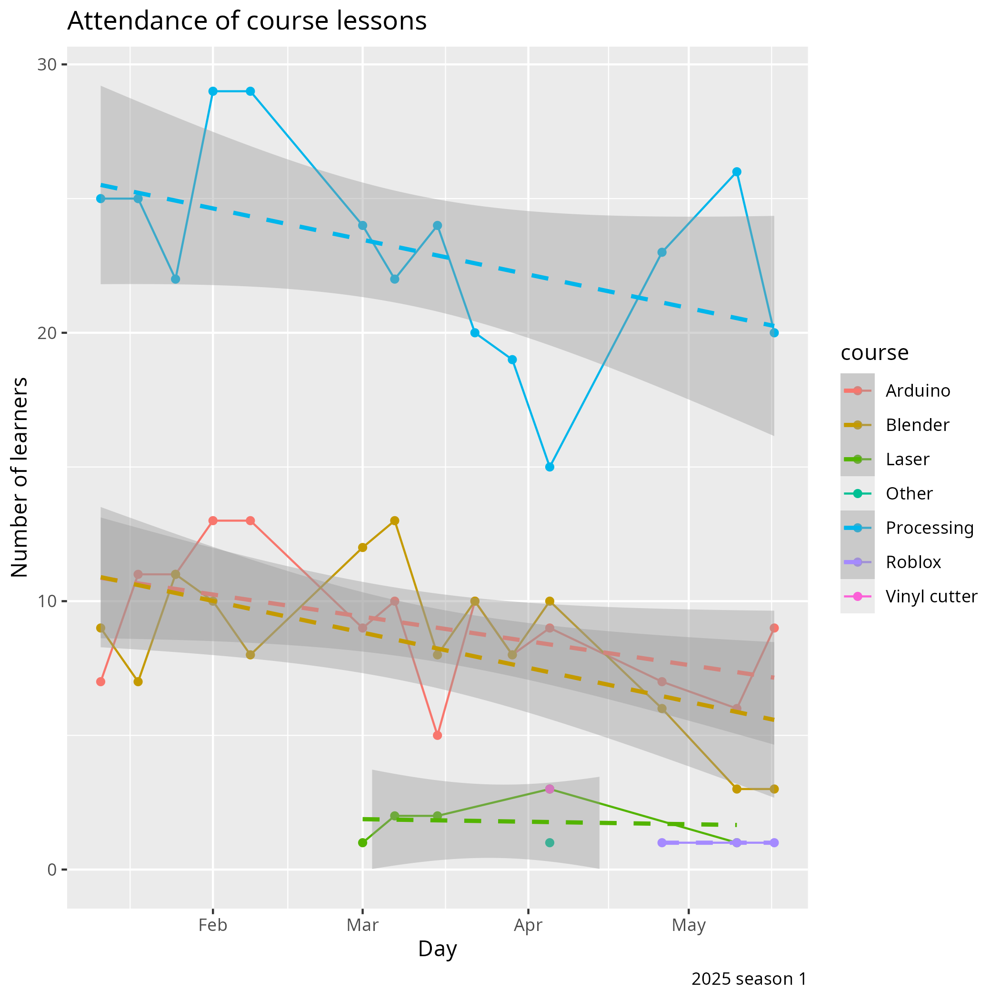
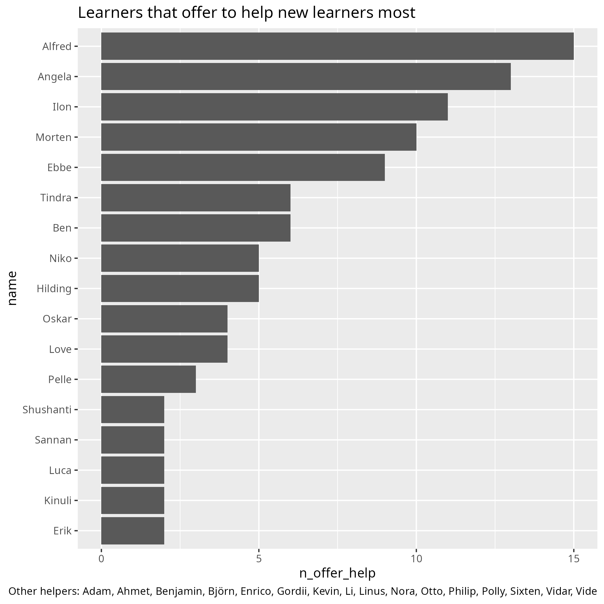

# Slutpresentation

> En tidigare slutpresentation

- Vad: Slutpresentation och utvärderig
- När: Lördag 24:e Maj 2025
- Tiderna: 11.00-13.30
- Målet: att elever får visar deras mästarevärk
- Vem: varje en
- Kostnad: ingenting
- Var: [Uppsala Stadsbibliotek](https://bibliotekuppsala.se/web/arena/stadsbiblioteket),
  Svartbäcksgatan 17, 753 75 Uppsala

> Presentationen är på 1.
> 1: Stadsbiblioteket.
> 2: Domkyrkan.
> 3: Stora Torget.
> 4: Centralstationen.

> Presentationen är i Mallassal

När  |Besökare                           | Elever
-----|-----------------------------------|-----------------------
11:00|Dör öpnas [G]                      | Dör öpnas [M]
11:01|Väntar med kaffe, te och kakor [G] | Förbereda presentation [M]
11:01|Store Björn pratar [G]             | .
11:30|Kollar på presentationer  [M]      | Ger presentationer  [M]
12:00|Rast [M]                           | Rast  [M]
12:15|Utvärdering med föräldrar [M]      | Anonym utvärdering [B]
13:00|Slut                               | Slut

- [G] Grupprum brevid Mallassal
- [M] Mallassal
- [B] Biblioteket

Tider är bara riklinjer, ofta slutar vi tidigare.

## Frågor och svar

- F: Måste jag presentera?
- S: Nej :-)

- F: Jag har ingenting nu, men kommer på Hackathon imorgen
- S: Toppen, det ska funkar!

- F: Jag har ingenting nu, men schickar koden senare
- S: Toppen, det ska funkar!

- F: Jag kan inte komma på slutpresentationen
- S: Tyvvär, men det är okej

## Presentationsschema

Namn                          |Ålder|Titel                                  |Notiser
------------------------------|-----|---------------------------------------|------------------
Björn (Store)                 |-Inf |Blender                                |B, live demo
Fredrik                       |-Inf |Arduino                                |A
Richel                        |-Inf |ProPokeVolley                          |P, needs two volunteers, from the volunteers
[TODO] Adam                   |0    |Jobbiga ljud 2.0                       |A, will give code
Jacob                         |0    |Tio lampor lyser                       |A
Philip                        |1    |Philipprojekt                          |P, needs to present early
Gabriel                       |2    |Pong Infinite Mode                     |P, needs to present early
Ilon                          |9    |Joystick                               |A
Björn och Love                |?10  |Disco                                  |A
[TODO] Gordii                 |?10  |Ljus                                   |A, need to bring code
Dennis                        |10   |WeFree                                 |A
Emil                          |10   |Space cannon                           |B
Morten                        |10   |Mortenproject                          |A
Sixten                        |10   |Sixtenprojekt                          |A
Alfred, Daniel och Vide       |11   |Grodcasino                             |Use their own computer
Ben and Leo                   |11   |.                                      |P
Enrico                        |11   |Stay In The Square                     |P
Shushanti                     |11   |House                                  |P
Tindra                        |11   |Delfin                                 |P
Ahmet                         |12   |Revolver                               |B
Otto                          |12   |Bouncecounter                          |P
Isaac och Pablo               |?13  |Platformer 2D                          |Godot, will present from own computer
Felipe                        |?13  |Fire Rain                              |P
Axel                          |13   |Lavaball                               |P, will practice today
Niko                          |13   |Book Of Programs                        |Uses own computer
[TODO] Kevin                  |?14   |Minesweeper                            |P, will send me new code
Mats                          |15   |Retrogolf                              |P, will give code, will practice present
Herman och Leonid             |99    |Train Game                             |Use their own computer
[TODO] Linus                         |.    |Armeé                                  |B, Need drawing
[TODO] Noah                          |.    |Three In One                           |P, no code yet
[TODO] Luca                          |.    |Superbollen                            |P, no code yet
[TODO] Malek                         |.    |Error 666                              |P, no code yet
[TODO] Diesel                        |.    |?                                      |?, no code yet
[TODO] Elis                          |.    |?                                      |?, no code yet

## Absent

- Oskar
- Pelle

## Audience

- Emil
- Felix
- Yusef
- Stefan

## Volunteers

- Alice
- Kinuli
- Li
- Lukas
- William

## Presentation parents

- Don't forget:
    - Next week: no course, because of klämdag
    - In two weeks: last course day, which is an Eftermorsdag
    - Next season starts 2025-08-23

- Courses changes:

    - We moved up

    - We added a reception desk
    - Team of volunteers:
        - 'veteran' volunteers: Janne (Processing), Kristoffer (Processing), Store Björn (Blender)
        - volunteers that left: Leslie (Blender)
        - new volunteers: Atom Björn (reception desk), Dennis (Processing), Elisha (Processing), Fredrik (Arduino), Nikita (Processing)

- Future plans:

    - Cooking course, 9:00-10:00, as part of the regular course

- Extra thanks to these kids:

## Notes

## Notes from next time

- 22 presentations took 45 minutes to prepare with two computers,
  i.e. `preparation_time = n_presentations * 2 minutes`
- 22 presentations took 60 minutes
  i.e. `presention_time = n_presentations * 3 minutes`
- Let all pupils present a line of code and/or a part of their 3D image.
  It slows down the presentations and makes them look into the audience more

