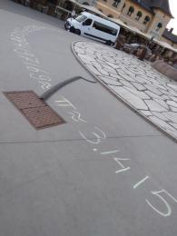

# 2025-07-22 Pi Approximations Dag

=== "🇸🇪 Pi Approximations Dag"

    Pi Approximation Day är en internationel firande
    för att uppskattar talet pi,
    eller mer exakt: dess beräkning ('approximation').
    I dag kommer vi att beräkna pi ungefär på flera tokiga sätt,
    ett som involverar pizza
    (japp, det kommer att finnas tid att äta det också :-)).

    - Mål: att approximera pi på flera tokiga sätt
    - Datum: På Pi Approximations Dag, som är den 22:e juli 2025
    - Tid: 18:15-20:00, dörren öppnar kl. 18:00
    - Registrering: behövs inte, bara dyker upp :-)
    - Kostnader: gratis
    - Ålder: 6+
    - Övriga: det kommer att finnas pizza!
    - [Exempel på tidigare Pi Approximations Dagar](https://richelbilderbeek.github.io/pi_approximation_day/)

=== "🇬🇧 Pi Approximation Day"

    Pi Approximation Day is an international celebration
    to appreciate the number pi,
    or more precise: how to calculate it (i.e. 'to approximate it').
    At this day, we will calculate
    pi approximately in multiple weird ways, one involving pizza (yes,
    there will be time to eat it too :-) ).

    - Goal: to approximate pi in funky ways
    - Date: On Pi Approximation Day, which is July 22nd
    - Time: 18:15-20:00, door open at 18:00
    - Registration: not needed, just show up :-)
    - Costs: free
    - Ages: 6+
    - Others: there will be pizza!
    - [Examples of earlier Pi Approximation Days](https://richelbilderbeek.github.io/pi_approximation_day/)

???- note "For organizers"

    - Goal: to approximate pi in funky ways
    - B leads the activity, R does the admin/preparation/other dull stuff
    - The activity will be from 18:00-20:00.
    - The door will be open at 18:00, we will start at 18:15
    - The activity is free
    - There will be pizza for the participants
    - It is suitable for ages 6 and older

    Publicity texts:

    🇸🇪 Imorgon/tisdag 18.15-20.00 kommer vi att fira Pi Approximations Dag
    på Uppsala Makerspace.
    Den är lämplig för alla som är minst sex år gammal
    och uppskattar numret pi och/eller njuter av pizza.
    Mer information finns [här](https://uppsala-makerspace.github.io/loerdagskurser/verksamheter/20250722_pi_approximation_day/)

    🇬🇧 Tomorrow/Tuesday 18:15-20:00 we will celebrate Pi Approximation Day
    at the Uppsala Makerspace. It is suitable for all that are at least
    six years old and appreciate the number pi and/or enjoy pizza.
    Details can be found [here](https://uppsala-makerspace.github.io/loerdagskurser/verksamheter/20250722_pi_approximation_day/)

