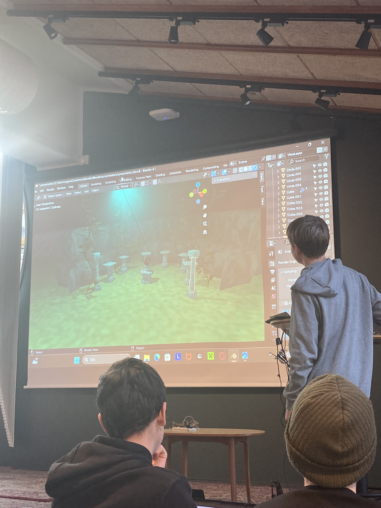
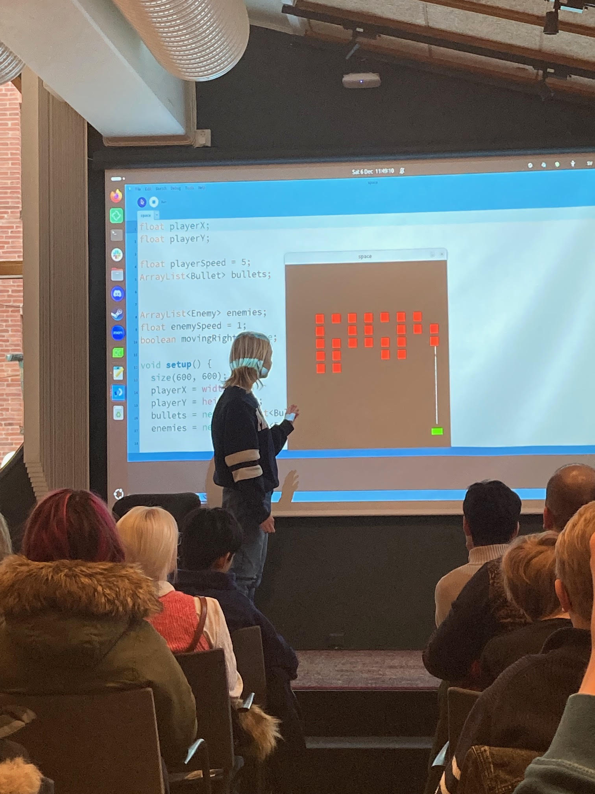

# Slutpresentation

> En tidigare slutpresentation

- Vad: Slutpresentation och utvärderig
- När: Lördag 6:e December 2025
- Tiderna: 11.00-13.30
- Målet: att elever får visar deras mästarevärk
- Vem: varje en
- Kostnad: ingenting
- Var: [Uppsala Stadsbibliotek](https://bibliotekuppsala.se/web/arena/stadsbiblioteket),
  Svartbäcksgatan 17, 753 75 Uppsala

> Presentationen är på 1.
> 1: Stadsbiblioteket.
> 2: Domkyrkan.
> 3: Stora Torget.
> 4: Centralstationen.

> Presentationen är i Mallassal

När  |Besökare                            | Elever
-----|------------------------------------|-----------------------------------------------
11.00|Dör öpnas [G]                       | Dör öpnas [M]
11.01|Fika [G], `SB` presenterar [G]      | Presenterar [G]
11.01|`R` förberedar med elever [M]       | Förbereder presentationer [M]
11.30|Kollar på presentationer  [M]       | Ger presentationer  [M]
13.00|Slut                                | Slut

- [B] Biblioteket, [G] Grupprum brevid Mallassal, [M] Mallassal,
- `AB`: AtomBjörn, `R`: Richèl, `SB`: Store Björn

Tider är bara riklinjer, ofta slutar vi tidigare.

## Frågor och svar

- F: Måste jag presentera?
- S: Nej :-)

- F: Jag har ingenting nu, men kommer på Hackathon imorgen
- S: Toppen, det ska funkar!

- F: Jag har ingenting nu, men schickar koden senare
- S: Toppen, det ska funkar!

- F: Jag kan inte komma på slutpresentationen
- S: Tyvvär, men det är okej

## Presentationsschema

!!! info "Inte glöm"

    Fråga alla elever att berätta om en linje av sina kod, eller del
    av sina 3D ritningar: det hjälper att presentationen går lite
    långsammare och får dem att kolla i publiken mer

Namn                          |Ålder|Titel                                  |Notiser
------------------------------|-----|---------------------------------------|------------------
Richel                        |-Inf |Conquer Chess                          |Behövs 2 volontärer, [store page](https://store.steampowered.com/app/3873940/Conquer_Chess/?beta=1)
Björn                         |-Inf |Supermotor                             |Arduino
Fredrik                       |-Inf |Snake game                             |Processing, in `Fredrik` folder
Enrico                        |-Inf |Pong                                   |Processing, in `Enrico folder`
Luca                          |-Inf |Space                                  |Processing, in `Luca` folder
Danylo och Gordii             |10,11|Superpump                              |Tar med allt själva
Emil                          |11   |Superlampan                            |Tar med eget sak
Gabriel                       |12   |Minispel                               |Processing, in `Gabriel` folder
Otto                          |12   |Ingen Kod Skickat                      |Processing, in `Otto` folder
Adam                          |10   |Lagning av mobil                       |Använder egen dator
Ben                           |12   |Minecraft mod                          |Använder egen dator
Daniel                        |12   |Mattemästare                           |Använder egen dator
Niko                          |13   |Gun range                              |Använder egen dator
Isaac                         |13   |Bouncing cube                          |Använder egen dator
Axel                          |13   |Ludbert                                |Använder egen dator?
Alfred och Daniel och Vide    |?14  |Islands                                |Använder egen dator
Vide                          |13   |Skill Framework                        |Använder egen dator
Mats                          |15   |RetroGolf på Itch                      |Använder egen dator
Herman och Leonid             |14,16|Turngame                               |Använder egen dator
Richel                        |Inf  |Hemlig                                 |Också hemliga :-)

## Notes

???- info "Checklist"

    - [x] Coffee
    - Hot water (for tea)
    - [x] Teabags
    - Paper cups (for coffee and tea)
    - [x] Sugar (for coffee and tea)
    - Milk (for coffee and tea)
    - [x] Evaluation forms
    - [x] Pens
    - [x] Mouse
    - [x] Laptop
    - [x] Camera
    - [x] USB cable
    - [x] Extension cord

## Pictures

???- info "Notes from December 2026"

    - 10 presentations that need preparation are predicted to take 20
      minutes to prepare with 10 computers
    - 17 presentations are predicted to take 51 minutes,
      i.e. `presention_time = n_presentations * 3 minutes`
    - Let all pupils present a line of code and/or a part of their 3D image.
      It slows down the presentations and makes them look into the audience more

???- info "Notes from July 2025"

    - 22 presentations took 45 minutes to prepare with two computers,
      i.e. `preparation_time = n_presentations * 2 minutes`
    - 22 presentations took 60 minutes
      i.e. `presention_time = n_presentations * 3 minutes`
    - Let all pupils present a line of code and/or a part of their 3D image.
      It slows down the presentations and makes them look into the audience more

