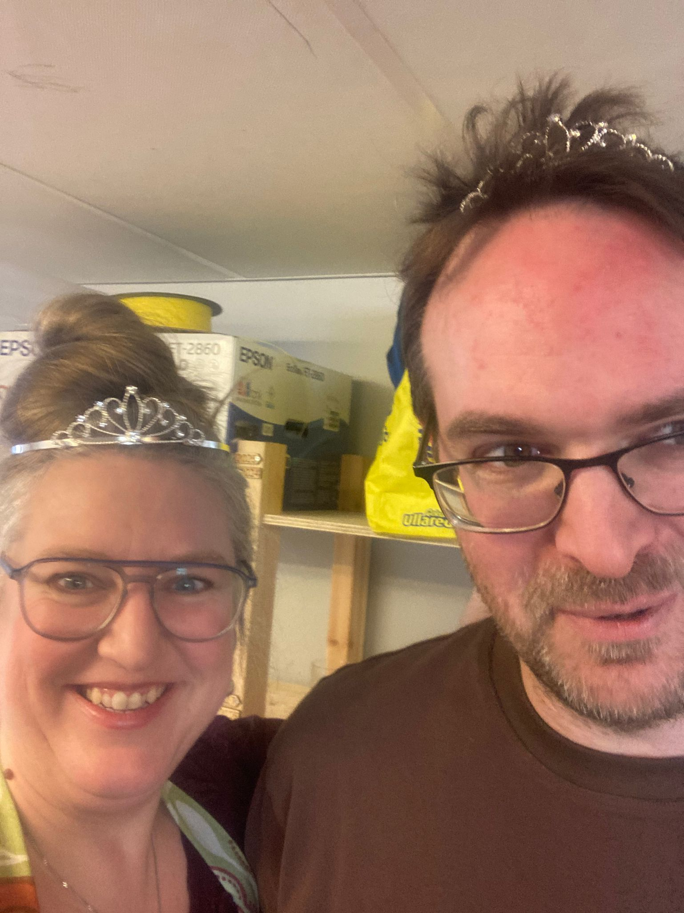
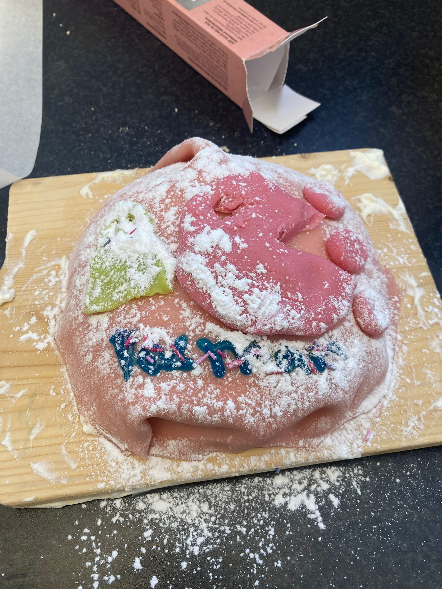
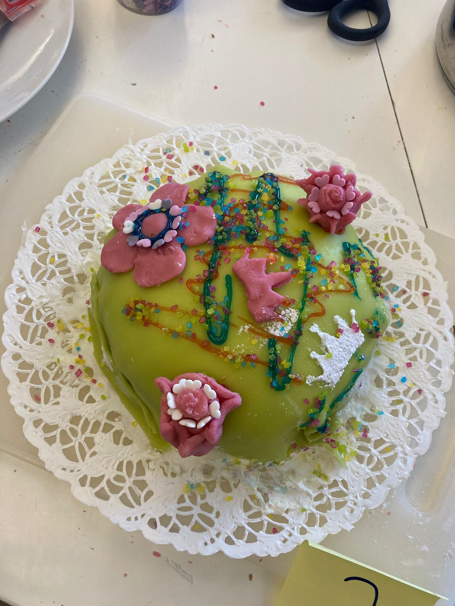
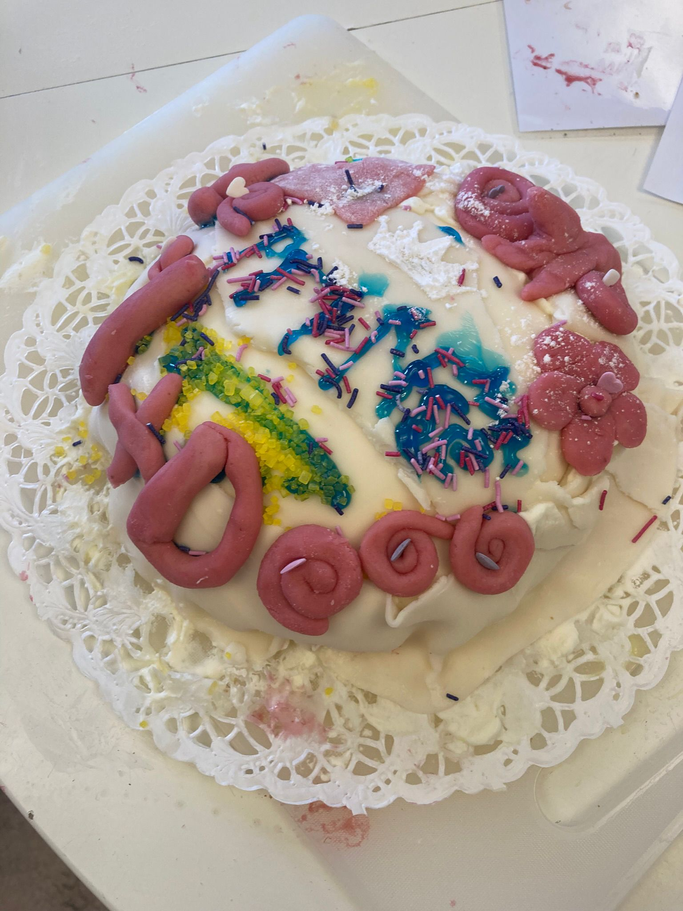
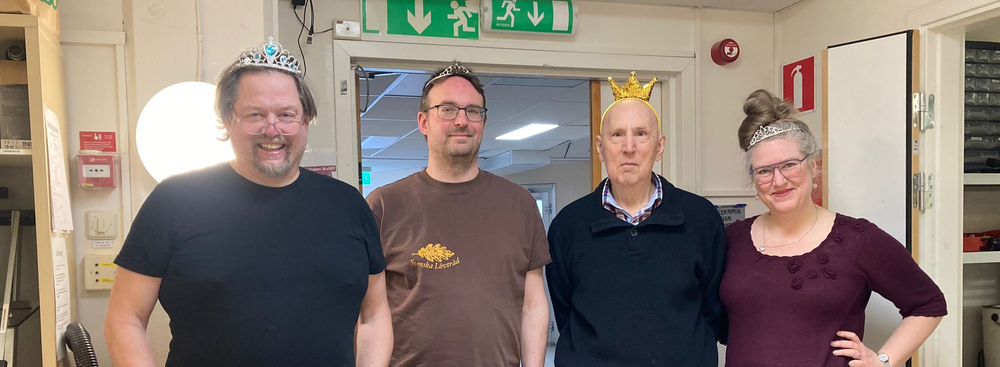
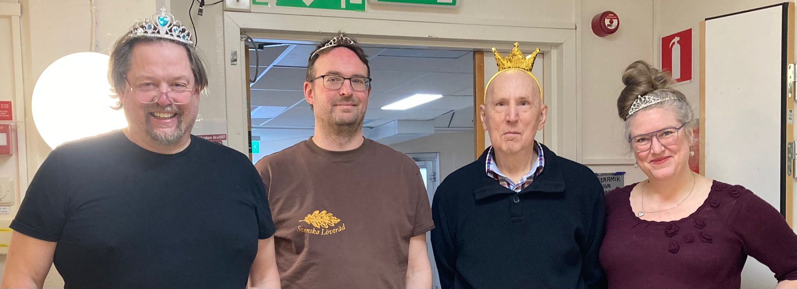
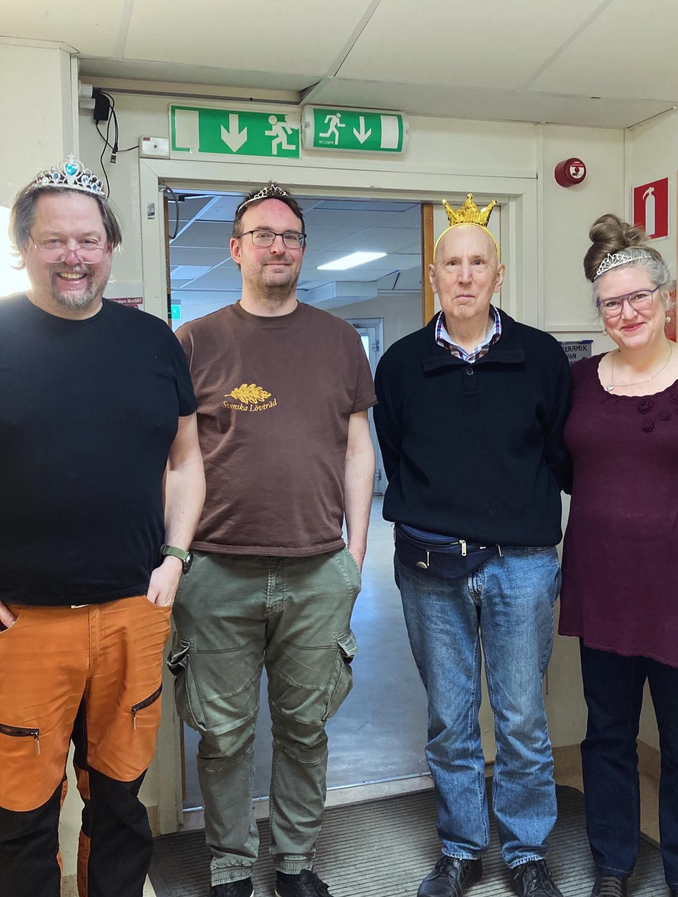
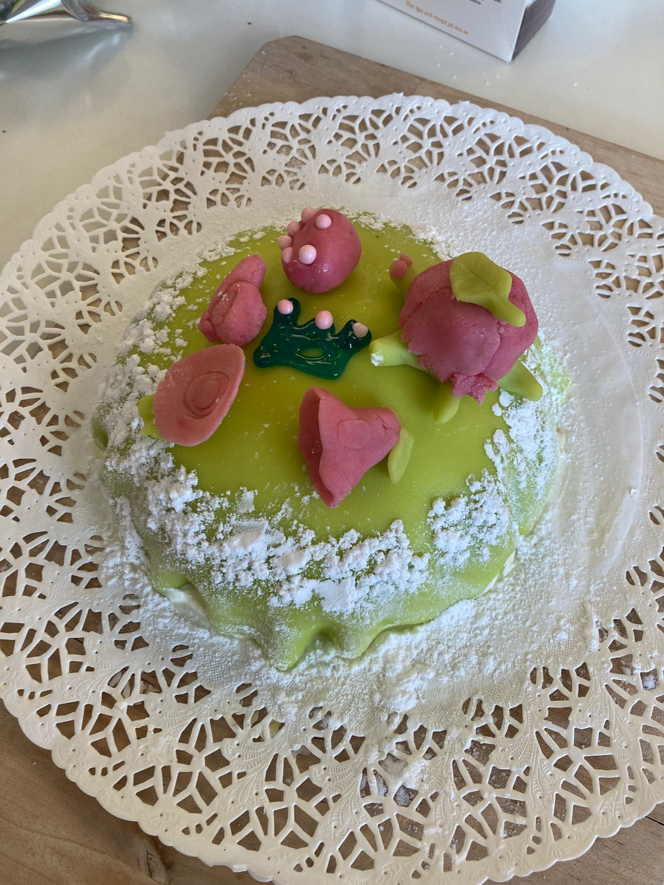

# 2026-04-18: Prinsessdagen

- Målet: att undervisa programmering till kvinnor
- Vem: eleverna från Programmeringskursen och kvinnor
  (t.ex mor, farmor, mormor, osv)
- Var: Uppsala Makerspace
- Kostnad: ingenting
- Tiderna: samma schema som vanligt

## Vanliga frågor

### Jag är en elev och tar ingen kvinnan med mig. Är det OK?

Absolut! För dig blir det en vanligt kursdag.

### Jag är en elev och tar två kvinnor med mig. Är det OK?

Absolut! Du får undervisar två kvinnor, men -och kanske roligare-
letar vi efter en elev utan en kvinna, så att hen kan tar hand om din
andra kvinnan.

## Bilder

