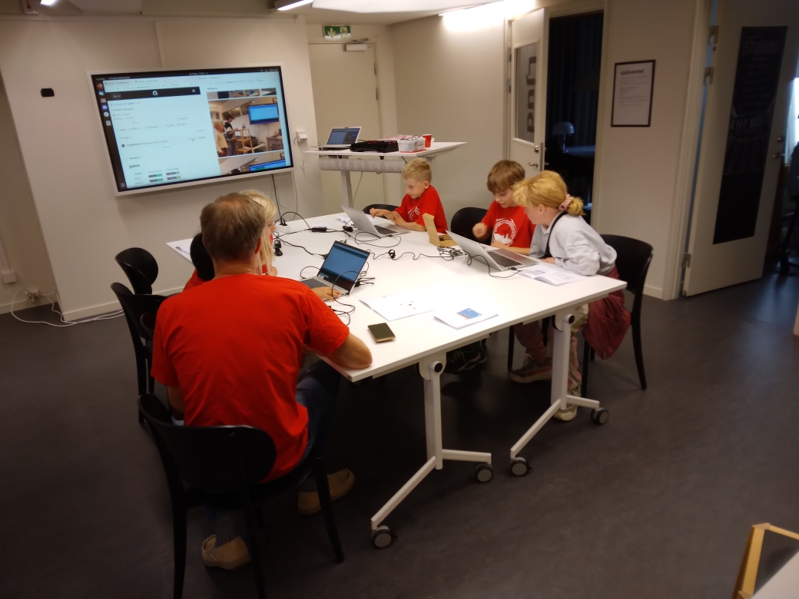
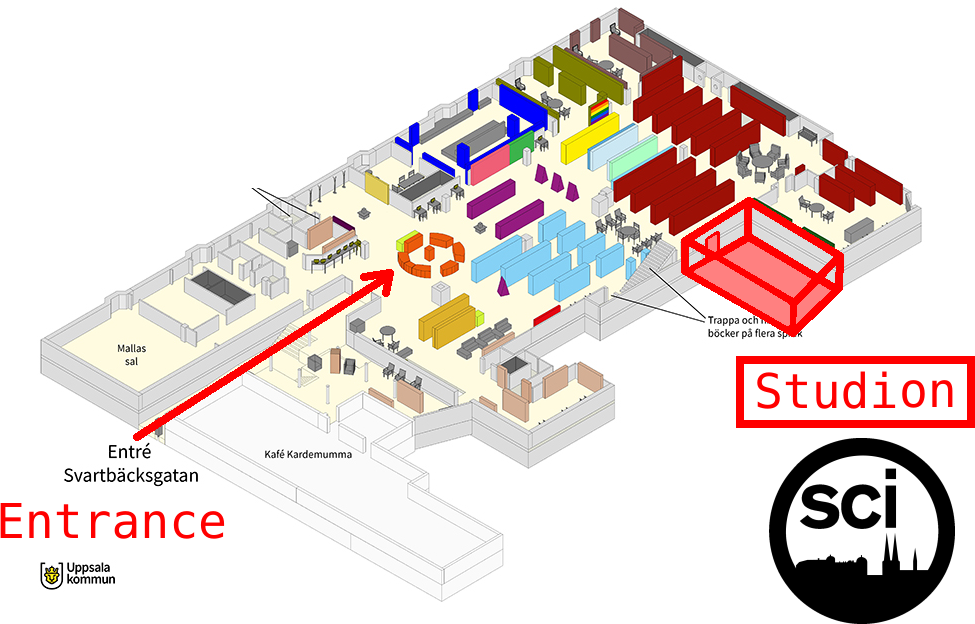
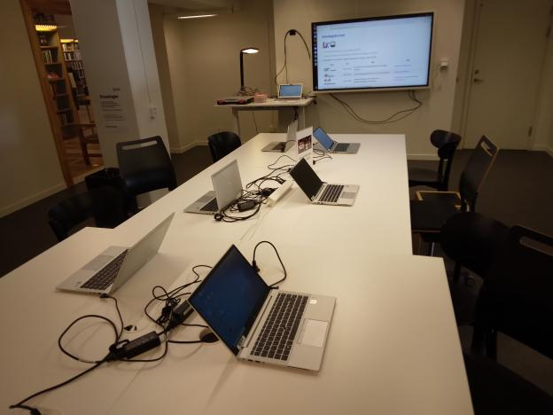

# 2026-09-12 Kulturnatten

> Så här ser det ut när första gäst har kommit in.
> Vi är folket med den röda T-shirts!

- Målet: att undervisa till Kulturnattens besökare
- Vem: eleverna från Lördagskurna
- Var: [Uppsala Stadsbibliotek](https://bibliotekuppsala.se/web/arena/stadsbiblioteket),
   (Svartbäcksgatan 17, 753 75 Uppsala) i rum Studion (ser bild nedåt)
- Tiderna: 11.00-19.00 (men eleverna undervisa bara flera timmar :-) )
- USB contact: Elisabet Edin

> Vi är i Uppsala Stadsbibliotek i rum Studion.

## Vanliga frågor

### När är jag välkommen?

Någonsin mellan klockan ? och ?

Schemat är här:

När        |Vem
-----------|------------------
10:00-11:00|Richel, ...
11:00-12:00|Richel, ...
12:00-13:00|Richel, ...
13:00-14:00|Richel, ...
14:00-15:00|Richel, ...
15:00-16:00|Richel, ...
16:00-17:00|Richel, ...
17:00-18:00|Richel, ...
18:00-19:00|Richel, ...

### Hur länge skulle jag hjälpa med?

Om du hjälper med en timme är Richel redan riktigt nöjd.

Redan om du undervisar en person får du en Uppsala Makerspace
T-shirt.

Men om du kann och vill får du hjälper helt evenemangen.
Eller tar en timme rast före kommer tillbaka.

### Vad ska vi göra?

Vi ska undervisa våra kurser till gästerna.

### Vad måsta jag tar med?

Kort svar: ingenting :-). Du får tar med dig dina egna grejer på egen risk.

- Mat och dryck: Richel fixar det för dig.
   Vill du tar med din egna dryck och mat är det inget problem
- Dator: vi har tillräckligt mycket datorer (sex, för att vara exact).
   Om du riktigt vill använder din egna, är det okay,
   men du är säkrare att har ingen skada på din dator när du
   använder Makerspacets datorer (obs, aldrig har nåt hänt med
   kursdatorer, men det behövs inte håller i evigheten)
- Arduino: samma sak som datorer. Du får utställa dina Arduino projekter,
   men vi kan aldrig vara säkert att dina grejer är trygg

> Redo för Kulturnatten!

## Statistics

- Estimated visitors:
- Number of guests being taught: ... computers x (... hours / 30 mins / guest) = ...
- Estimated flyers given away: ...
- Estimated number of minor volunteers: ...
- Number of adult volunteers: ...

