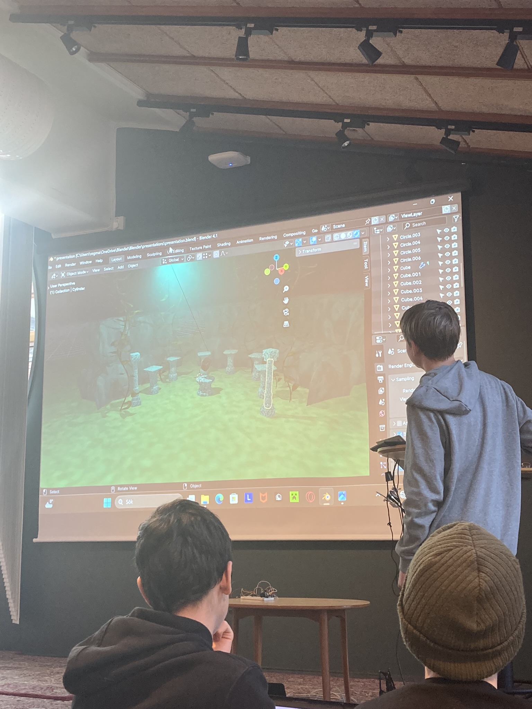
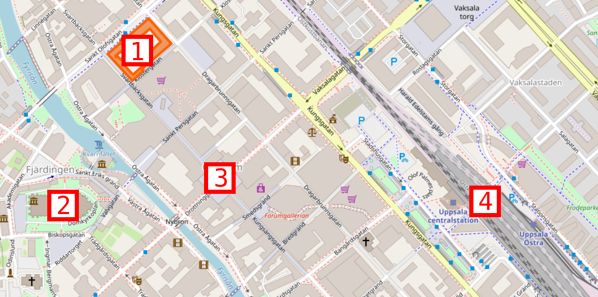
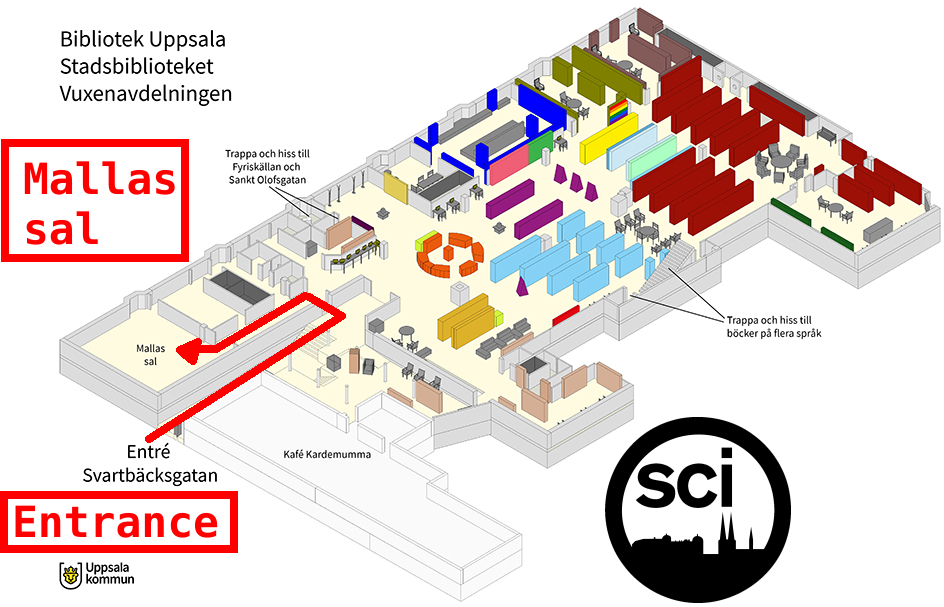

# Slutpresentation

> En tidigare slutpresentation

- Vad: Slutpresentation och utvärderig
- När: Lördag 12:e December 2026
- Tiderna: 11.00-13.30
- Målet: att elever får visar deras mästarevärk
- Vem: varje en
- Kostnad: ingenting
- Var: [Uppsala Stadsbibliotek](https://bibliotekuppsala.se/web/arena/stadsbiblioteket),
  Svartbäcksgatan 17, 753 75 Uppsala

> Presentationen är på 1.
> 1: Stadsbiblioteket.
> 2: Domkyrkan.
> 3: Stora Torget.
> 4: Centralstationen.

> Presentationen är i Mallassal

När  |Besökare                                  | Matlagningskurs | Andra elever    | Volontärer
-----|------------------------------------------|-----------------|-----------------|-----------
10.30|.                                         | .               | .               | Förbereda
11.00|Dör öpnas                                 | Dör öpnas       | Dör öpnas       | Dör öpnas
11.01|Har fika [G]                              | Presenterar [G] | Förberedar [M]  | Leda
11.29|Till Mallassal                            | Till Mallassal  | Stanna kvar [M] | **Lämna rent [G]**
11.30|Kolla på presentationer [M]               | Kolla [M]       | Kolla [M]       | Leda [M]
13.00|Slut                                      | Slut            | Slut            | Slut

- [B] Biblioteket, [G] Grupprum brevid Mallassal, [M] Mallassal,
- `AB`: AtomBjörn, `R`: Richèl, `SB`: Store Björn

Tider är bara riklinjer, ofta slutar vi tidigare.

## Frågor och svar

- F: Måste jag presentera?
- S: Nej :-)

- F: Jag har ingenting nu, men kommer på Hackathon imorgen
- S: Toppen, det ska funkar!

- F: Jag har ingenting nu, men schickar koden senare
- S: Toppen, det ska funkar!

- F: Jag kan inte komma på slutpresentationen
- S: Tyvvär, men det är okej

## Presentationsschema

!!! info "Inte glöm"

    Fråga alla elever att berätta om en linje av sina kod, eller del
    av sina 3D ritningar: det hjälper att presentationen går lite
    långsammare och får dem att kolla i publiken mer

???- info "Checklist"

    To do:

    - Prepare questions for parents: show who helped most
    - [ ] Coffee
    - [ ] Hot water (for tea)
    - [ ] Paper cups (for coffee and tea) (20 is enough, took 30, needed ?)
    - [ ] Evaluation forms (took 60, needed ?)
    - [ ] Laptop
    - [ ] Camera
    - [ ] USB cable
    - [ ] Mouse
    - [ ] Spoons for stirring (took 10)
    - [ ] Mouse mat
    - [ ] Extension cord
    - [ ] Teabags
    - [ ] Sugar (for coffee and tea)
    - [ ] Milk (for coffee and tea)
    - [ ] Pens (have 30, needed ?)

Presentations:

Vem                      |Vad                            |Notiser
-------------------------|-------------------------------|-------------------------
[STATUS] .               |.                              |.

???- info "Notes from December 2025"

    - 10 presentations that need preparation are predicted to take 20
      minutes to prepare with 10 computers. This became 30 minutes, hence
      `preparation_time = n_presentations * 3 minutes`
    - 20 presentations were predicted to take 60 minutes,
      i.e. `presention_time = n_presentations * 3 minutes`. This was correct.
    - Let all pupils present a line of code and/or a part of their 3D image.
      It slows down the presentations and makes them look into the audience more

???- info "Presentation parents"

    - Thanks parents
    - Show parents which kids helped most

## Bilder

...
