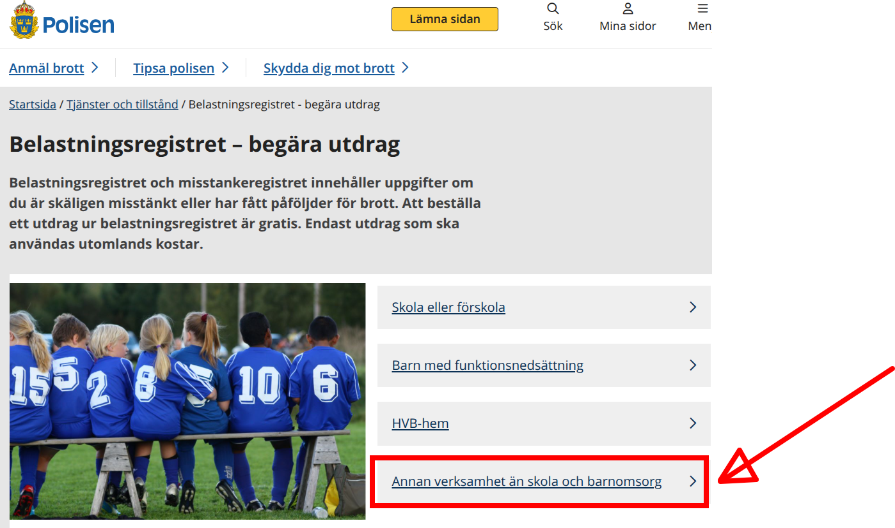
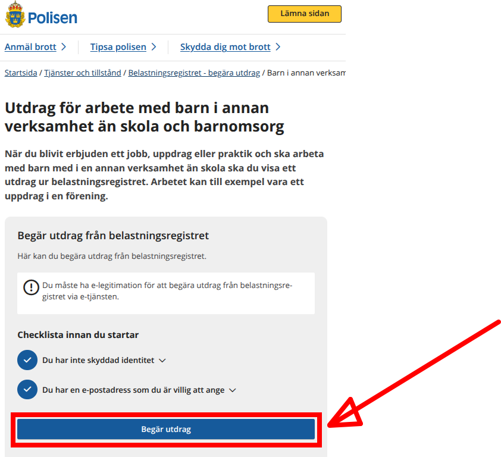
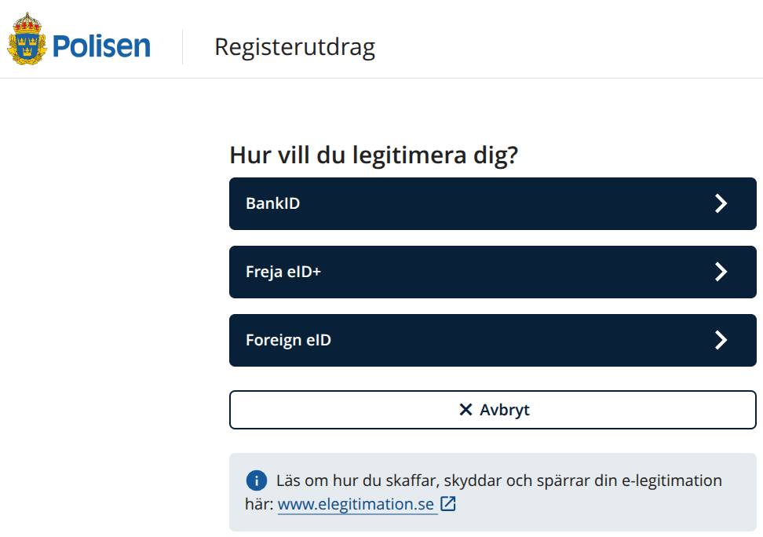
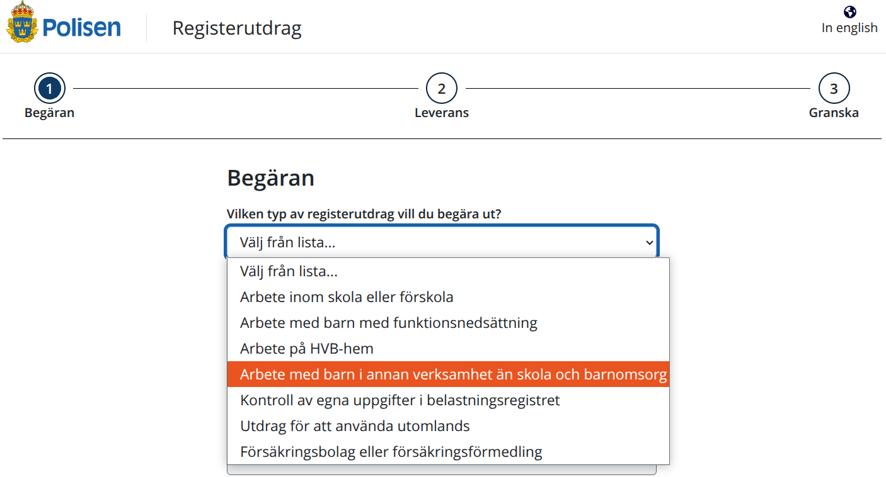
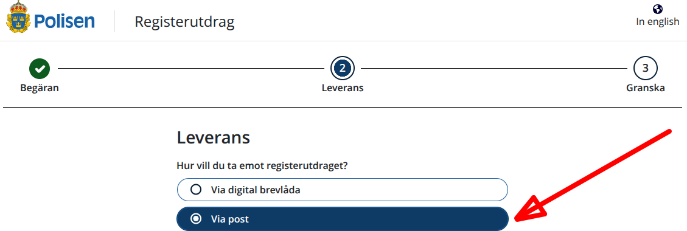

---
tags:
  - volunteers
  - frivilligare
  - volontäre
---

# Volontärer

Under Lördagskurserna är vi bara frivilliga som jobbar.
Du får vara med i laget!

Namn                         |Ansvar
-----------------------------|----------
Richel Bilderbeek            |Samordnare
?Mathias Palmer              |Infall
?Björn 'AtomBjörn' Pihlgren  |Receptionsbordet
?Björn 'Store Björn' Engström|Blender kursledare
?Christoffer Ramqvist        |Lärare Processing
?Fredrik Eldh                |Lärare Processing
?Janne Holmberg              |Lärare Processing
?Dennis Leenheer             |Lärare Processing
?Nikita Churikov             |Lärare Processing

## Tidigare volontärer

Namn                 |Ansvar
---------------------|----------
Bogdan Nicolae       |Lärare Processing
Leslie Solorzano     |Lärare Blender
Lily Lindstrand Hogan|Lärare Processing
Ludvig Ahnlund Groiss|Lärare Arduino
Saw Simeon           |Lärare Processing

## Registerutdrag

=== "🇸🇪"

    TODO

=== "🇬🇧"

    To help assure the Lördagskurserna are a safe environment,
    Every volunteer needs a so-called 'Registerutdrag'.

    It can be requested for free at [the police](https://polisen.se/tjanster-tillstand/belastningsregistret/).
    Go to [https://polisen.se/tjanster-tillstand/belastningsregistret/](https://polisen.se/tjanster-tillstand/belastningsregistret/)
    and click on 'Annan verksamhet än skola och barnomsorg':

=== "🇸🇪"

    TODO

=== "🇬🇧"

    You will be taken to
    [https://polisen.se/tjanster-tillstand/belastningsregistret/barn-annan-verksamhet/](https://polisen.se/tjanster-tillstand/belastningsregistret/barn-annan-verksamhet/).
    Click on 'Begär utdrag'.
    and click on 'Annan verksamhet än skola och barnomsorg':

=== "🇸🇪"

    TODO

=== "🇬🇧"

    You will be taken to
    [https://polisen.se/tjanster-tillstand/belastningsregistret/barn-annan-verksamhet/](https://polisen.se/tjanster-tillstand/belastningsregistret/barn-annan-verksamhet/).
    Click on 'Begär utdrag'.
    and click on 'Annan verksamhet än skola och barnomsorg'.

    Now you will asked to identify yourself. Do so.

=== "🇸🇪"

    TODO

=== "🇬🇧"

    Now you will asked again what type of Registerutdrag you need.
    Again choose 'Annan verksamhet än skola och barnomsorg'.

    Click 'Nästa' to go to the 'Begäran' screen.

=== "🇸🇪"

    TODO

=== "🇬🇧"

    Now you will asked again what type of Registerutdrag you need.
    Again choose 'Annan verksamhet än skola och barnomsorg'.

    The other questions are about you. These you should know :-)

    Click 'Nästa' to go to the 'Leverans' screen.

    On the 'Leverans' screen, select 'Via post' to get the Registerutdrag
    per mail.

=== "🇸🇪"

    TODO

=== "🇬🇧"

    The other questions are about you. These you should know.

    When you've filled in everything, please show the -ideally unopened-
    envelope to the course coordinator.

    You will be thanked deeply for the hassle :-)
