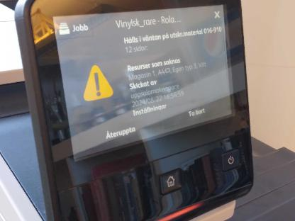
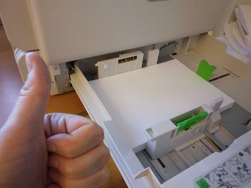

# Printer

If the printer states that there is no paper and there is paper in tray 1 ...

What the printer states|What is in reality
-----------------------|-----------------------
|

then try the computer with the bigger screen (i.e. not the computer closest to the printer, but the one-but-closest instead).

This is because of the orientation of the A4 that is setup incorrectly by accident.

An alternative solution: go into the printer settings and specify that it should take paper from the cassette or manual, rather than "auto".

