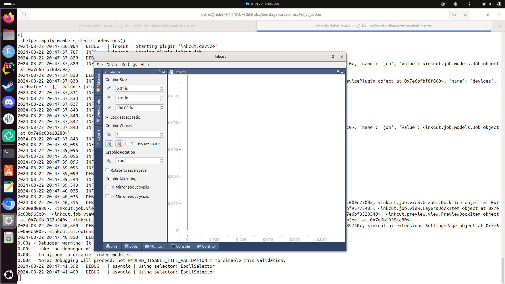

# Inkcut

## Install

From https://www.codelv.com/projects/inkcut/docs/installing :

```bash
apt-get install python3-pip python3-pyqt5 python3-setuptools libcups2-dev python3-pyqt5.qtsvg
```

Works!

```bash
pip3 install inkcut
```

Gives:

```
richel@richel-N141CU:~/GitHubs/loerdagskurser/misc/vinyl_cutter$ pip3 install inkcut
error: externally-managed-environment

× This environment is externally managed
╰─> To install Python packages system-wide, try apt install
    python3-xyz, where xyz is the package you are trying to
    install.
    
    If you wish to install a non-Debian-packaged Python package,
    create a virtual environment using python3 -m venv path/to/venv.
    Then use path/to/venv/bin/python and path/to/venv/bin/pip. Make
    sure you have python3-full installed.
    
    If you wish to install a non-Debian packaged Python application,
    it may be easiest to use pipx install xyz, which will manage a
    virtual environment for you. Make sure you have pipx installed.
    
    See /usr/share/doc/python3.12/README.venv for more information.

note: If you believe this is a mistake, please contact your Python installation or OS distribution provider. You can override this, at the risk of breaking your Python installation or OS, by passing --break-system-packages.
hint: See PEP 668 for the detailed specification.
```

So:

```
python3 -m venv ~/inkcut_venv
```

and

```
~/inkcut_venv/bin/pip install inkcut
```

```
richel@richel-N141CU:~/GitHubs/loerdagskurser/misc/vinyl_cutter$ ~/inkcut_venv/bin/pip install inkcut
Collecting inkcut
  Downloading inkcut-2.1.5-py2.py3-none-any.whl.metadata (2.7 kB)
Collecting twisted (from inkcut)
  Downloading twisted-24.7.0-py3-none-any.whl.metadata (18 kB)
Collecting enamlx>=0.4.2 (from inkcut)
  Downloading enamlx-0.6.4-py2.py3-none-any.whl.metadata (1.9 kB)
Collecting pyqtgraph (from inkcut)
  Downloading pyqtgraph-0.13.7-py3-none-any.whl.metadata (1.3 kB)
Collecting qtconsole (from inkcut)
  Downloading qtconsole-5.5.2-py3-none-any.whl.metadata (5.1 kB)
Collecting pyserial>=3.5 (from inkcut)
  Downloading pyserial-3.5-py2.py3-none-any.whl.metadata (1.6 kB)
Collecting jsonpickle (from inkcut)
  Downloading jsonpickle-3.2.2-py3-none-any.whl.metadata (7.2 kB)
Collecting lxml (from inkcut)
  Downloading lxml-5.3.0-cp312-cp312-manylinux_2_28_x86_64.whl.metadata (3.8 kB)
Collecting qt-reactor (from inkcut)
  Downloading qt_reactor-0.6-py2.py3-none-any.whl.metadata (2.1 kB)
Collecting enaml>=0.10 (from inkcut)
  Downloading enaml-0.17.0-cp312-cp312-manylinux_2_12_x86_64.manylinux2010_x86_64.manylinux_2_17_x86_64.manylinux2014_x86_64.whl.metadata (13 kB)
Collecting pycups (from inkcut)
  Downloading pycups-2.0.4.tar.gz (65 kB)
     ━━━━━━━━━━━━━━━━━━━━━━━━━━━━━━━━━━━━━━━━ 65.1/65.1 kB 2.3 MB/s eta 0:00:00
  Installing build dependencies ... done
  Getting requirements to build wheel ... done
  Preparing metadata (pyproject.toml) ... done
Collecting ply (from enaml>=0.10->inkcut)
  Downloading ply-3.11-py2.py3-none-any.whl.metadata (844 bytes)
Collecting atom>=0.9.0 (from enaml>=0.10->inkcut)
  Downloading atom-0.10.5-cp312-cp312-manylinux_2_17_x86_64.manylinux2014_x86_64.whl.metadata (8.1 kB)
Collecting kiwisolver>=1.2.0 (from enaml>=0.10->inkcut)
  Downloading kiwisolver-1.4.5-cp312-cp312-manylinux_2_17_x86_64.manylinux2014_x86_64.whl.metadata (6.4 kB)
Collecting bytecode>=0.15.1 (from enaml>=0.10->inkcut)
  Downloading bytecode-0.15.1-py3-none-any.whl.metadata (4.6 kB)
Collecting pegen>=0.3.0 (from enaml>=0.10->inkcut)
  Downloading pegen-0.3.0-py3-none-any.whl.metadata (11 kB)
Collecting numpy>=1.22.0 (from pyqtgraph->inkcut)
  Downloading numpy-2.1.0-cp312-cp312-manylinux_2_17_x86_64.manylinux2014_x86_64.whl.metadata (60 kB)
     ━━━━━━━━━━━━━━━━━━━━━━━━━━━━━━━━━━━━━━━━ 60.9/60.9 kB 7.2 MB/s eta 0:00:00
Collecting qtpy (from qt-reactor->inkcut)
  Downloading QtPy-2.4.1-py3-none-any.whl.metadata (12 kB)
Collecting traitlets!=5.2.1,!=5.2.2 (from qtconsole->inkcut)
  Downloading traitlets-5.14.3-py3-none-any.whl.metadata (10 kB)
Collecting jupyter-core (from qtconsole->inkcut)
  Downloading jupyter_core-5.7.2-py3-none-any.whl.metadata (3.4 kB)
Collecting jupyter-client>=4.1 (from qtconsole->inkcut)
  Downloading jupyter_client-8.6.2-py3-none-any.whl.metadata (8.3 kB)
Collecting pygments (from qtconsole->inkcut)
  Downloading pygments-2.18.0-py3-none-any.whl.metadata (2.5 kB)
Collecting ipykernel>=4.1 (from qtconsole->inkcut)
  Downloading ipykernel-6.29.5-py3-none-any.whl.metadata (6.3 kB)
Collecting pyzmq>=17.1 (from qtconsole->inkcut)
  Downloading pyzmq-26.2.0-cp312-cp312-manylinux_2_28_x86_64.whl.metadata (6.2 kB)
Collecting packaging (from qtconsole->inkcut)
  Downloading packaging-24.1-py3-none-any.whl.metadata (3.2 kB)
Collecting attrs>=21.3.0 (from twisted->inkcut)
  Downloading attrs-24.2.0-py3-none-any.whl.metadata (11 kB)
Collecting automat>=0.8.0 (from twisted->inkcut)
  Downloading Automat-24.8.1-py3-none-any.whl.metadata (8.4 kB)
Collecting constantly>=15.1 (from twisted->inkcut)
  Downloading constantly-23.10.4-py3-none-any.whl.metadata (1.8 kB)
Collecting hyperlink>=17.1.1 (from twisted->inkcut)
  Downloading hyperlink-21.0.0-py2.py3-none-any.whl.metadata (1.5 kB)
Collecting incremental>=24.7.0 (from twisted->inkcut)
  Downloading incremental-24.7.2-py3-none-any.whl.metadata (8.1 kB)
Collecting typing-extensions>=4.2.0 (from twisted->inkcut)
  Downloading typing_extensions-4.12.2-py3-none-any.whl.metadata (3.0 kB)
Collecting zope-interface>=5 (from twisted->inkcut)
  Downloading zope.interface-7.0.1-cp312-cp312-manylinux_2_5_x86_64.manylinux1_x86_64.manylinux_2_17_x86_64.manylinux2014_x86_64.whl.metadata (43 kB)
     ━━━━━━━━━━━━━━━━━━━━━━━━━━━━━━━━━━━━━━━━ 43.2/43.2 kB 2.3 MB/s eta 0:00:00
Collecting idna>=2.5 (from hyperlink>=17.1.1->twisted->inkcut)
  Downloading idna-3.7-py3-none-any.whl.metadata (9.9 kB)
Collecting setuptools>=61.0 (from incremental>=24.7.0->twisted->inkcut)
  Using cached setuptools-73.0.1-py3-none-any.whl.metadata (6.6 kB)
Collecting comm>=0.1.1 (from ipykernel>=4.1->qtconsole->inkcut)
  Downloading comm-0.2.2-py3-none-any.whl.metadata (3.7 kB)
Collecting debugpy>=1.6.5 (from ipykernel>=4.1->qtconsole->inkcut)
  Downloading debugpy-1.8.5-cp312-cp312-manylinux_2_5_x86_64.manylinux1_x86_64.manylinux_2_17_x86_64.manylinux2014_x86_64.whl.metadata (1.1 kB)
Collecting ipython>=7.23.1 (from ipykernel>=4.1->qtconsole->inkcut)
  Downloading ipython-8.26.0-py3-none-any.whl.metadata (5.0 kB)
Collecting matplotlib-inline>=0.1 (from ipykernel>=4.1->qtconsole->inkcut)
  Downloading matplotlib_inline-0.1.7-py3-none-any.whl.metadata (3.9 kB)
Collecting nest-asyncio (from ipykernel>=4.1->qtconsole->inkcut)
  Downloading nest_asyncio-1.6.0-py3-none-any.whl.metadata (2.8 kB)
Collecting psutil (from ipykernel>=4.1->qtconsole->inkcut)
  Downloading psutil-6.0.0-cp36-abi3-manylinux_2_12_x86_64.manylinux2010_x86_64.manylinux_2_17_x86_64.manylinux2014_x86_64.whl.metadata (21 kB)
Collecting tornado>=6.1 (from ipykernel>=4.1->qtconsole->inkcut)
  Downloading tornado-6.4.1-cp38-abi3-manylinux_2_5_x86_64.manylinux1_x86_64.manylinux_2_17_x86_64.manylinux2014_x86_64.whl.metadata (2.5 kB)
Collecting python-dateutil>=2.8.2 (from jupyter-client>=4.1->qtconsole->inkcut)
  Downloading python_dateutil-2.9.0.post0-py2.py3-none-any.whl.metadata (8.4 kB)
Collecting platformdirs>=2.5 (from jupyter-core->qtconsole->inkcut)
  Downloading platformdirs-4.2.2-py3-none-any.whl.metadata (11 kB)
Collecting decorator (from ipython>=7.23.1->ipykernel>=4.1->qtconsole->inkcut)
  Downloading decorator-5.1.1-py3-none-any.whl.metadata (4.0 kB)
Collecting jedi>=0.16 (from ipython>=7.23.1->ipykernel>=4.1->qtconsole->inkcut)
  Downloading jedi-0.19.1-py2.py3-none-any.whl.metadata (22 kB)
Collecting prompt-toolkit<3.1.0,>=3.0.41 (from ipython>=7.23.1->ipykernel>=4.1->qtconsole->inkcut)
  Downloading prompt_toolkit-3.0.47-py3-none-any.whl.metadata (6.4 kB)
Collecting stack-data (from ipython>=7.23.1->ipykernel>=4.1->qtconsole->inkcut)
  Downloading stack_data-0.6.3-py3-none-any.whl.metadata (18 kB)
Collecting pexpect>4.3 (from ipython>=7.23.1->ipykernel>=4.1->qtconsole->inkcut)
  Downloading pexpect-4.9.0-py2.py3-none-any.whl.metadata (2.5 kB)
Collecting six>=1.5 (from python-dateutil>=2.8.2->jupyter-client>=4.1->qtconsole->inkcut)
  Downloading six-1.16.0-py2.py3-none-any.whl.metadata (1.8 kB)
Collecting parso<0.9.0,>=0.8.3 (from jedi>=0.16->ipython>=7.23.1->ipykernel>=4.1->qtconsole->inkcut)
  Downloading parso-0.8.4-py2.py3-none-any.whl.metadata (7.7 kB)
Collecting ptyprocess>=0.5 (from pexpect>4.3->ipython>=7.23.1->ipykernel>=4.1->qtconsole->inkcut)
  Downloading ptyprocess-0.7.0-py2.py3-none-any.whl.metadata (1.3 kB)
Collecting wcwidth (from prompt-toolkit<3.1.0,>=3.0.41->ipython>=7.23.1->ipykernel>=4.1->qtconsole->inkcut)
  Downloading wcwidth-0.2.13-py2.py3-none-any.whl.metadata (14 kB)
Collecting executing>=1.2.0 (from stack-data->ipython>=7.23.1->ipykernel>=4.1->qtconsole->inkcut)
  Downloading executing-2.0.1-py2.py3-none-any.whl.metadata (9.0 kB)
Collecting asttokens>=2.1.0 (from stack-data->ipython>=7.23.1->ipykernel>=4.1->qtconsole->inkcut)
  Downloading asttokens-2.4.1-py2.py3-none-any.whl.metadata (5.2 kB)
Collecting pure-eval (from stack-data->ipython>=7.23.1->ipykernel>=4.1->qtconsole->inkcut)
  Downloading pure_eval-0.2.3-py3-none-any.whl.metadata (6.3 kB)
Downloading inkcut-2.1.5-py2.py3-none-any.whl (1.2 MB)
   ━━━━━━━━━━━━━━━━━━━━━━━━━━━━━━━━━━━━━━━━ 1.2/1.2 MB 2.3 MB/s eta 0:00:00
Downloading enaml-0.17.0-cp312-cp312-manylinux_2_12_x86_64.manylinux2010_x86_64.manylinux_2_17_x86_64.manylinux2014_x86_64.whl (1.2 MB)
   ━━━━━━━━━━━━━━━━━━━━━━━━━━━━━━━━━━━━━━━━ 1.2/1.2 MB 2.4 MB/s eta 0:00:00
Downloading enamlx-0.6.4-py2.py3-none-any.whl (47 kB)
   ━━━━━━━━━━━━━━━━━━━━━━━━━━━━━━━━━━━━━━━━ 47.9/47.9 kB 3.1 MB/s eta 0:00:00
Downloading pyserial-3.5-py2.py3-none-any.whl (90 kB)
   ━━━━━━━━━━━━━━━━━━━━━━━━━━━━━━━━━━━━━━━━ 90.6/90.6 kB 5.0 MB/s eta 0:00:00
Downloading jsonpickle-3.2.2-py3-none-any.whl (41 kB)
   ━━━━━━━━━━━━━━━━━━━━━━━━━━━━━━━━━━━━━━━━ 41.8/41.8 kB 2.8 MB/s eta 0:00:00
Downloading lxml-5.3.0-cp312-cp312-manylinux_2_28_x86_64.whl (4.9 MB)
   ━━━━━━━━━━━━━━━━━━━━━━━━━━━━━━━━━━━━━━━━ 4.9/4.9 MB 2.9 MB/s eta 0:00:00
Downloading pyqtgraph-0.13.7-py3-none-any.whl (1.9 MB)
   ━━━━━━━━━━━━━━━━━━━━━━━━━━━━━━━━━━━━━━━━ 1.9/1.9 MB 4.9 MB/s eta 0:00:00
Downloading qt_reactor-0.6-py2.py3-none-any.whl (6.1 kB)
Downloading qtconsole-5.5.2-py3-none-any.whl (123 kB)
   ━━━━━━━━━━━━━━━━━━━━━━━━━━━━━━━━━━━━━━━━ 123.4/123.4 kB 4.7 MB/s eta 0:00:00
Downloading twisted-24.7.0-py3-none-any.whl (3.2 MB)
   ━━━━━━━━━━━━━━━━━━━━━━━━━━━━━━━━━━━━━━━━ 3.2/3.2 MB 6.0 MB/s eta 0:00:00
Downloading atom-0.10.5-cp312-cp312-manylinux_2_17_x86_64.manylinux2014_x86_64.whl (1.4 MB)
   ━━━━━━━━━━━━━━━━━━━━━━━━━━━━━━━━━━━━━━━━ 1.4/1.4 MB 4.0 MB/s eta 0:00:00
Downloading attrs-24.2.0-py3-none-any.whl (63 kB)
   ━━━━━━━━━━━━━━━━━━━━━━━━━━━━━━━━━━━━━━━━ 63.0/63.0 kB 2.7 MB/s eta 0:00:00
Downloading Automat-24.8.1-py3-none-any.whl (42 kB)
   ━━━━━━━━━━━━━━━━━━━━━━━━━━━━━━━━━━━━━━━━ 42.6/42.6 kB 2.0 MB/s eta 0:00:00
Downloading bytecode-0.15.1-py3-none-any.whl (39 kB)
Downloading constantly-23.10.4-py3-none-any.whl (13 kB)
Downloading hyperlink-21.0.0-py2.py3-none-any.whl (74 kB)
   ━━━━━━━━━━━━━━━━━━━━━━━━━━━━━━━━━━━━━━━━ 74.6/74.6 kB 5.0 MB/s eta 0:00:00
Downloading incremental-24.7.2-py3-none-any.whl (20 kB)
Downloading ipykernel-6.29.5-py3-none-any.whl (117 kB)
   ━━━━━━━━━━━━━━━━━━━━━━━━━━━━━━━━━━━━━━━━ 117.2/117.2 kB 3.7 MB/s eta 0:00:00
Downloading jupyter_client-8.6.2-py3-none-any.whl (105 kB)
   ━━━━━━━━━━━━━━━━━━━━━━━━━━━━━━━━━━━━━━━━ 105.9/105.9 kB 4.1 MB/s eta 0:00:00
Downloading jupyter_core-5.7.2-py3-none-any.whl (28 kB)
Downloading kiwisolver-1.4.5-cp312-cp312-manylinux_2_17_x86_64.manylinux2014_x86_64.whl (1.5 MB)
   ━━━━━━━━━━━━━━━━━━━━━━━━━━━━━━━━━━━━━━━━ 1.5/1.5 MB 4.3 MB/s eta 0:00:00
Downloading numpy-2.1.0-cp312-cp312-manylinux_2_17_x86_64.manylinux2014_x86_64.whl (16.0 MB)
   ━━━━━━━━━━━━━━━━━━━━━━━━━━━━━━━━━━━━━━━━ 16.0/16.0 MB 3.2 MB/s eta 0:00:00
Downloading pegen-0.3.0-py3-none-any.whl (35 kB)
Downloading pyzmq-26.2.0-cp312-cp312-manylinux_2_28_x86_64.whl (860 kB)
   ━━━━━━━━━━━━━━━━━━━━━━━━━━━━━━━━━━━━━━━━ 860.6/860.6 kB 3.9 MB/s eta 0:00:00
Downloading QtPy-2.4.1-py3-none-any.whl (93 kB)
   ━━━━━━━━━━━━━━━━━━━━━━━━━━━━━━━━━━━━━━━━ 93.5/93.5 kB 3.9 MB/s eta 0:00:00
Downloading traitlets-5.14.3-py3-none-any.whl (85 kB)
   ━━━━━━━━━━━━━━━━━━━━━━━━━━━━━━━━━━━━━━━━ 85.4/85.4 kB 4.3 MB/s eta 0:00:00
Downloading typing_extensions-4.12.2-py3-none-any.whl (37 kB)
Downloading zope.interface-7.0.1-cp312-cp312-manylinux_2_5_x86_64.manylinux1_x86_64.manylinux_2_17_x86_64.manylinux2014_x86_64.whl (266 kB)
   ━━━━━━━━━━━━━━━━━━━━━━━━━━━━━━━━━━━━━━━━ 266.5/266.5 kB 3.6 MB/s eta 0:00:00
Downloading packaging-24.1-py3-none-any.whl (53 kB)
   ━━━━━━━━━━━━━━━━━━━━━━━━━━━━━━━━━━━━━━━━ 54.0/54.0 kB 6.6 MB/s eta 0:00:00
Downloading ply-3.11-py2.py3-none-any.whl (49 kB)
   ━━━━━━━━━━━━━━━━━━━━━━━━━━━━━━━━━━━━━━━━ 49.6/49.6 kB 2.0 MB/s eta 0:00:00
Downloading pygments-2.18.0-py3-none-any.whl (1.2 MB)
   ━━━━━━━━━━━━━━━━━━━━━━━━━━━━━━━━━━━━━━━━ 1.2/1.2 MB 4.0 MB/s eta 0:00:00
Downloading comm-0.2.2-py3-none-any.whl (7.2 kB)
Downloading debugpy-1.8.5-cp312-cp312-manylinux_2_5_x86_64.manylinux1_x86_64.manylinux_2_17_x86_64.manylinux2014_x86_64.whl (1.4 MB)
   ━━━━━━━━━━━━━━━━━━━━━━━━━━━━━━━━━━━━━━━━ 1.4/1.4 MB 3.8 MB/s eta 0:00:00
Downloading idna-3.7-py3-none-any.whl (66 kB)
   ━━━━━━━━━━━━━━━━━━━━━━━━━━━━━━━━━━━━━━━━ 66.8/66.8 kB 3.7 MB/s eta 0:00:00
Downloading ipython-8.26.0-py3-none-any.whl (817 kB)
   ━━━━━━━━━━━━━━━━━━━━━━━━━━━━━━━━━━━━━━━━ 817.9/817.9 kB 3.4 MB/s eta 0:00:00
Downloading matplotlib_inline-0.1.7-py3-none-any.whl (9.9 kB)
Downloading platformdirs-4.2.2-py3-none-any.whl (18 kB)
Downloading python_dateutil-2.9.0.post0-py2.py3-none-any.whl (229 kB)
   ━━━━━━━━━━━━━━━━━━━━━━━━━━━━━━━━━━━━━━━━ 229.9/229.9 kB 4.1 MB/s eta 0:00:00
Using cached setuptools-73.0.1-py3-none-any.whl (2.3 MB)
Downloading tornado-6.4.1-cp38-abi3-manylinux_2_5_x86_64.manylinux1_x86_64.manylinux_2_17_x86_64.manylinux2014_x86_64.whl (436 kB)
   ━━━━━━━━━━━━━━━━━━━━━━━━━━━━━━━━━━━━━━━━ 436.8/436.8 kB 3.8 MB/s eta 0:00:00
Downloading nest_asyncio-1.6.0-py3-none-any.whl (5.2 kB)
Downloading psutil-6.0.0-cp36-abi3-manylinux_2_12_x86_64.manylinux2010_x86_64.manylinux_2_17_x86_64.manylinux2014_x86_64.whl (290 kB)
   ━━━━━━━━━━━━━━━━━━━━━━━━━━━━━━━━━━━━━━━━ 290.5/290.5 kB 4.5 MB/s eta 0:00:00
Downloading jedi-0.19.1-py2.py3-none-any.whl (1.6 MB)
   ━━━━━━━━━━━━━━━━━━━━━━━━━━━━━━━━━━━━━━━━ 1.6/1.6 MB 5.1 MB/s eta 0:00:00
Downloading pexpect-4.9.0-py2.py3-none-any.whl (63 kB)
   ━━━━━━━━━━━━━━━━━━━━━━━━━━━━━━━━━━━━━━━━ 63.8/63.8 kB 3.5 MB/s eta 0:00:00
Downloading prompt_toolkit-3.0.47-py3-none-any.whl (386 kB)
   ━━━━━━━━━━━━━━━━━━━━━━━━━━━━━━━━━━━━━━━━ 386.4/386.4 kB 5.3 MB/s eta 0:00:00
Downloading six-1.16.0-py2.py3-none-any.whl (11 kB)
Downloading decorator-5.1.1-py3-none-any.whl (9.1 kB)
Downloading stack_data-0.6.3-py3-none-any.whl (24 kB)
Downloading asttokens-2.4.1-py2.py3-none-any.whl (27 kB)
Downloading executing-2.0.1-py2.py3-none-any.whl (24 kB)
Downloading parso-0.8.4-py2.py3-none-any.whl (103 kB)
   ━━━━━━━━━━━━━━━━━━━━━━━━━━━━━━━━━━━━━━━━ 103.7/103.7 kB 6.3 MB/s eta 0:00:00
Downloading ptyprocess-0.7.0-py2.py3-none-any.whl (13 kB)
Downloading pure_eval-0.2.3-py3-none-any.whl (11 kB)
Downloading wcwidth-0.2.13-py2.py3-none-any.whl (34 kB)
Building wheels for collected packages: pycups
  Building wheel for pycups (pyproject.toml) ... done
  Created wheel for pycups: filename=pycups-2.0.4-cp312-cp312-linux_x86_64.whl size=227664 sha256=2853d73547a4b02d4574776c8696bcf9733ef38212a085e9871a0371cb92f3dd
  Stored in directory: /home/richel/.cache/pip/wheels/7e/03/57/972b28956b7dbcf30027b904c2552a343495ffa2369b087c78
Successfully built pycups
Installing collected packages: wcwidth, pyserial, pycups, pure-eval, ptyprocess, ply, typing-extensions, traitlets, tornado, six, setuptools, pyzmq, pygments, psutil, prompt-toolkit, platformdirs, pexpect, pegen, parso, packaging, numpy, nest-asyncio, lxml, kiwisolver, jsonpickle, idna, executing, decorator, debugpy, constantly, bytecode, automat, attrs, atom, zope-interface, qtpy, python-dateutil, pyqtgraph, matplotlib-inline, jupyter-core, jedi, incremental, hyperlink, enaml, comm, asttokens, twisted, stack-data, jupyter-client, enamlx, qt-reactor, ipython, ipykernel, qtconsole, inkcut
Successfully installed asttokens-2.4.1 atom-0.10.5 attrs-24.2.0 automat-24.8.1 bytecode-0.15.1 comm-0.2.2 constantly-23.10.4 debugpy-1.8.5 decorator-5.1.1 enaml-0.17.0 enamlx-0.6.4 executing-2.0.1 hyperlink-21.0.0 idna-3.7 incremental-24.7.2 inkcut-2.1.5 ipykernel-6.29.5 ipython-8.26.0 jedi-0.19.1 jsonpickle-3.2.2 jupyter-client-8.6.2 jupyter-core-5.7.2 kiwisolver-1.4.5 lxml-5.3.0 matplotlib-inline-0.1.7 nest-asyncio-1.6.0 numpy-2.1.0 packaging-24.1 parso-0.8.4 pegen-0.3.0 pexpect-4.9.0 platformdirs-4.2.2 ply-3.11 prompt-toolkit-3.0.47 psutil-6.0.0 ptyprocess-0.7.0 pure-eval-0.2.3 pycups-2.0.4 pygments-2.18.0 pyqtgraph-0.13.7 pyserial-3.5 python-dateutil-2.9.0.post0 pyzmq-26.2.0 qt-reactor-0.6 qtconsole-5.5.2 qtpy-2.4.1 setuptools-73.0.1 six-1.16.0 stack-data-0.6.3 tornado-6.4.1 traitlets-5.14.3 twisted-24.7.0 typing-extensions-4.12.2 wcwidth-0.2.13 zope-interface-7.0.1
richel@richel-N141CU:~/GitHubs/loerdagskurser/misc/vinyl_cutter$ 
```


Works!

Starting it:

```
~/inkcut_venv/bin/inkcut 
```

Fails:

```
richel@richel-N141CU:~/GitHubs/loerdagskurser/misc/vinyl_cutter$ ~/inkcut_venv/bin/inkcut 
Logging to /home/richel/.config/inkcut/logs/inkcut.txt
2024-08-22 20:44:42,993 | INFO    | inkcut | ========================================
2024-08-22 20:44:42,993 | INFO    | inkcut | Inkcut launched
2024-08-22 20:44:42,993 | INFO    | inkcut | Version: 2.1.5
2024-08-22 20:44:42,993 | INFO    | inkcut | Python: 3.12.3 (main, Jul 31 2024, 17:43:48) [GCC 13.2.0]
2024-08-22 20:44:42,993 | INFO    | inkcut | System: uname_result(system='Linux', node='richel-N141CU', release='6.8.0-41-generic', version='#41-Ubuntu SMP PREEMPT_DYNAMIC Fri Aug  2 20:41:06 UTC 2024', machine='x86_64')
2024-08-22 20:44:42,993 | INFO    | inkcut | Executable: /home/richel/inkcut_venv/bin/python3
2024-08-22 20:44:42,993 | INFO    | inkcut | Args: ['/home/richel/inkcut_venv/bin/inkcut']
2024-08-22 20:44:43,003 | ERROR   | inkcut | No Qt bindings could be found
Traceback (most recent call last):
  File "/home/richel/inkcut_venv/lib/python3.12/site-packages/inkcut/app.py", line 78, in log_debug_info
    from qtpy import QT_VERSION
  File "/home/richel/inkcut_venv/lib/python3.12/site-packages/qtpy/__init__.py", line 287, in <module>
    raise QtBindingsNotFoundError from None
qtpy.QtBindingsNotFoundError: No Qt bindings could be found
2024-08-22 20:44:43,006 | INFO    | inkcut | ========================================
2024-08-22 20:44:43,012 | ERROR   | inkcut | Traceback (most recent call last):
  File "/home/richel/inkcut_venv/lib/python3.12/site-packages/inkcut/app.py", line 97, in main
    from inkcut.core.workbench import InkcutWorkbench
  File "/home/richel/inkcut_venv/lib/python3.12/site-packages/inkcut/core/workbench.py", line 17, in <module>
    enamlx.install()
  File "/home/richel/inkcut_venv/lib/python3.12/site-packages/enamlx/__init__.py", line 6, in install
    from enamlx.qt import qt_factories  # noqa: F401
    ^^^^^^^^^^^^^^^^^^^^^^^^^^^^^^^^^^
  File "/home/richel/inkcut_venv/lib/python3.12/site-packages/enamlx/qt/qt_factories.py", line 8, in <module>
    from enaml.qt import qt_factories
  File "/home/richel/inkcut_venv/lib/python3.12/site-packages/enaml/qt/__init__.py", line 8, in <module>
    from qtpy import (
  File "/home/richel/inkcut_venv/lib/python3.12/site-packages/qtpy/__init__.py", line 287, in <module>
    raise QtBindingsNotFoundError from None
qtpy.QtBindingsNotFoundError: No Qt bindings could be found

Traceback (most recent call last):
  File "/home/richel/inkcut_venv/bin/inkcut", line 8, in <module>
    sys.exit(main())
             ^^^^^^
  File "/home/richel/inkcut_venv/lib/python3.12/site-packages/inkcut/app.py", line 97, in main
    from inkcut.core.workbench import InkcutWorkbench
  File "/home/richel/inkcut_venv/lib/python3.12/site-packages/inkcut/core/workbench.py", line 17, in <module>
    enamlx.install()
  File "/home/richel/inkcut_venv/lib/python3.12/site-packages/enamlx/__init__.py", line 6, in install
    from enamlx.qt import qt_factories  # noqa: F401
    ^^^^^^^^^^^^^^^^^^^^^^^^^^^^^^^^^^
  File "/home/richel/inkcut_venv/lib/python3.12/site-packages/enamlx/qt/qt_factories.py", line 8, in <module>
    from enaml.qt import qt_factories
  File "/home/richel/inkcut_venv/lib/python3.12/site-packages/enaml/qt/__init__.py", line 8, in <module>
    from qtpy import (
  File "/home/richel/inkcut_venv/lib/python3.12/site-packages/qtpy/__init__.py", line 287, in <module>
    raise QtBindingsNotFoundError from None
qtpy.QtBindingsNotFoundError: No Qt bindings could be found
```

Install PyQt5:

```
richel@richel-N141CU:~/GitHubs/loerdagskurser/misc/vinyl_cutter$ ~/inkcut_venv/bin/pip install PyQt5
Collecting PyQt5
  Downloading PyQt5-5.15.11-cp38-abi3-manylinux_2_17_x86_64.whl.metadata (2.1 kB)
Collecting PyQt5-sip<13,>=12.15 (from PyQt5)
  Downloading PyQt5_sip-12.15.0-cp312-cp312-manylinux_2_5_x86_64.manylinux1_x86_64.whl.metadata (421 bytes)
Collecting PyQt5-Qt5<5.16.0,>=5.15.2 (from PyQt5)
  Downloading PyQt5_Qt5-5.15.14-py3-none-manylinux2014_x86_64.whl.metadata (536 bytes)
Downloading PyQt5-5.15.11-cp38-abi3-manylinux_2_17_x86_64.whl (8.2 MB)
   ━━━━━━━━━━━━━━━━━━━━━━━━━━━━━━━━━━━━━━━━ 8.2/8.2 MB 8.4 MB/s eta 0:00:00
Downloading PyQt5_Qt5-5.15.14-py3-none-manylinux2014_x86_64.whl (60.5 MB)
   ━━━━━━━━━━━━━━━━━━━━━━━━━━━━━━━━━━━━━━━━ 60.5/60.5 MB 4.8 MB/s eta 0:00:00
Downloading PyQt5_sip-12.15.0-cp312-cp312-manylinux_2_5_x86_64.manylinux1_x86_64.whl (281 kB)
   ━━━━━━━━━━━━━━━━━━━━━━━━━━━━━━━━━━━━━━━━ 281.4/281.4 kB 5.1 MB/s eta 0:00:00
Installing collected packages: PyQt5-Qt5, PyQt5-sip, PyQt5
Successfully installed PyQt5-5.15.11 PyQt5-Qt5-5.15.14 PyQt5-sip-12.15.0
richel@richel-N141CU:~/GitHubs/loerdagskurser/misc/vinyl_cutter$ 
```

Starting `inkcut` with:

```
~/inkcut_venv/bin/inkcut 
```

And it starts:

```
richel@richel-N141CU:~/GitHubs/loerdagskurser/misc/vinyl_cutter$ ~/inkcut_venv/bin/inkcut 
Logging to /home/richel/.config/inkcut/logs/inkcut.txt
2024-08-22 20:47:33,618 | INFO    | inkcut | ========================================
2024-08-22 20:47:33,619 | INFO    | inkcut | Inkcut launched
2024-08-22 20:47:33,619 | INFO    | inkcut | Version: 2.1.5
2024-08-22 20:47:33,619 | INFO    | inkcut | Python: 3.12.3 (main, Jul 31 2024, 17:43:48) [GCC 13.2.0]
2024-08-22 20:47:33,619 | INFO    | inkcut | System: uname_result(system='Linux', node='richel-N141CU', release='6.8.0-41-generic', version='#41-Ubuntu SMP PREEMPT_DYNAMIC Fri Aug  2 20:41:06 UTC 2024', machine='x86_64')
2024-08-22 20:47:33,619 | INFO    | inkcut | Executable: /home/richel/inkcut_venv/bin/python3
2024-08-22 20:47:33,619 | INFO    | inkcut | Args: ['/home/richel/inkcut_venv/bin/inkcut']
2024-08-22 20:47:33,649 | INFO    | inkcut | Qt: 5.15.14 Api:
2024-08-22 20:47:33,649 | INFO    | inkcut | ========================================
Warning: Ignoring XDG_SESSION_TYPE=wayland on Gnome. Use QT_QPA_PLATFORM=wayland to run on Wayland anyway.
2024-08-22 20:47:34,358 | DEBUG   | inkcut | Starting plugin 'inkcut.core'
2024-08-22 20:47:34,358 | DEBUG   | inkcut | Inkcut loaded.
2024-08-22 20:47:34,394 | DEBUG   | inkcut | CLI | Commands loaded
2024-08-22 20:47:34,395 | DEBUG   | inkcut | CLI | No cli command was given.
2024-08-22 20:47:34,396 | WARNING | inkcut | Translations not found at /home/richel/inkcut_venv/lib/python3.12/site-packages/inkcut/res/translations/en_US
2024-08-22 20:47:36,193 | DEBUG   | inkcut | CLI | Commands loaded
2024-08-22 20:47:36,194 | DEBUG   | inkcut | CLI | No cli command was given.
2024-08-22 20:47:36,204 | INFO    | inkcut | Loading plugin inkcut.device
/home/richel/inkcut_venv/lib/python3.12/site-packages/atom/meta/atom_meta.py:554: MissingMemberWarning: _default_ method _default_protocol on class 'Device' does not match any member defined on the Atom object. Existing members are: {'name': <atom.scalars.Str object at 0x7e6c000d9b20>, 'manufacturer': <atom.scalars.Str object at 0x7e6c000d9bd0>, 'model': <atom.scalars.Str object at 0x7e6c000d9c80>, 'custom': <atom.scalars.Bool object at 0x7e6c015eb880>, 'area': <atom.instance.Instance object at 0x7e6c015ebce0>, 'declaration': <atom.typed.Typed object at 0x7e6c015eb920>, 'protocols': <atom.list.List object at 0x7e6c000d9d20>, 'transports': <atom.list.List object at 0x7e6c000d9dd0>, 'filters': <atom.list.List object at 0x7e6c000d9e80>, 'connection': <atom.instance.Instance object at 0x7e6c015ebba0>, 'jobs': <atom.list.List object at 0x7e6c000d9f30>, 'queue': <atom.list.List object at 0x7e6c000d9fe0>, 'job': <atom.instance.Instance object at 0x7e6c015ebe20>, 'config': <atom.instance.Instance object at 0x7e6c015ebec0>, 'position': <atom.containerlist.ContainerList object at 0x7e6c000da090>, 'origin': <atom.containerlist.ContainerList object at 0x7e6c000da140>, 'busy': <atom.scalars.Bool object at 0x7e6c0008c040>, 'status': <atom.scalars.Str object at 0x7e6c000da200>}
  helper.apply_members_static_behaviors()
2024-08-22 20:47:36,904 | DEBUG   | inkcut | Starting plugin 'inkcut.device'
2024-08-22 20:47:37,787 | INFO    | inkcut | Loading plugin inkcut.job
2024-08-22 20:47:37,828 | DEBUG   | inkcut | Starting plugin 'inkcut.job'
2024-08-22 20:47:37,829 | INFO    | inkcut | {'type': 'create', 'object': <inkcut.job.plugin.JobPlugin object at 0x7e6c046c51c0>, 'name': 'job', 'value': <inkcut.job.models.Job object at 0x7e6bfbf60ac0>}
2024-08-22 20:47:37,830 | DEBUG   | inkcut | Starting plugin 'inkcut.preview'
2024-08-22 20:47:37,830 | INFO    | inkcut | Saving state due to change: {'type': 'update', 'object': <inkcut.device.plugin.DevicePlugin object at 0x7e6bfbf8f800>, 'name': 'devices', 'oldvalue': [], 'value': [<inkcut.device.plugin.Device object at 0x7e6bfb42a3c0>]}
2024-08-22 20:47:37,831 | INFO    | inkcut | {}
2024-08-22 20:47:37,833 | INFO    | inkcut | Saving state due to change: {'type': 'request'}
2024-08-22 20:47:37,837 | INFO    | inkcut | device | 
2024-08-22 20:47:37,840 | INFO    | inkcut | {}
2024-08-22 20:47:37,840 | INFO    | inkcut | Saving state due to change: {'type': 'request'}
2024-08-22 20:47:37,842 | INFO    | inkcut | Saving state due to change: {'type': 'request'}
2024-08-22 20:47:37,843 | INFO    | inkcut | {'type': 'create', 'object': <inkcut.job.plugin.JobPlugin object at 0x7e6c046c51c0>, 'name': 'job', 'value': <inkcut.job.models.Job object at 0x7e6c00a18280>}
2024-08-22 20:47:37,843 | INFO    | inkcut | Saving state due to change: {'type': 'request'}
2024-08-22 20:47:39,095 | INFO    | inkcut | Loading plugin inkcut.job
2024-08-22 20:47:39,095 | INFO    | inkcut | Loading plugin inkcut.job
2024-08-22 20:47:39,096 | INFO    | inkcut | Loading plugin inkcut.job
2024-08-22 20:47:39,096 | INFO    | inkcut | Loading plugin inkcut.job
2024-08-22 20:47:39,096 | INFO    | inkcut | Loading plugin inkcut.monitor
2024-08-22 20:47:39,099 | DEBUG   | inkcut | Starting plugin 'inkcut.monitor'
2024-08-22 20:47:39,344 | INFO    | inkcut | Loading plugin inkcut.preview
2024-08-22 20:47:39,540 | INFO    | inkcut | Loading plugin inkcut.console
2024-08-22 20:47:40,035 | INFO    | inkcut | Loading plugin inkcut.joystick
2024-08-22 20:47:40,036 | DEBUG   | inkcut | Starting plugin 'inkcut.joystick'
2024-08-22 20:47:40,515 | DEBUG   | inkcut | Updating dock items: [<inkcut.device.view.DeviceProgressDockItem object at 0x7e6c009d7700>, <inkcut.job.view.GraphicDockItem object at 0x7e6c00ad0a80>, <inkcut.job.view.MaterialDockItem object at 0x7e6bfb42bd80>, <inkcut.job.view.WeedlinesDockItem object at 0x7e6bf9577340>, <inkcut.job.view.LayersDockItem object at 0x7e6c00b965c0>, <inkcut.job.view.JobHistoryDockItem object at 0x7e6bf956a180>, <inkcut.monitor.view.MonitorDockItem object at 0x7e6bf9529340>, <inkcut.preview.view.PreviewDockItem object at 0x7e6bf952a540>, <inkcut.console.view.ConsoleDockItem object at 0x7e6bf95522c0>, <inkcut.joystick.view.JoystickDockItem object at 0x7e6bf955ca80>]
2024-08-22 20:47:40,850 | DEBUG   | inkcut | Updating settings pages: [<inkcut.ui.extensions.SettingsPage object at 0x7e6c08d89740>, <inkcut.ui.extensions.SettingsPage object at 0x7e6c00a6e500>, <inkcut.ui.extensions.SettingsPage object at 0x7e6c00a6fec0>]
2024-08-22 20:47:40,850 | DEBUG   | inkcut | Starting plugin 'inkcut.ui'
0.00s - Debugger warning: It seems that frozen modules are being used, which may
0.00s - make the debugger miss breakpoints. Please pass -Xfrozen_modules=off
0.00s - to python to disable frozen modules.
0.00s - Note: Debugging will proceed. Set PYDEVD_DISABLE_FILE_VALIDATION=1 to disable this validation.
2024-08-22 20:47:41,392 | DEBUG   | asyncio | Using selector: EpollSelector
2024-08-22 20:47:41,408 | DEBUG   | asyncio | Using selector: EpollSelector
```




